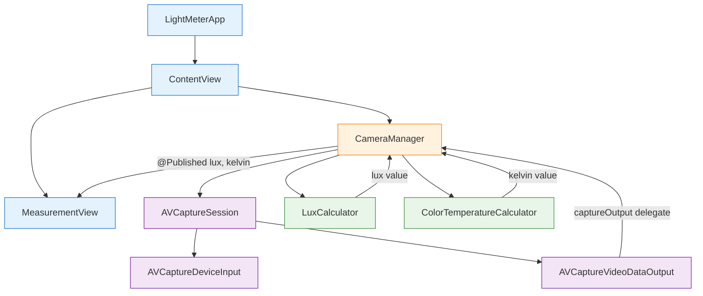

# Design Document: iOS Light Meter Skeleton

## Overview

This design describes a minimal iOS light meter app that uses the back camera to measure and display real-time Lux (illuminance) and Color Temperature (Kelvin). The app captures video frames via AVFoundation, extracts camera metadata (ISO, exposure duration, white balance gains), and derives light measurements displayed in a SwiftUI interface.

The architecture follows a clean separation between camera management, calculation logic, and UI. This is a skeleton/MVP — no persistence, no settings, no advanced features. The goal is a working app that can be deployed to a physical iPhone for testing.

### Key Design Decisions

- **AVFoundation over CoreImage/ARKit**: AVFoundation provides direct access to camera metadata (ISO, exposure, white balance gains) without the overhead of higher-level frameworks. This is the most lightweight approach for extracting the raw values we need.
- **SwiftUI over UIKit**: SwiftUI provides a declarative, reactive UI that naturally fits the real-time data update pattern. `@Published` properties on an `ObservableObject` drive automatic view updates.
- **Calculation in pure functions**: Lux and color temperature calculations are implemented as pure functions, making them independently testable without camera hardware.
- **Single-view architecture**: As an MVP, a single `ContentView` with a `CameraManager` ViewModel is sufficient. No navigation or multi-screen flows.

## Architecture



### Data Flow

1. `CameraManager` configures and starts an `AVCaptureSession` with the back camera.
2. Each captured frame triggers the `AVCaptureVideoDataOutputSampleBufferDelegate` callback.
3. In the callback, `CameraManager` reads the current `AVCaptureDevice` properties: `iso`, `exposureDuration`, and `deviceWhiteBalanceGains`.
4. These values are passed to `LuxCalculator.calculateLux(iso:exposureDuration:aperture:)` and `ColorTemperatureCalculator.calculateColorTemperature(gains:device:)`.
5. Results are published via `@Published` properties, which SwiftUI observes to update `MeasurementView`.

### Threading Model

- `AVCaptureSession` runs on a dedicated serial `DispatchQueue` (background).
- The delegate callback fires on that same background queue.
- UI updates are dispatched to `@MainActor` / main thread via `DispatchQueue.main.async` or `@MainActor` annotation.

## Components and Interfaces

### LightMeterApp

The `@main` SwiftUI app entry point. Creates `ContentView` and injects `CameraManager` as a `@StateObject`.

```swift
@main
struct LightMeterApp: App {
    var body: some Scene {
        WindowGroup {
            ContentView()
        }
    }
}
```

### CameraManager

An `ObservableObject` that owns the `AVCaptureSession` and publishes measurement values.

```swift
class CameraManager: NSObject, ObservableObject {
    @Published var lux: Double = 0.0
    @Published var colorTemperature: Double = 0.0
    @Published var cameraError: String? = nil
    @Published var permissionGranted: Bool = false

    private let captureSession = AVCaptureSession()
    private let sessionQueue = DispatchQueue(label: "camera.session.queue")
    private var captureDevice: AVCaptureDevice?

    func requestPermission()
    func setupSession()
    func startSession()
    func stopSession()
}

extension CameraManager: AVCaptureVideoDataOutputSampleBufferDelegate {
    func captureOutput(_ output: AVCaptureOutput,
                       didOutput sampleBuffer: CMSampleBuffer,
                       from connection: AVCaptureConnection)
}
```

### LuxCalculator

A pure-function utility for computing lux from camera metadata.

```swift
struct LuxCalculator {
    static let defaultCalibrationConstant: Double = 12.5
    static let defaultAperture: Double = 1.8  // iPhone back camera typical f-number

    /// Computes lux from ISO and exposure duration.
    /// Formula: lux = (calibrationConstant * aperture^2) / (ISO * exposureDurationInSeconds)
    /// Returns 0.0 if inputs would cause division by zero or negative results.
    static func calculateLux(
        iso: Float,
        exposureDuration: CMTime,
        calibrationConstant: Double = defaultCalibrationConstant,
        aperture: Double = defaultAperture
    ) -> Double
}
```

### ColorTemperatureCalculator

A utility for converting white balance gains to Kelvin.

```swift
struct ColorTemperatureCalculator {
    static let minKelvin: Double = 1000.0
    static let maxKelvin: Double = 15000.0

    /// Converts white balance gains to color temperature in Kelvin.
    /// Uses AVCaptureDevice.temperatureAndTintValues(for:) internally.
    /// Clamps result to [1000, 15000] range.
    static func calculateColorTemperature(
        gains: AVCaptureDevice.WhiteBalanceGains,
        device: AVCaptureDevice
    ) -> Double
}
```

### MeasurementView

A SwiftUI view that displays lux and color temperature, or an error/permission message.

```swift
struct MeasurementView: View {
    @ObservedObject var cameraManager: CameraManager

    var body: some View {
        // If no permission: show permission-required message
        // If error: show error message
        // Otherwise: show lux (with "lux" label) and color temperature (with "K" label)
    }
}
```

### ContentView

The root view that creates `CameraManager` and presents `MeasurementView`. Handles lifecycle events (foreground/background) to start/stop the camera session.

```swift
struct ContentView: View {
    @StateObject private var cameraManager = CameraManager()

    var body: some View {
        MeasurementView(cameraManager: cameraManager)
            .onAppear { cameraManager.requestPermission() }
            .onReceive(NotificationCenter.default.publisher(for: UIApplication.willEnterForegroundNotification)) { _ in
                cameraManager.startSession()
            }
            .onReceive(NotificationCenter.default.publisher(for: UIApplication.didEnterBackgroundNotification)) { _ in
                cameraManager.stopSession()
            }
    }
}
```

## Data Models

This MVP has minimal data models — the primary data flows as primitive values through `@Published` properties.

### Camera Metadata (extracted per frame)

| Field | Type | Source |
|-------|------|--------|
| `iso` | `Float` | `AVCaptureDevice.iso` |
| `exposureDuration` | `CMTime` | `AVCaptureDevice.exposureDuration` |
| `whiteBalanceGains` | `AVCaptureDevice.WhiteBalanceGains` | `AVCaptureDevice.deviceWhiteBalanceGains` |

### Published State (CameraManager)

| Property | Type | Description |
|----------|------|-------------|
| `lux` | `Double` | Current illuminance in lux |
| `colorTemperature` | `Double` | Current color temperature in Kelvin |
| `cameraError` | `String?` | Error message if camera setup fails |
| `permissionGranted` | `Bool` | Whether camera permission was granted |

### Constants

| Constant | Value | Rationale |
|----------|-------|-----------|
| `calibrationConstant` | 12.5 | Standard incident light meter calibration constant |
| `defaultAperture` | 1.8 | Typical iPhone back camera f-number |
| `minKelvin` | 1000.0 | Lower bound for valid color temperature |
| `maxKelvin` | 15000.0 | Upper bound for valid color temperature |


## Correctness Properties

*A property is a characteristic or behavior that should hold true across all valid executions of a system — essentially, a formal statement about what the system should do. Properties serve as the bridge between human-readable specifications and machine-verifiable correctness guarantees.*

### Property 1: Lux formula correctness

*For any* valid ISO value (positive float) and valid exposure duration (positive seconds), `LuxCalculator.calculateLux` SHALL return a value equal to `(calibrationConstant * aperture²) / (ISO * exposureDurationInSeconds)` within floating-point tolerance.

**Validates: Requirements 3.2**

### Property 2: Lux non-negativity invariant

*For any* ISO value (including zero and negative) and any exposure duration (including zero and negative), `LuxCalculator.calculateLux` SHALL return a value >= 0.0. When inputs would cause division by zero or produce a negative result, the function returns 0.0.

**Validates: Requirements 3.4**

### Property 3: Color temperature clamping invariant

*For any* raw color temperature value produced by the white balance conversion, `ColorTemperatureCalculator` SHALL clamp the result to the range [1000, 15000]. That is, the output is always >= 1000.0 and <= 15000.0.

**Validates: Requirements 4.4**

## Error Handling

| Scenario | Component | Behavior |
|----------|-----------|----------|
| Camera permission denied | CameraManager | Sets `permissionGranted = false`. MeasurementView shows permission-required message. |
| Back camera unavailable | CameraManager | Sets `cameraError` to a descriptive message. MeasurementView shows error. |
| AVCaptureSession configuration failure | CameraManager | Sets `cameraError`. Session is not started. |
| Division by zero in lux calculation (ISO=0 or exposure=0) | LuxCalculator | Returns 0.0 instead of crashing or returning infinity. |
| White balance gains produce out-of-range Kelvin | ColorTemperatureCalculator | Clamps to [1000, 15000] range. |
| App enters background | CameraManager | Stops session, releases resources. No crash on re-entry. |
| App returns to foreground | CameraManager | Restarts session. Handles case where session was already running. |

## Testing Strategy

### Unit Tests

Unit tests cover specific examples, edge cases, and component behavior with mocked dependencies.

**LuxCalculator:**
- Known input/output pairs (e.g., ISO=100, exposure=1/125s → expected lux value)
- Edge case: ISO = 0 → returns 0.0
- Edge case: exposure duration = 0 → returns 0.0
- Edge case: very large ISO and very short exposure → small but non-negative lux

**ColorTemperatureCalculator:**
- Clamping: raw value below 1000 → returns 1000
- Clamping: raw value above 15000 → returns 15000
- Clamping: raw value within range → returns unchanged

**CameraManager:**
- Permission denied → `permissionGranted` is false, `cameraError` is nil
- Back camera unavailable → `cameraError` is set
- Lifecycle: foreground notification → session starts
- Lifecycle: background notification → session stops

**MeasurementView:**
- Renders lux value with "lux" label
- Renders color temperature with "K" label
- Shows permission message when `permissionGranted` is false
- Shows error message when `cameraError` is set

### Property-Based Tests

Property-based tests verify universal correctness properties across many generated inputs. Use Swift's `swift-testing` framework with a property-based testing library such as [SwiftCheck](https://github.com/typelift/SwiftCheck) or a custom generator approach.

**Configuration:**
- Minimum 100 iterations per property test
- Each test references its design document property

**Property tests to implement:**

1. **Feature: 01-ios-light-meter-skeleton, Property 1: Lux formula correctness**
   - Generate random valid ISO (0.01...10000) and random valid exposure duration (1/100000...30 seconds)
   - Verify `calculateLux` output matches the formula within floating-point tolerance (epsilon = 1e-6)

2. **Feature: 01-ios-light-meter-skeleton, Property 2: Lux non-negativity invariant**
   - Generate random ISO values including 0, negative, and positive floats
   - Generate random exposure durations including 0, negative, and positive values
   - Verify `calculateLux` always returns >= 0.0

3. **Feature: 01-ios-light-meter-skeleton, Property 3: Color temperature clamping invariant**
   - Generate random raw Kelvin values across a wide range (e.g., -1000...50000)
   - Verify the clamping function always returns a value in [1000, 15000]

### Integration Tests (On-Device)

These require a physical iPhone and cannot be automated in CI without device access:

- Camera session starts with back camera input after permission grant
- Video frames produce valid ISO, exposure duration, and white balance gain values
- Lux and color temperature values update in real time on the display
- Session stops/starts correctly on background/foreground transitions
