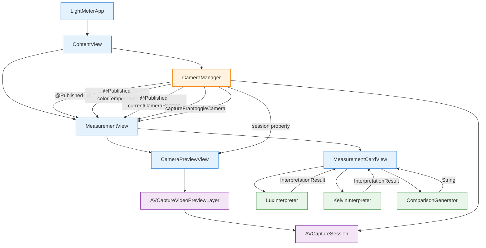
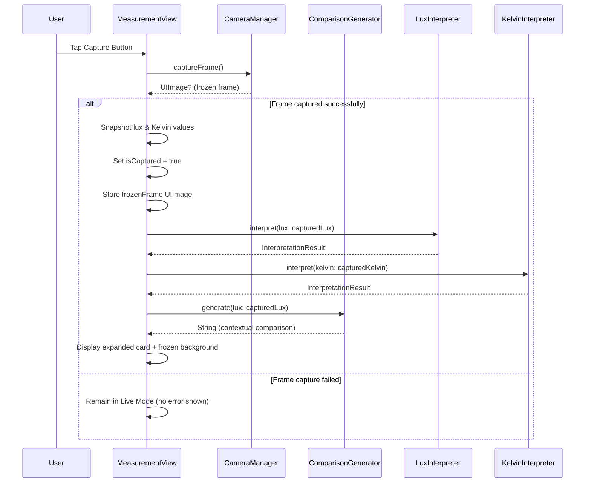
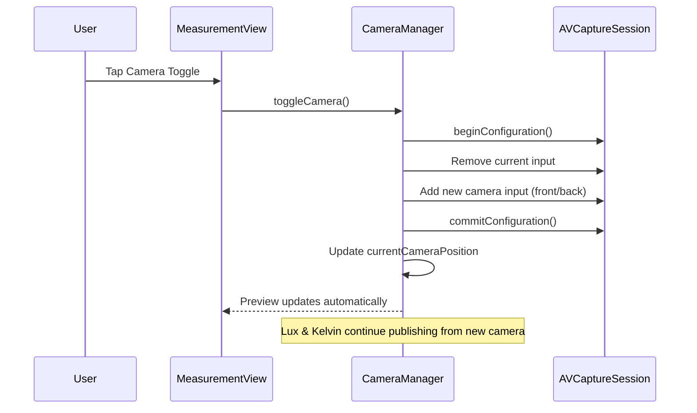

# Design Document: Capture & Freeze

## Overview

This design adds capture-and-freeze functionality to the Light Meter app, building on specs 01 (skeleton) and 02 (interpretation + live preview). Three capabilities are introduced:

1. **Capture & mode transition** — A capture button freezes the live camera feed as a still image and transitions the UI from a compact live-mode card to an expanded captured-mode card showing interpretation details and a contextual comparison sentence. A back arrow returns to live mode.
2. **Camera toggle** — A toggle button switches between front and rear cameras without interrupting the capture session lifecycle.
3. **Contextual comparison** — A pure function (`ComparisonGenerator`) that accepts a lux value and returns a sentence comparing the current environment to adjacent lux ranges (e.g., "Brighter than a movie theater but darker than a living room").

### Key Design Decisions

- **ComparisonGenerator is pure logic**: Following the deterministic-split steering doc, `ComparisonGenerator` is a stateless struct with a static method, no framework imports, and is trivially testable with property-based tests. It reuses the same 8 lux range definitions as `LuxInterpreter`.
- **CameraManager gains two effect methods**: `captureFrame()` produces a `UIImage` from the current video output buffer, and `toggleCamera()` swaps front/rear inputs. Both are thin AVFoundation wrappers with minimal logic.
- **MeasurementView refactored into live/captured modes**: The view manages an `isCaptured` state. In live mode it shows a compact frosted-glass card with lux + Kelvin. In captured mode it shows the frozen frame background, an expanded card with interpretation + comparison, and a back arrow.
- **Frozen frame from sample buffer**: Rather than using `AVCapturePhotoOutput` (which adds complexity and shutter sound), we convert the latest `CMSampleBuffer` to a `UIImage`. This is silent, instant, and doesn't interrupt the session.
- **Session stays running in captured mode**: The `AVCaptureSession` continues running while the frozen frame is displayed. This avoids the cost of stopping/restarting the session when returning to live mode.
- **Captured values are snapshotted**: When the user taps capture, the current lux and Kelvin values are copied into local state. The expanded card displays these frozen values, not the live-updating ones.

## Architecture



### Data Flow — Capture Action



### Data Flow — Camera Toggle



## Components and Interfaces

### ComparisonGenerator (Pure Logic Layer — NEW)

A pure function that maps a lux value to a contextual comparison sentence. No framework imports. Uses the same 8 lux range definitions as `LuxInterpreter`.

```swift
struct ComparisonGenerator {
    /// Returns a contextual comparison sentence for the given lux value.
    /// - Lowest range (0–10): "Darker than [upper adjacent environment]"
    /// - Highest range (10,001+): "Brighter than [lower adjacent environment]"
    /// - Middle ranges: "Brighter than [lower environment] but darker than [upper environment]"
    static func generate(lux: Double) -> String
}
```

The range definitions used internally:

| Index | Lux Range | Environment Description |
|-------|-----------|------------------------|
| 0 | 0–10 | Very dark outdoors, full moon night |
| 1 | 11–100 | Hallways, bathrooms, storage rooms, movie theaters |
| 2 | 101–200 | Living room relaxation, dining, hotel rooms |
| 3 | 201–500 | General office work, kitchen cooking, light reading |
| 4 | 501–1,000 | Focused studying, precision handwork, store displays |
| 5 | 1,001–2,000 | Bright window (indoors), broadcast studios, operating rooms |
| 6 | 2,001–10,000 | Cloudy day outdoors, sunset outdoors |
| 7 | 10,001+ | Direct sunlight on a clear day, noon outdoors |

Sentence generation logic:
- Find the range index `i` that contains the lux value (negative values → index 0)
- If `i == 0`: return `"Darker than \(ranges[1].environment)"`
- If `i == 7`: return `"Brighter than \(ranges[6].environment)"`
- Otherwise: return `"Brighter than \(ranges[i-1].environment) but darker than \(ranges[i+1].environment)"`

The environment descriptions used in comparison sentences are shortened forms (lowercase, no articles) derived from the range table. For example, range 1 uses "hallways and movie theaters" rather than the full description.

### CameraManager (Effects Layer — MODIFIED)

Additions to the existing `CameraManager` class:

```swift
class CameraManager: NSObject, ObservableObject {
    // Existing published properties (unchanged)
    @Published var lux: Double = 0.0
    @Published var colorTemperature: Double = 0.0
    @Published var cameraError: String? = nil
    @Published var permissionGranted: Bool = false

    // NEW published property
    @Published var currentCameraPosition: AVCaptureDevice.Position = .back

    // Existing session property (unchanged)
    var session: AVCaptureSession { captureSession }

    // NEW: Latest sample buffer for frame capture
    private var latestSampleBuffer: CMSampleBuffer?

    // NEW: Capture the current frame as a UIImage
    /// Returns a UIImage from the latest video sample buffer, or nil if unavailable.
    func captureFrame() -> UIImage?

    // NEW: Toggle between front and rear cameras
    /// Switches the active camera input. If the target camera is unavailable,
    /// retains the current input silently.
    func toggleCamera()

    // Existing methods (unchanged)
    func requestPermission()
    func setupSession()
    func startSession()
    func stopSession()
}
```

Implementation notes:
- `captureFrame()` converts `latestSampleBuffer` to a `UIImage` via `CIImage` → `CGImage` → `UIImage`. Returns `nil` if no buffer is available.
- `latestSampleBuffer` is updated on every `captureOutput` delegate call (replacing the previous buffer).
- `toggleCamera()` runs on `sessionQueue`, calls `beginConfiguration()`, removes the current input, creates a new `AVCaptureDeviceInput` for the opposite position, adds it, and calls `commitConfiguration()`. Updates `currentCameraPosition` on the main thread.
- `setupSession()` is updated to use `currentCameraPosition` instead of hardcoding `.back`, so it works correctly after a toggle.

### MeasurementView (Glue Layer — MAJOR REFACTOR)

The view now manages live/captured mode state and delegates card rendering to `MeasurementCardView`.

```swift
struct MeasurementView: View {
    @ObservedObject var cameraManager: CameraManager

    // Capture state
    @State private var isCaptured: Bool = false
    @State private var frozenFrame: UIImage? = nil
    @State private var capturedLux: Double = 0.0
    @State private var capturedKelvin: Double = 0.0

    var body: some View {
        ZStack {
            // Background: live preview or frozen frame
            if isCaptured, let frame = frozenFrame {
                Image(uiImage: frame)
                    .resizable()
                    .aspectRatio(contentMode: .fill)
                    .ignoresSafeArea()
            } else if cameraManager.permissionGranted {
                CameraPreviewView(session: cameraManager.session)
                    .ignoresSafeArea()
            } else {
                Color.black.ignoresSafeArea()
            }

            // Overlay content
            VStack {
                // Back arrow (captured mode only)
                if isCaptured {
                    HStack {
                        Button(action: returnToLiveMode) {
                            // Back arrow icon
                        }
                        Spacer()
                    }
                }

                // Measurement card
                MeasurementCardView(
                    lux: isCaptured ? capturedLux : cameraManager.lux,
                    kelvin: isCaptured ? capturedKelvin : cameraManager.colorTemperature,
                    isCaptured: isCaptured
                )

                Spacer()

                // Bottom controls (live mode only)
                if !isCaptured {
                    HStack {
                        Button(action: capture) {
                            // Capture button circle
                        }
                        Button(action: { cameraManager.toggleCamera() }) {
                            // Camera toggle icon
                        }
                    }
                }
            }
        }
    }

    private func capture() {
        guard let frame = cameraManager.captureFrame() else { return }
        frozenFrame = frame
        capturedLux = cameraManager.lux
        capturedKelvin = cameraManager.colorTemperature
        isCaptured = true
    }

    private func returnToLiveMode() {
        isCaptured = false
        frozenFrame = nil
    }
}
```

### MeasurementCardView (Glue Layer — NEW)

A reusable card component that renders compact (live) or expanded (captured) content.

```swift
struct MeasurementCardView: View {
    let lux: Double
    let kelvin: Double
    let isCaptured: Bool

    var body: some View {
        VStack(spacing: 8) {
            // Always shown: Kelvin + Lux readings
            Text(String(format: "%.0f", kelvin))
                .font(.system(size: 20, weight: .medium))
            Text("K")
                .font(.system(size: 12))
            Text(String(format: "%.0f", lux))
                .font(.system(size: 48, weight: .bold, design: .monospaced))
            Text("LUX")
                .font(.system(size: 14))

            // Expanded content (captured mode only)
            if isCaptured {
                Divider()
                Text("User Guide")
                    .font(.system(size: 14, weight: .semibold))
                Text(LuxInterpreter.interpret(lux: lux).description)
                    .font(.system(size: 13))
                Text(LuxInterpreter.interpret(lux: lux).tip)
                    .font(.system(size: 12))
                Text(ComparisonGenerator.generate(lux: lux))
                    .font(.system(size: 12))
                    .italic()
            }
        }
        .foregroundColor(.white)
        .padding()
        .background(.ultraThinMaterial) // Frosted glass effect
        .cornerRadius(16)
    }
}
```

### CameraPreviewView (Unchanged)

No modifications needed. Continues to wrap `AVCaptureVideoPreviewLayer`.

### LuxInterpreter / KelvinInterpreter / InterpretationResult (Unchanged)

Reused as-is from spec 02.

## Data Models

### ComparisonGenerator Range Data (compile-time constant)

Uses the same 8 ranges as `LuxInterpreter`. Stored as an internal array of tuples:

| Index | Upper Bound | Short Environment Label (for comparison sentences) |
|-------|-------------|-----------------------------------------------------|
| 0 | 10 | very dark outdoors |
| 1 | 100 | hallways and movie theaters |
| 2 | 200 | a living room |
| 3 | 500 | an office |
| 4 | 1,000 | a study room |
| 5 | 2,000 | a bright window indoors |
| 6 | 10,000 | a cloudy day outdoors |
| 7 | ∞ | direct sunlight |

### CameraManager Published State (additions to spec 01/02)

| Property | Type | Description |
|----------|------|-------------|
| `currentCameraPosition` | `AVCaptureDevice.Position` | Currently active camera (`.front` or `.back`) |
| `latestSampleBuffer` | `CMSampleBuffer?` (private) | Most recent video frame for capture |

### MeasurementView State

| Property | Type | Description |
|----------|------|-------------|
| `isCaptured` | `Bool` | Whether the app is in captured mode |
| `frozenFrame` | `UIImage?` | The captured still image |
| `capturedLux` | `Double` | Lux value at moment of capture |
| `capturedKelvin` | `Double` | Kelvin value at moment of capture |

