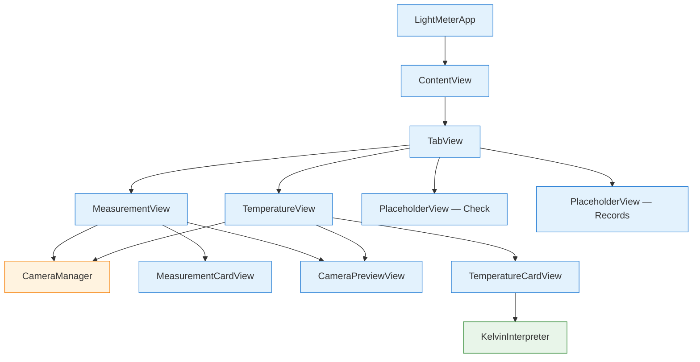
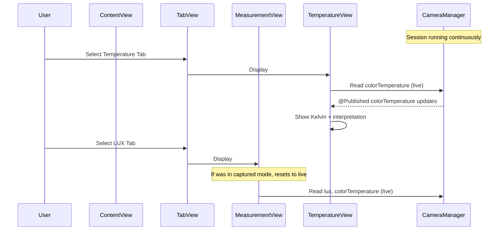

# Design Document: Tab Navigation

## Overview

This design adds a four-tab navigation structure to the Light Meter app, building on specs 01–03. The tab bar provides the app's top-level navigation and becomes the structural skeleton for all remaining features.

Two new capabilities are introduced:

1. **Tab bar with four tabs** — A SwiftUI `TabView` hosts LUX (existing measurement flow), Temperature (new dedicated view), Check (placeholder), and Records (placeholder). A single `CameraManager` instance is shared across all tabs.
2. **Temperature view** — A new view showing the live camera background with a frosted-glass card displaying the Kelvin reading and its interpretation from `KelvinInterpreter`.

### Key Design Decisions

- **Single CameraManager, owned by ContentView**: `ContentView` continues to own the `@StateObject` CameraManager and passes it down to each tab's view. This avoids duplicate sessions and ensures seamless tab switching.
- **TabView with programmatic selection**: A `@State var selectedTab` binding controls the active tab. This enables future features (e.g., navigating to Records after a capture) and allows hiding the tab bar conditionally.
- **Tab bar hidden in captured mode**: When `MeasurementView` is in captured mode, the tab bar is hidden using `.toolbar(.hidden, for: .tabBar)`. This gives the frozen-frame experience a full-screen feel. Returning to live mode restores the tab bar.
- **Captured state resets on tab switch**: If the user is in captured mode on the LUX tab and switches to another tab, the captured state resets to live mode when they return. This avoids stale frozen frames and simplifies state management.
- **TemperatureView is a thin glue view**: It reuses `CameraPreviewView` for the background and `KelvinInterpreter` for interpretation — no new pure logic or effects needed.
- **Placeholder views are minimal**: Check and Records placeholders are simple `VStack` views with title + "Coming Soon" text on a dark background. They'll be replaced by real implementations in future specs.

## Architecture



### Data Flow — Tab Switching



## Components and Interfaces

### ContentView (Glue Layer — REFACTORED)

Refactored from a single-view container to a `TabView` host. Owns the shared `CameraManager` and manages tab selection state.

```swift
struct ContentView: View {
    @StateObject private var cameraManager = CameraManager()
    @State private var selectedTab: Int = 0

    var body: some View {
        TabView(selection: $selectedTab) {
            MeasurementView(cameraManager: cameraManager)
                .tabItem {
                    Image(systemName: "sun.max")
                    Text("LUX")
                }
                .tag(0)

            TemperatureView(cameraManager: cameraManager)
                .tabItem {
                    Image(systemName: "thermometer.medium")
                    Text("Temperature")
                }
                .tag(1)

            PlaceholderView(title: "Flicker Detection", subtitle: "Coming Soon")
                .tabItem {
                    Image(systemName: "checkmark.shield")
                    Text("Check")
                }
                .tag(2)

            PlaceholderView(title: "Records", subtitle: "Coming Soon")
                .tabItem {
                    Image(systemName: "list.clipboard")
                    Text("Records")
                }
                .tag(3)
        }
        .onAppear {
            cameraManager.requestPermission()
        }
        .onReceive(
            NotificationCenter.default.publisher(
                for: UIApplication.willEnterForegroundNotification
            )
        ) { _ in
            cameraManager.startSession()
        }
        .onReceive(
            NotificationCenter.default.publisher(
                for: UIApplication.didEnterBackgroundNotification
            )
        ) { _ in
            cameraManager.stopSession()
        }
    }
}
```

Key changes from current `ContentView`:
- Wraps views in a `TabView` with `selection` binding
- Lifecycle management (permission, foreground/background) stays at this level
- `CameraManager` passed to both `MeasurementView` and `TemperatureView`

### MeasurementView (Glue Layer — MINOR MODIFICATION)

Two small additions to the existing view:

1. **Hide tab bar in captured mode**: Add `.toolbar(.hidden, for: .tabBar)` when `isCaptured` is true.
2. **Reset captured state on disappear**: Add `.onDisappear` to call `returnToLiveMode()` so switching tabs clears the frozen frame.

```swift
struct MeasurementView: View {
    // ... existing code unchanged ...

    var body: some View {
        ZStack {
            // ... existing layout unchanged ...
        }
        .toolbar(isCaptured ? .hidden : .visible, for: .tabBar)
        .onDisappear {
            if isCaptured {
                returnToLiveMode()
            }
        }
    }
}
```

### TemperatureView (Glue Layer — NEW)

A dedicated view for the Temperature tab. Shows the live camera background with a frosted-glass card containing the Kelvin reading and interpretation.

```swift
struct TemperatureView: View {
    @ObservedObject var cameraManager: CameraManager

    var body: some View {
        ZStack {
            // Background: live camera or black fallback
            if cameraManager.permissionGranted {
                CameraPreviewView(session: cameraManager.session)
                    .ignoresSafeArea()
            } else {
                Color.black.ignoresSafeArea()
            }

            VStack {
                if !cameraManager.permissionGranted {
                    Spacer()
                    Text("Camera access is required to measure light.\nPlease enable it in Settings.")
                        .font(.system(size: 16))
                        .foregroundColor(.white)
                        .multilineTextAlignment(.center)
                        .padding()
                    Spacer()
                } else {
                    // Temperature card
                    TemperatureCardView(
                        kelvin: cameraManager.colorTemperature
                    )
                    .padding(.horizontal)

                    Spacer()
                }
            }
        }
    }
}
```

### TemperatureCardView (Glue Layer — NEW)

A frosted-glass card showing the Kelvin reading with its interpretation.

```swift
struct TemperatureCardView: View {
    let kelvin: Double

    private var interpretation: InterpretationResult {
        KelvinInterpreter.interpret(kelvin: kelvin)
    }

    var body: some View {
        VStack(spacing: 8) {
            // Kelvin reading
            Text(String(format: "%.0f", kelvin))
                .font(.system(size: 48, weight: .bold, design: .monospaced))
            Text("K")
                .font(.system(size: 14))

            Divider()

            // Color tone label
            Text(interpretation.description)
                .font(.system(size: 18, weight: .semibold))

            // Recommended environment
            Text(interpretation.tip)
                .font(.system(size: 14))
                .multilineTextAlignment(.center)
        }
        .foregroundColor(.white)
        .padding()
        .background(.ultraThinMaterial)
        .cornerRadius(16)
    }
}
```

### PlaceholderView (Glue Layer — NEW)

A minimal reusable placeholder for unimplemented tabs.

```swift
struct PlaceholderView: View {
    let title: String
    let subtitle: String

    var body: some View {
        ZStack {
            Color.black.ignoresSafeArea()

            VStack(spacing: 12) {
                Text(title)
                    .font(.system(size: 24, weight: .bold))
                    .foregroundColor(.white)
                Text(subtitle)
                    .font(.system(size: 16))
                    .foregroundColor(.gray)
            }
        }
    }
}
```

### Unchanged Components

- **CameraManager**: No modifications. Shared instance passed to multiple views.
- **CameraPreviewView**: No modifications. Reused by both MeasurementView and TemperatureView.
- **MeasurementCardView**: No modifications.
- **LuxInterpreter / KelvinInterpreter / ComparisonGenerator**: No modifications.
- **LightMeterApp**: No modifications (still renders `ContentView`).

## Data Models

No new data models are introduced. The tab selection is a simple `Int` state variable.

### Tab Index Mapping

| Index | Tab | View | Icon |
|-------|-----|------|------|
| 0 | LUX | MeasurementView | sun.max |
| 1 | Temperature | TemperatureView | thermometer.medium |
| 2 | Check | PlaceholderView | checkmark.shield |
| 3 | Records | PlaceholderView | list.clipboard |
