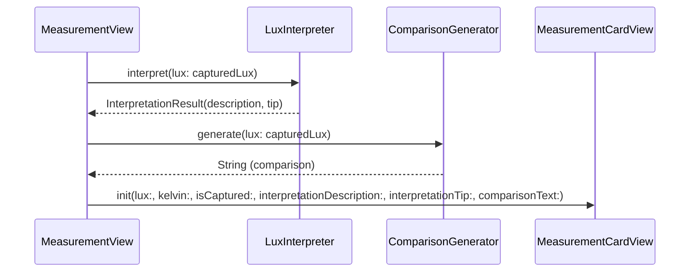

# Design Document

## Overview

This refactor enforces the deterministic split across the LightMeter codebase by removing platform-specific framework imports (`CoreMedia`, `AVFoundation`) from the pure logic layer. It also cleans up the glue layer by extracting business logic calls out of `MeasurementCardView`, syncs `Package.swift` to include all pure logic files, and adds the settings gear icon placeholder required by the product spec.

After this refactor:
- **Pure Logic layer** (`LuxCalculator`, `ColorTemperatureCalculator`, `LuxInterpreter`, `KelvinInterpreter`, `ComparisonGenerator`, `InterpretationResult`) will have zero platform framework imports.
- **Effects layer** (`CameraManager`) will be the sole owner of `AVFoundation` and `CoreMedia` imports, performing all hardware-specific conversions before calling pure functions.
- **Glue layer** (SwiftUI views) will pass pre-computed data to display components without invoking business logic in the rendering path.
- **SPM target** will compile and test all pure logic files without platform dependencies.

### Design Rationale

The current architecture has three P0 violations identified in CODE-REVIEW.md:
1. `LuxCalculator` imports `CoreMedia` for `CMTime` — couples pure logic to Apple platform.
2. `ColorTemperatureCalculator` imports `AVFoundation` and takes `AVCaptureDevice` — makes the "pure" struct untestable without hardware.
3. `Package.swift` excludes both calculators, so `swift test` doesn't exercise them.

Additionally, `MeasurementCardView` calls `LuxInterpreter.interpret()` and `ComparisonGenerator.generate()` inline in its view body (P1 #6), and the settings gear icon from the product spec is missing (P1 #7 / CODE-REVIEW question #2).

The fix is straightforward: push all `CMTime` and `AVCaptureDevice` conversions into `CameraManager.captureOutput(...)`, change calculator signatures to accept plain `Double`/`Float` values, and have `MeasurementView` pre-compute interpretation strings before passing them to the card.

## Architecture

```mermaid
graph TB
    subgraph "Effects Layer"
        CM["CameraManager"]
    end

    subgraph "Pure Logic Layer"
        LC["LuxCalculator"]
        CTC["ColorTemperatureCalculator"]
        LI["LuxInterpreter"]
        KI["KelvinInterpreter"]
        CG["ComparisonGenerator"]
        IR["InterpretationResult"]
    end

    subgraph "Glue Layer"
        CV["ContentView"]
        MV["MeasurementView"]
        MCV["MeasurementCardView"]
        TV["TemperatureView"]
        TCV["TemperatureCardView"]
        PV["PlaceholderView"]
    end

    CM -- "exposureDurationInSeconds: Double" --> LC
    CM -- "rawKelvin: Double" --> CTC

    MV -- "calls interpret/generate" --> LI
    MV -- "pre-computed strings" --> MCV
    MV -- "gear icon tap" --> PV
    TV -- "gear icon tap" --> PV
    CV --> MV
    CV --> TV

    style CM fill:#fff3e0,stroke:#f57c00
    style LC fill:#e8f5e9,stroke:#388e3c
    style CTC fill:#e8f5e9,stroke:#388e3c
    style LI fill:#e8f5e9,stroke:#388e3c
    style KI fill:#e8f5e9,stroke:#388e3c
    style CG fill:#e8f5e9,stroke:#388e3c
    style IR fill:#e8f5e9,stroke:#388e3c
    style CV fill:#e3f2fd,stroke:#1976d2
    style MV fill:#e3f2fd,stroke:#1976d2
    style MCV fill:#e3f2fd,stroke:#1976d2
    style TV fill:#e3f2fd,stroke:#1976d2
    style TCV fill:#e3f2fd,stroke:#1976d2
    style PV fill:#e3f2fd,stroke:#1976d2

### Data Flow: Sample Buffer → Published Values

```mermaid
sequenceDiagram
    participant HW as Camera Hardware
    participant CM as CameraManager
    participant LC as LuxCalculator
    participant CTC as ColorTemperatureCalculator
    participant UI as SwiftUI Views

    HW->>CM: captureOutput(sampleBuffer)
    CM->>CM: CMTimeGetSeconds(device.exposureDuration)
    CM->>CM: device.temperatureAndTintValues(for: gains).temperature
    CM->>LC: calculateLux(iso: Float, exposureDurationInSeconds: Double)
    LC-->>CM: Double (lux)
    CM->>CTC: calculateColorTemperature(rawKelvin: Double)
    CTC-->>CM: Double (clamped kelvin)
    CM->>UI: @Published lux, colorTemperature
```

### Data Flow: MeasurementView → MeasurementCardView (Captured Mode)



## Components and Interfaces

### 1. LuxCalculator (Pure Logic — modified)

**File:** `LightMeter/LuxCalculator.swift`

**Before:**
```swift
import CoreMedia

struct LuxCalculator {
    static func calculateLux(
        iso: Float,
        exposureDuration: CMTime,
        calibrationConstant: Double = defaultCalibrationConstant,
        aperture: Double = defaultAperture
    ) -> Double
}
```

**After:**
```swift
// No imports

struct LuxCalculator {
    static let defaultCalibrationConstant: Double = 12.5
    static let defaultAperture: Double = 1.6

    static func calculateLux(
        iso: Float,
        exposureDurationInSeconds: Double,
        calibrationConstant: Double = defaultCalibrationConstant,
        aperture: Double = defaultAperture
    ) -> Double
}
```

**Changes:**
- Remove `import CoreMedia`
- Replace `exposureDuration: CMTime` with `exposureDurationInSeconds: Double`
- Remove internal `CMTimeGetSeconds()` call
- Guard logic and formula remain identical

### 2. ColorTemperatureCalculator (Pure Logic — modified)

**File:** `LightMeter/ColorTemperatureCalculator.swift`

**Before:**
```swift
import AVFoundation

struct ColorTemperatureCalculator {
    static func calculateColorTemperature(
        gains: AVCaptureDevice.WhiteBalanceGains,
        device: AVCaptureDevice
    ) -> Double

    static func clamp(_ kelvin: Double) -> Double
}
```

**After:**
```swift
// No imports

struct ColorTemperatureCalculator {
    static let minKelvin: Double = 1000.0
    static let maxKelvin: Double = 15000.0

    static func calculateColorTemperature(rawKelvin: Double) -> Double {
        return clamp(rawKelvin)
    }

    static func clamp(_ kelvin: Double) -> Double {
        return min(max(kelvin, minKelvin), maxKelvin)
    }
}
```

**Changes:**
- Remove `import AVFoundation`
- Remove `calculateColorTemperature(gains:device:)` method
- Add `calculateColorTemperature(rawKelvin: Double) -> Double` that delegates to `clamp()`
- `clamp()` remains unchanged

### 3. CameraManager (Effects Layer — modified)

**File:** `LightMeter/CameraManager.swift`

**Changes to `captureOutput(_:didOutput:from:)`:**

```swift
nonisolated func captureOutput(
    _ output: AVCaptureOutput,
    didOutput sampleBuffer: CMSampleBuffer,
    from connection: AVCaptureConnection
) {
    latestSampleBuffer = sampleBuffer
    guard let device = captureDevice else { return }

    let iso = device.iso
    let exposureDurationInSeconds = CMTimeGetSeconds(device.exposureDuration)
    let gains = device.deviceWhiteBalanceGains
    let rawKelvin = Double(device.temperatureAndTintValues(for: gains).temperature)

    let luxValue = LuxCalculator.calculateLux(
        iso: iso,
        exposureDurationInSeconds: exposureDurationInSeconds
    )

    let kelvinValue = ColorTemperatureCalculator.calculateColorTemperature(
        rawKelvin: rawKelvin
    )

    Task { @MainActor [weak self] in
        self?.lux = luxValue
        self?.colorTemperature = kelvinValue
    }
}
```

**Key change:** `CMTimeGetSeconds()` and `device.temperatureAndTintValues(for:)` are now called in `CameraManager` before invoking the pure calculators. The calculators receive only primitive values.

### 4. MeasurementCardView (Glue Layer — modified)

**File:** `LightMeter/MeasurementCardView.swift`

**Before:** Calls `LuxInterpreter.interpret(lux:)` and `ComparisonGenerator.generate(lux:)` inline.

**After:**
```swift
struct MeasurementCardView: View {
    let lux: Double
    let kelvin: Double
    let isCaptured: Bool
    var interpretationDescription: String = ""
    var interpretationTip: String = ""
    var comparisonText: String = ""

    var body: some View {
        VStack(spacing: 8) {
            // Kelvin reading
            Text(String(format: "%.0f", kelvin))
                .font(.system(size: 20, weight: .medium))
            Text("K")
                .font(.system(size: 12))

            // Lux reading
            Text(String(format: "%.0f", lux))
                .font(.system(size: 48, weight: .bold, design: .monospaced))
            Text("LUX")
                .font(.system(size: 14))

            // Expanded content (captured mode only)
            if isCaptured {
                Divider()
                Text("User Guide")
                    .font(.system(size: 14, weight: .semibold))
                Text(interpretationDescription)
                    .font(.system(size: 13))
                Text(interpretationTip)
                    .font(.system(size: 12))
                Text(comparisonText)
                    .font(.system(size: 12))
                    .italic()
            }
        }
        .foregroundColor(.white)
        .padding()
        .background(.ultraThinMaterial)
        .cornerRadius(16)
    }
}
```

**Changes:**
- Remove direct calls to `LuxInterpreter` and `ComparisonGenerator`
- Add `interpretationDescription`, `interpretationTip`, `comparisonText` parameters with empty string defaults
- Display the pre-computed strings in captured mode

### 5. MeasurementView (Glue Layer — modified)

**File:** `LightMeter/MeasurementView.swift`

**Changes:**
- Pre-compute interpretation results in `capture()` method using `LuxInterpreter.interpret(lux:)` and `ComparisonGenerator.generate(lux:)`
- Store results in `@State` properties
- Pass pre-computed strings to `MeasurementCardView`
- Add gear icon button (SF Symbol `"gearshape"`) in top-right corner during live mode
- Hide gear icon in captured mode (back arrow takes its place)
- Gear icon navigates to `PlaceholderView(title: "Settings", subtitle: "Coming Soon")`

**New state properties:**
```swift
@State private var capturedInterpretationDescription: String = ""
@State private var capturedInterpretationTip: String = ""
@State private var capturedComparisonText: String = ""
```

**Updated capture():**
```swift
private func capture() {
    guard let frame = cameraManager.captureFrame() else { return }
    frozenFrame = frame
    capturedLux = cameraManager.lux
    capturedKelvin = cameraManager.colorTemperature
    let interpretation = LuxInterpreter.interpret(lux: capturedLux)
    capturedInterpretationDescription = interpretation.description
    capturedInterpretationTip = interpretation.tip
    capturedComparisonText = ComparisonGenerator.generate(lux: capturedLux)
    isCaptured = true
}
```

### 6. TemperatureView (Glue Layer — modified)

**File:** `LightMeter/TemperatureView.swift`

**Changes:**
- Add gear icon button (SF Symbol `"gearshape"`) in top-right corner
- Gear icon navigates to `PlaceholderView(title: "Settings", subtitle: "Coming Soon")`

### 7. Package.swift (Build Config — modified)

**File:** `Package.swift`

**Changes:**
- Add `"LuxCalculator.swift"` to SPM target sources
- Add `"ColorTemperatureCalculator.swift"` to SPM target sources
- Add `"LuxCalculatorTests.swift"` to SPM test target sources
- Add `"ColorTemperatureCalculatorTests.swift"` to SPM test target sources

### 8. Test Files (modified)

**LuxCalculatorTests.swift:**
- Remove `import CoreMedia`
- Replace all `CMTime` / `CMTimeMake` / `CMTimeMakeWithSeconds` usage with plain `Double` values
- Call `calculateLux(iso:, exposureDurationInSeconds:)` instead of `calculateLux(iso:, exposureDuration:)`
- Keep all property-based tests, adapting to new signature

**ColorTemperatureCalculatorTests.swift:**
- Remove `import AVFoundation` (not currently imported, but ensure it stays absent)
- Add tests for `calculateColorTemperature(rawKelvin:)` method
- Keep existing `clamp()` tests and property-based clamping invariant test

## Data Models

No new data models are introduced. The existing `InterpretationResult` struct remains unchanged:

```swift
struct InterpretationResult: Equatable {
    let description: String
    let tip: String
}
```

The only data model change is at the interface boundary:
- `LuxCalculator.calculateLux` parameter changes from `CMTime` to `Double`
- `ColorTemperatureCalculator.calculateColorTemperature` parameter changes from `(AVCaptureDevice.WhiteBalanceGains, AVCaptureDevice)` to `Double`
- `MeasurementCardView` gains three new `String` parameters for pre-computed interpretation data


## Correctness Properties

*A property is a characteristic or behavior that should hold true across all valid executions of a system — essentially, a formal statement about what the system should do. Properties serve as the bridge between human-readable specifications and machine-verifiable correctness guarantees.*

### Property 1: Lux formula correctness

*For any* positive `iso` (Float in 0.01...10000) and positive `exposureDurationInSeconds` (Double in 0.00001...30.0), `LuxCalculator.calculateLux` SHALL return a value equal to `(calibrationConstant * aperture²) / (Double(iso) * exposureDurationInSeconds)` within a relative tolerance of 1e-6.

**Validates: Requirements 1.3, 1.7, 7.5**

### Property 2: Lux non-negativity invariant

*For any* `iso` (Float in -1000...10000) and `exposureDurationInSeconds` (Double in -10.0...30.0), `LuxCalculator.calculateLux` SHALL return a value greater than or equal to 0.0.

**Validates: Requirements 1.4, 1.5, 1.6, 7.6**

### Property 3: Color temperature clamping invariant

*For any* `rawKelvin` (Double in -1000...50000), `ColorTemperatureCalculator.calculateColorTemperature(rawKelvin:)` SHALL return a value in the range [1000.0, 15000.0].

**Validates: Requirements 2.2, 2.3, 2.4, 2.6, 7.7**

### Property 4: Color temperature identity for in-range values

*For any* `rawKelvin` (Double in 1000.0...15000.0), `ColorTemperatureCalculator.calculateColorTemperature(rawKelvin:)` SHALL return the input value unchanged (output == input).

**Validates: Requirements 2.5**

## Error Handling

### LuxCalculator

- **Invalid inputs (iso ≤ 0 or exposureDurationInSeconds ≤ 0):** Returns `0.0` via the existing guard clause. No exceptions thrown. This is a safe default — zero lux means "no light measured."
- **Overflow:** For extremely large iso or extremely small exposure values, the division could produce very large results. The `max(lux, 0.0)` guard ensures non-negativity but does not cap the upper bound. This matches the current behavior and is acceptable since real camera hardware constrains these values.

### ColorTemperatureCalculator

- **Out-of-range inputs:** Clamped to [1000, 15000] via `min(max(...))`. No exceptions thrown.
- **NaN/Infinity:** If `rawKelvin` is `NaN`, `min(max(NaN, 1000))` returns `NaN` in Swift. This is an edge case from hardware — `CameraManager` should guard against `NaN` before calling the calculator. However, this is pre-existing behavior and out of scope for this refactor.

### CameraManager

- **No changes to error handling.** The existing error states (`cameraError`, `permissionGranted`) remain unchanged. The only change is where `CMTimeGetSeconds()` and `device.temperatureAndTintValues(for:)` are called — they move from the calculators into `captureOutput(...)`, which already runs on the session queue with proper error context.

### MeasurementCardView / MeasurementView

- **No error states.** The card displays whatever strings it receives. If interpretation strings are empty (live mode), the captured-mode section is hidden via the `isCaptured` flag.

### Settings Navigation

- **No error states.** The gear icon navigates to a static `PlaceholderView`. No network calls or data loading involved.

## Testing Strategy

### Dual Testing Approach

This refactor uses both unit tests and property-based tests:

- **Property-based tests** verify universal invariants across randomized inputs (Properties 1–4)
- **Unit tests** verify specific known values, edge cases, and the new `calculateColorTemperature(rawKelvin:)` method

### Property-Based Testing

**Library:** Swift Testing framework with manual randomization (matching existing test patterns in the codebase — `SystemRandomNumberGenerator` with 100-iteration loops).

**Configuration:**
- Minimum 100 iterations per property test
- Each property test references its design document property via a comment tag

**Tag format:** `Feature: 05-deterministic-split-refactor, Property {number}: {property_text}`

**Property test implementations:**

| Property | Test Method | File |
|----------|------------|------|
| Property 1: Lux formula correctness | `property_luxFormulaCorrectness()` | `LuxCalculatorTests.swift` |
| Property 2: Lux non-negativity invariant | `property_luxNonNegativity()` | `LuxCalculatorTests.swift` |
| Property 3: Color temperature clamping invariant | `property_clampingInvariant()` | `ColorTemperatureCalculatorTests.swift` |
| Property 4: Color temperature identity for in-range values | `property_identityForInRangeValues()` | `ColorTemperatureCalculatorTests.swift` |

Each property-based test MUST be implemented as a SINGLE test method with a loop of 100+ iterations using `SystemRandomNumberGenerator`.

### Unit Tests

**LuxCalculatorTests.swift:**
- `knownValues()` — verifies a specific iso=100, exposure=1/125s calculation
- `zeroISO_returnsZero()` — edge case
- `negativeISO_returnsZero()` — edge case
- `zeroExposure_returnsZero()` — edge case
- `veryLargeISO_returnsSmallPositive()` — edge case

All unit tests updated to use `Double` for exposure duration instead of `CMTime`.

**ColorTemperatureCalculatorTests.swift:**
- Existing `clamp()` unit tests retained (below min, above max, within range, at boundaries)
- New `calculateColorTemperature_belowMin_returnsMin()` — tests the new public method
- New `calculateColorTemperature_aboveMax_returnsMax()` — tests the new public method
- New `calculateColorTemperature_withinRange_returnsUnchanged()` — tests the new public method

### What Is NOT Tested

- **CameraManager wiring** (Requirements 3.x): Verified by code review and successful Xcode build. Integration testing requires a real device.
- **UI layout** (Requirements 5.3, 5.4, 6.x): Verified by SwiftUI previews and manual testing. No automated UI tests in scope.
- **Package.swift correctness** (Requirements 4.x): Verified by successful `swift test` execution.
- **Import absence** (Requirements 1.2, 2.1, 7.2, 7.4): Verified by successful SPM compilation — if platform frameworks were imported, the SPM target would fail to compile on macOS without iOS SDK.
