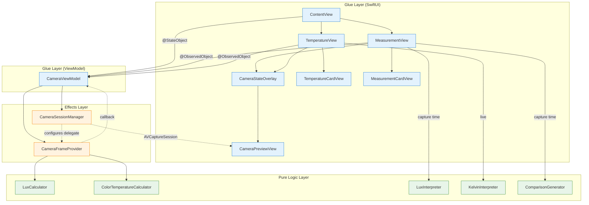
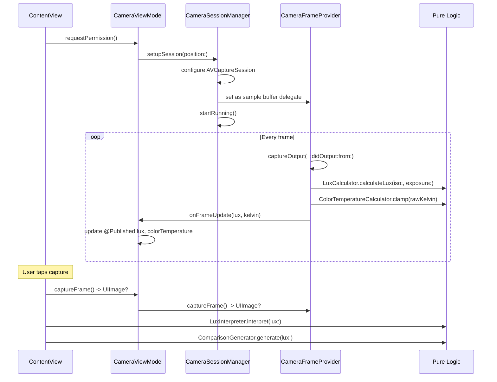

# Design Document — UI Architecture Cleanup

## Overview

This design refactors the monolithic `CameraManager` (~180 lines) into three focused components following the deterministic split architecture, extracts duplicated permission/error UI into a shared overlay, and makes `TemperatureCardView` a pure display component.

The current `CameraManager` violates single-responsibility by handling session lifecycle, sample buffer delegation, frame capture, and `@Published` state for SwiftUI views — all in one class. The refactor splits these concerns:

| New Component | Layer | Responsibility |
|---|---|---|
| `CameraSessionManager` | Effects | AVCaptureSession lifecycle, input/output setup, start/stop, camera toggle |
| `CameraFrameProvider` | Effects | Sample buffer delegate, latest buffer storage, frame capture, lux/kelvin computation dispatch |
| `CameraViewModel` | Glue | `@Published` properties, coordinates session manager + frame provider, observed by views |
| `CameraStateOverlay` | Glue | Shared permission-denied / error / live-preview background component |

The old `CameraManager.swift` is deleted after migration. No user-visible behavior changes.

## Architecture

### Component Diagram



### Data Flow



### Swift 6 Concurrency Strategy

The current `CameraManager` uses `nonisolated(unsafe)` to bridge `@MainActor` isolation with the session queue. The refactored design preserves this pattern in the effects layer while improving isolation boundaries:

- `CameraSessionManager`: Not `@MainActor`. Owns the `sessionQueue` (`DispatchQueue`) and all AVFoundation objects. All session operations dispatch to `sessionQueue`. Reports errors via a callback closure `@Sendable (String) -> Void`.
- `CameraFrameProvider`: Not `@MainActor`. Implements `AVCaptureVideoDataOutputSampleBufferDelegate`. The delegate callback runs on the session queue. Reports computed values via a callback closure `@Sendable (Double, Double) -> Void`.
- `CameraViewModel`: `@MainActor` isolated. Receives callbacks from effects layer via `Task { @MainActor in ... }`. Holds all `@Published` properties. Views observe this single object.

The `nonisolated(unsafe)` markers remain on AVFoundation properties that must be accessed from the session queue — this is the standard pattern for bridging GCD-based AVFoundation APIs with Swift concurrency.

## Components and Interfaces

### CameraSessionManager (Effects Layer)

File: `LightMeter/CameraSessionManager.swift`

```swift
import AVFoundation

final class CameraSessionManager: NSObject {
    private let captureSession = AVCaptureSession()
    private let sessionQueue = DispatchQueue(label: "camera.session.queue")
    private var captureDevice: AVCaptureDevice?
    private var currentPosition: AVCaptureDevice.Position = .back

    /// Exposes the capture session for CameraPreviewView.
    var session: AVCaptureSession { captureSession }

    /// Called on the main actor when a session configuration error occurs.
    var onError: (@Sendable (String) -> Void)?

    /// Configures the session with input/output for the given camera position.
    /// Sets the provided delegate on the video data output.
    /// - Parameters:
    ///   - position: `.back` or `.front`
    ///   - delegate: The AVCaptureVideoDataOutputSampleBufferDelegate (CameraFrameProvider)
    func setupSession(
        position: AVCaptureDevice.Position,
        delegate: AVCaptureVideoDataOutputSampleBufferDelegate
    ) { ... }

    /// Starts the capture session on the session queue.
    func startSession() { ... }

    /// Stops the capture session on the session queue.
    func stopSession() { ... }

    /// Toggles between front and rear cameras.
    /// Reports the new position via the completion handler on success.
    /// - Parameter completion: Called with the new camera position on success.
    func toggleCamera(completion: @escaping @Sendable (AVCaptureDevice.Position) -> Void) { ... }
}
```

Key design decisions:
- `NSObject` subclass is not needed here (no delegate conformance), but kept as `final class` for reference semantics required by AVFoundation ownership.
- `onError` is a `@Sendable` closure so it can be safely called from the session queue and dispatched to `@MainActor`.
- `setupSession` accepts the delegate as a parameter — this is how `CameraFrameProvider` gets wired as the sample buffer delegate without the session manager knowing about frame processing.
- `toggleCamera` uses a completion handler rather than returning the new position, because the camera switch happens asynchronously on the session queue.

### CameraFrameProvider (Effects Layer)

File: `LightMeter/CameraFrameProvider.swift`

```swift
import AVFoundation
import CoreImage
import UIKit

final class CameraFrameProvider: NSObject, AVCaptureVideoDataOutputSampleBufferDelegate {
    /// Stores the latest sample buffer for frame capture.
    private var latestSampleBuffer: CMSampleBuffer?

    /// Reference to the capture device for reading ISO, exposure, white balance.
    /// Set by CameraViewModel after session setup.
    var captureDevice: AVCaptureDevice?

    /// Called with (lux, colorTemperature) on each frame.
    var onFrameUpdate: (@Sendable (Double, Double) -> Void)?

    // MARK: - AVCaptureVideoDataOutputSampleBufferDelegate

    func captureOutput(
        _ output: AVCaptureOutput,
        didOutput sampleBuffer: CMSampleBuffer,
        from connection: AVCaptureConnection
    ) { ... }

    /// Returns a UIImage from the latest sample buffer, or nil if unavailable.
    func captureFrame() -> UIImage? { ... }
}
```

Key design decisions:
- `NSObject` subclass required for `AVCaptureVideoDataOutputSampleBufferDelegate` conformance.
- `captureDevice` is set externally by `CameraViewModel` after session setup — the frame provider reads device metadata (ISO, exposure duration, white balance gains) but does not own the device.
- `onFrameUpdate` is `@Sendable` so the callback can safely dispatch to `@MainActor`.
- Pure logic calls (`LuxCalculator.calculateLux`, `ColorTemperatureCalculator.clamp`) happen inside `captureOutput` — the frame provider extracts primitive values from the device and passes them to pure functions, then forwards the results via the callback. This keeps the effects layer thin: it reads hardware state and delegates computation.

### CameraViewModel (Glue Layer)

File: `LightMeter/CameraViewModel.swift`

```swift
import AVFoundation
import SwiftUI

@MainActor
final class CameraViewModel: ObservableObject {
    @Published var lux: Double = 0.0
    @Published var colorTemperature: Double = 0.0
    @Published var permissionGranted: Bool = false
    @Published var cameraError: String? = nil
    @Published var currentCameraPosition: AVCaptureDevice.Position = .back

    private let sessionManager = CameraSessionManager()
    private let frameProvider = CameraFrameProvider()

    /// Exposes the AVCaptureSession for CameraPreviewView.
    nonisolated var session: AVCaptureSession { sessionManager.session }

    init() {
        // Wire error callback
        sessionManager.onError = { [weak self] message in
            Task { @MainActor in self?.cameraError = message }
        }
        // Wire frame update callback
        frameProvider.onFrameUpdate = { [weak self] luxValue, kelvinValue in
            Task { @MainActor in
                self?.lux = luxValue
                self?.colorTemperature = kelvinValue
            }
        }
    }

    /// Requests camera permission. On grant, sets up the session.
    func requestPermission() { ... }

    /// Starts the capture session.
    func startSession() { ... }

    /// Stops the capture session.
    func stopSession() { ... }

    /// Toggles between front and rear cameras.
    func toggleCamera() { ... }

    /// Captures the current frame as a UIImage.
    nonisolated func captureFrame() -> UIImage? { ... }
}
```

Key design decisions:
- `@MainActor` isolation ensures all `@Published` property updates happen on the main thread.
- Owns both `CameraSessionManager` and `CameraFrameProvider` — single point of coordination.
- `session` property is `nonisolated` because `CameraPreviewView` needs it from any context, and it delegates to `sessionManager.session` which is safe to access (the `AVCaptureSession` reference itself doesn't change).
- `captureFrame()` is `nonisolated` to match the current `CameraManager` API — it delegates to `frameProvider.captureFrame()`.
- No business logic — interpretation and comparison generation stay in the views at capture time.

### CameraStateOverlay (Glue Layer — Shared View)

File: `LightMeter/CameraStateOverlay.swift`

```swift
import SwiftUI

struct CameraStateOverlay<Content: View>: View {
    let permissionGranted: Bool
    let cameraError: String?
    let session: AVCaptureSession
    @ViewBuilder let content: () -> Content

    var body: some View {
        ZStack {
            // Background layer
            if permissionGranted {
                CameraPreviewView(session: session)
                    .ignoresSafeArea()
            } else {
                Color.black.ignoresSafeArea()
            }

            // State overlay
            if !permissionGranted {
                VStack {
                    Spacer()
                    Text("Camera access is required to measure light.\nPlease enable it in Settings.")
                        .font(.system(size: 16))
                        .foregroundColor(.white)
                        .multilineTextAlignment(.center)
                        .padding()
                    Spacer()
                }
            } else if let error = cameraError {
                VStack {
                    Spacer()
                    Text(error)
                        .font(.system(size: 16))
                        .foregroundColor(.red)
                        .multilineTextAlignment(.center)
                        .padding()
                    Spacer()
                }
            } else {
                content()
            }
        }
    }
}
```

Key design decisions:
- Generic `@ViewBuilder` content parameter — each tab provides its own measurement card and controls as the `content` closure. The overlay only handles the three background states (preview, black, error).
- Accepts primitive values (`permissionGranted: Bool`, `cameraError: String?`, `session: AVCaptureSession`) rather than the full view model — keeps the component decoupled and reusable.
- `TemperatureView` currently lacks error handling (no `cameraError` check). The overlay adds it for free.

### Updated TemperatureCardView (Glue Layer — Pure Display)

File: `LightMeter/TemperatureCardView.swift` (modified)

```swift
import SwiftUI

struct TemperatureCardView: View {
    let kelvin: Double
    let interpretationDescription: String
    let interpretationTip: String

    var body: some View {
        VStack(spacing: 8) {
            Text(String(format: "%.0f", kelvin))
                .font(.system(size: 48, weight: .bold, design: .monospaced))
            Text("K")
                .font(.system(size: 14))
            Divider()
            Text(interpretationDescription)
                .font(.system(size: 18, weight: .semibold))
            Text(interpretationTip)
                .font(.system(size: 14))
                .multilineTextAlignment(.center)
        }
        .foregroundColor(.white)
        .padding()
        .background(.ultraThinMaterial)
        .cornerRadius(16)
    }
}
```

Key change: Removes the `private var interpretation: InterpretationResult` computed property that called `KelvinInterpreter.interpret(kelvin:)`. Now accepts `interpretationDescription` and `interpretationTip` as input properties. The calling `TemperatureView` computes these values.

### Updated View Wiring

**ContentView** — replaces `@StateObject private var cameraManager = CameraManager()` with `@StateObject private var cameraViewModel = CameraViewModel()`. Passes `cameraViewModel` to child views. Lifecycle hooks (`onAppear`, foreground/background notifications) call `cameraViewModel` methods.

**MeasurementView** — replaces `@ObservedObject var cameraManager: CameraManager` with `@ObservedObject var cameraViewModel: CameraViewModel`. Uses `CameraStateOverlay` for background/permission/error states. Capture logic calls `LuxInterpreter.interpret(lux:)` and `ComparisonGenerator.generate(lux:)` at capture time (unchanged behavior, already correct).

**TemperatureView** — replaces `@ObservedObject var cameraManager: CameraManager` with `@ObservedObject var cameraViewModel: CameraViewModel`. Uses `CameraStateOverlay` for background/permission/error states. Computes `KelvinInterpreter.interpret(kelvin: cameraViewModel.colorTemperature)` and passes the description and tip strings to `TemperatureCardView`.

## Data Models

No new data models are introduced. The existing `InterpretationResult` struct continues to serve as the return type for both `LuxInterpreter.interpret` and `KelvinInterpreter.interpret`.

The `@Published` properties on `CameraViewModel` mirror the current `CameraManager` properties exactly:

| Property | Type | Default | Description |
|---|---|---|---|
| `lux` | `Double` | `0.0` | Current lux reading from camera |
| `colorTemperature` | `Double` | `0.0` | Current color temperature in Kelvin |
| `permissionGranted` | `Bool` | `false` | Whether camera permission is granted |
| `cameraError` | `String?` | `nil` | Error message from session setup |
| `currentCameraPosition` | `AVCaptureDevice.Position` | `.back` | Active camera (front/back) |

The callback signatures between components use only primitive/Sendable types:

| Callback | Signature | Direction |
|---|---|---|
| Frame update | `@Sendable (Double, Double) -> Void` | `CameraFrameProvider` → `CameraViewModel` |
| Error report | `@Sendable (String) -> Void` | `CameraSessionManager` → `CameraViewModel` |
| Toggle completion | `@Sendable (AVCaptureDevice.Position) -> Void` | `CameraSessionManager` → `CameraViewModel` |

## Correctness Properties

*A property is a characteristic or behavior that should hold true across all valid executions of a system — essentially, a formal statement about what the system should do. Properties serve as the bridge between human-readable specifications and machine-verifiable correctness guarantees.*

This refactoring is primarily structural (splitting classes, extracting shared UI, removing inline business logic). Most acceptance criteria are about code organization, effects-layer wiring, and UI state rendering — none of which benefit from property-based testing. However, Requirement 5.4 explicitly states a universal property over all valid kelvin values, which is well-suited to PBT.

### Property 1: Kelvin interpretation consistency

*For any* valid kelvin value in the range [1000, 15000], calling `KelvinInterpreter.interpret(kelvin:)` SHALL produce an `InterpretationResult` with a non-empty `description` and non-empty `tip`, and the result SHALL be deterministic (calling it twice with the same input produces the same output).

**Validates: Requirements 5.4**

## Error Handling

Error handling in the refactored architecture follows the same patterns as the current `CameraManager`, with clearer ownership:

### CameraSessionManager Errors

| Error Condition | Current Behavior | Refactored Behavior |
|---|---|---|
| Camera device unavailable | Sets `cameraError` string | Calls `onError("Back camera is not available on this device.")` |
| Cannot add input to session | Sets `cameraError` string | Calls `onError("Unable to add camera input to session.")` |
| `AVCaptureDeviceInput` init throws | Sets `cameraError` with localized description | Calls `onError("Camera setup failed: \(message)")` |
| Cannot add output to session | Sets `cameraError` string | Calls `onError("Unable to add video output to session.")` |
| Toggle fails (new device unavailable) | Silently retains current input | Silently retains current input (no change) |
| Toggle fails (new input creation throws) | Re-adds previous input | Re-adds previous input (no change) |

### CameraFrameProvider Errors

| Error Condition | Behavior |
|---|---|
| No sample buffer available | `captureFrame()` returns `nil` |
| `CMSampleBufferGetImageBuffer` returns nil | `captureFrame()` returns `nil` |
| `CIContext.createCGImage` returns nil | `captureFrame()` returns `nil` |
| No capture device set | `captureOutput` returns early, no lux/kelvin update |

### CameraViewModel Error Propagation

The view model receives errors via the `onError` callback from `CameraSessionManager` and sets `self.cameraError`. The `CameraStateOverlay` then displays the error. This is identical to current behavior but with clearer ownership — the error originates in the session manager, flows through the view model, and renders in the overlay.

### Permission Handling

Permission flow is unchanged:
1. `CameraViewModel.requestPermission()` calls `AVCaptureDevice.requestAccess(for: .video)`
2. On grant: sets `permissionGranted = true`, calls `setupSession()`
3. On deny: sets `permissionGranted = false`, no session setup
4. `CameraStateOverlay` renders the appropriate state based on `permissionGranted`

## Testing Strategy

### Dual Testing Approach

This refactoring is primarily structural, so the testing strategy emphasizes:
- **Unit tests** for the one testable property (kelvin interpretation consistency)
- **Integration tests** for effects-layer wiring (session manager, frame provider)
- **Code review / compile-time checks** for structural requirements (protocol conformance, no business logic in views)

### Property-Based Tests

Property-based testing applies to one property in this feature. Use Swift's `swift-testing` framework with a custom property-based approach, or a library like `SwiftCheck` if available.

| Property | Test | Iterations | Tag |
|---|---|---|---|
| Property 1: Kelvin interpretation consistency | Generate random kelvin values in [1000, 15000], verify `KelvinInterpreter.interpret(kelvin:)` returns non-empty description and tip, and is deterministic | 100+ | `Feature: 06-ui-architecture-cleanup, Property 1: Kelvin interpretation consistency` |

Since the project already has `KelvinInterpreterTests.swift` in the test target, the property test can be added there.

### Unit Tests (Example-Based)

| Test | Validates | Description |
|---|---|---|
| CameraStateOverlay shows preview when permitted | 4.1 | Verify preview background renders when `permissionGranted=true`, `cameraError=nil` |
| CameraStateOverlay shows permission message | 4.2 | Verify permission text when `permissionGranted=false` |
| CameraStateOverlay shows error in red | 4.3 | Verify error text renders when `cameraError` is non-nil |
| TemperatureCardView displays passed strings | 5.1, 5.2 | Verify card renders the exact strings passed as properties, no KelvinInterpreter call |
| CameraFrameProvider returns nil without buffer | 2.5 | Verify `captureFrame()` returns nil before any buffer is received |
| CameraViewModel initial state | 3.1 | Verify default values: lux=0, kelvin=0, permissionGranted=false, error=nil, position=.back |

### Integration Tests

| Test | Validates | Description |
|---|---|---|
| Session setup configures input and output | 1.1 | Verify session has video input and data output after `setupSession` |
| Session start/stop toggles running state | 1.2 | Verify `isRunning` state after start/stop calls |
| Toggle camera changes position | 1.3 | Verify position changes from .back to .front |
| Unavailable camera retains current input | 1.5 | Mock unavailable device, verify current input unchanged |
| Session error propagates to view model | 1.6, 3.2 | Force error in session manager, verify `cameraError` is set on view model |
| Frame update propagates to view model | 2.3, 3.2 | Trigger frame callback, verify lux and colorTemperature update on view model |

### What Is NOT Tested with PBT

The majority of this feature's acceptance criteria are structural or effects-layer concerns:
- Class splitting (Req 1, 2, 3) — verified by compilation and integration tests
- UI component extraction (Req 4) — verified by UI tests or SwiftUI previews
- Behavioral preservation (Req 6) — verified by integration tests and manual QA
- Code organization constraints (no business logic in views) — verified by code review

These don't benefit from property-based testing because they don't have universal properties that vary meaningfully with input.
