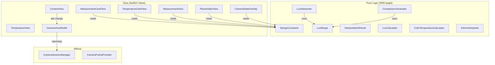

# Design Document

## Overview

This design addresses six code review items (P1 #7, P2 #8, P2 #10, P2 #11, P2 #12, P3 #13) from `docs/code-review.md`. The changes span all three layers of the deterministic split:

- **Pure logic layer**: `DesignConstants` enum, `LuxRange` shared construct, explicit `Sendable` conformance on value types
- **Glue layer**: VoiceOver accessibility modifiers on views, locale-aware number formatting in card views, per-tab camera session management in `ContentView`

No measurement behavior changes. All existing tests must continue to pass. Two new pure-logic constructs (`DesignConstants`, `LuxRange`) are added to the SPM target for cross-platform testability.

## Architecture

The changes fit within the existing three-layer architecture without introducing new layers or dependencies.



### Change Summary by Layer

| Layer | File | Change |
|-------|------|--------|
| Pure Logic | `DesignConstants.swift` (new) | Centralized font sizes, spacing, dimensions |
| Pure Logic | `LuxRange.swift` (new) | Shared `rangeIndex(for:)` function |
| Pure Logic | `InterpretationResult.swift` | Add `: Sendable` conformance |
| Pure Logic | `LuxInterpreter.swift` | Delegate to `LuxRange.rangeIndex(for:)` |
| Pure Logic | `ComparisonGenerator.swift` | Delegate to `LuxRange.rangeIndex(for:)` |
| Glue | `MeasurementCardView.swift` | Accessibility labels, locale formatting, DesignConstants refs |
| Glue | `TemperatureCardView.swift` | Accessibility labels, locale formatting, DesignConstants refs |
| Glue | `MeasurementView.swift` | Accessibility labels/hints on buttons, DesignConstants refs |
| Glue | `TemperatureView.swift` | Accessibility label on settings icon |
| Glue | `ContentView.swift` | Tab accessibility labels, per-tab camera session logic |
| Glue | `PlaceholderView.swift` | DesignConstants refs |
| Glue | `CameraStateOverlay.swift` | DesignConstants refs |
| Config | `Package.swift` | Add `DesignConstants.swift`, `LuxRange.swift` to SPM sources |

## Components and Interfaces

### DesignConstants (new — pure logic)

A caseless enum centralizing all hardcoded numeric literals from views. No framework imports.

```swift
enum DesignConstants {
    // Font sizes
    static let fontSizeXXL: CGFloat = 48
    static let fontSizeXL: CGFloat = 22
    static let fontSizeLG: CGFloat = 20
    static let fontSizeMD: CGFloat = 18
    static let fontSizeSM: CGFloat = 16
    static let fontSizeXS: CGFloat = 14
    static let fontSizeXXS: CGFloat = 13
    static let fontSizeXXXS: CGFloat = 12

    // Spacing / padding
    static let spacingLG: CGFloat = 40
    static let spacingMD: CGFloat = 24
    static let spacingSM: CGFloat = 12
    static let spacingXS: CGFloat = 8

    // Component dimensions
    static let captureButtonOuter: CGFloat = 70
    static let captureButtonInner: CGFloat = 58
    static let toggleButtonSize: CGFloat = 44
}
```

Note: `CGFloat` is available without importing any platform framework — it's part of Swift's core graphics types via `CoreGraphics`, which is implicitly available. If SPM compilation requires it, we can use `Double` instead since `CGFloat` is typealias'd to `Double` on 64-bit platforms.

### LuxRange (new — pure logic)

A caseless enum providing a single shared `rangeIndex(for:)` function. Replaces the duplicated threshold logic in `LuxInterpreter` and `ComparisonGenerator`.

```swift
enum LuxRange {
    /// Canonical lux thresholds shared across all consumers.
    static let thresholds: [Double] = [10, 100, 200, 500, 1000, 2000, 10000]

    /// Maps a lux value to a zero-based range index (0–7).
    /// Index 0 = darkest (≤10 lux), index 7 = brightest (>10000 lux).
    static func rangeIndex(for lux: Double) -> Int {
        if lux > 10000 { return 7 }
        if lux > 2000 { return 6 }
        if lux > 1000 { return 5 }
        if lux > 500 { return 4 }
        if lux > 200 { return 3 }
        if lux > 100 { return 2 }
        if lux > 10 { return 1 }
        return 0
    }
}
```

### LuxInterpreter (modified)

Refactored to use `LuxRange.rangeIndex(for:)` internally. The public API (`interpret(lux:) -> InterpretationResult`) remains identical. The internal if/else chain is replaced with an array lookup keyed by range index.

```swift
struct LuxInterpreter {
    private static let results: [InterpretationResult] = [
        // index 0: ≤10 lux
        InterpretationResult(description: "Very dark outdoors, full moon night",
                             tip: "Pre-sleep conditions. Be careful when moving around."),
        // index 1–7: same order as current if/else chain
        // ...
    ]

    static func interpret(lux: Double) -> InterpretationResult {
        let index = LuxRange.rangeIndex(for: lux)
        return results[index]
    }
}
```

### ComparisonGenerator (modified)

Refactored to use `LuxRange.rangeIndex(for:)` instead of its private `rangeIndex(for:)` method. The `ranges` array and `generate(lux:)` public API remain identical.

### InterpretationResult (modified)

```swift
struct InterpretationResult: Equatable, Sendable {
    let description: String
    let tip: String
}
```

Only change: add `, Sendable` to the conformance list. The struct is already a value type with only `let String` properties, so it's inherently safe.

### MeasurementCardView (modified)

Changes:
1. Replace `String(format: "%.0f", value)` with locale-aware formatting using `NumberFormatter` with `.decimal` style and `maximumFractionDigits = 0`
2. Add `.accessibilityElement(children: .combine)` on the outer `VStack`
3. Add `.accessibilityLabel` that includes lux, "lux", kelvin, "Kelvin", and conditionally the interpretation/comparison text
4. Replace hardcoded font sizes, spacing with `DesignConstants` references

### TemperatureCardView (modified)

Changes:
1. Replace `String(format: "%.0f", kelvin)` with locale-aware formatting
2. Add `.accessibilityElement(children: .combine)` on the outer `VStack`
3. Add `.accessibilityLabel` including kelvin, "Kelvin", description, and tip
4. Replace hardcoded font sizes, spacing with `DesignConstants` references

### MeasurementView (modified)

Changes:
1. Add `.accessibilityLabel("Capture")` and `.accessibilityHint("Freezes the current light reading")` on the capture button
2. Add `.accessibilityLabel("Switch Camera")` and `.accessibilityHint("Toggles between front and rear cameras")` on the camera toggle button
3. Add `.accessibilityLabel("Back to live mode")` on the back arrow button
4. Add `.accessibilityLabel("Settings")` on the gear icon NavigationLink
5. Replace hardcoded font sizes, padding, dimensions with `DesignConstants` references

### TemperatureView (modified)

Changes:
1. Add `.accessibilityLabel("Settings")` on the gear icon NavigationLink

### ContentView (modified)

Changes:
1. Add `.accessibilityLabel("Lux measurement")` on tab 0
2. Add `.accessibilityLabel("Color temperature")` on tab 1
3. Add `.accessibilityLabel("Flicker detection")` on tab 2
4. Add `.accessibilityLabel("Saved records")` on tab 3
5. Add `.onChange(of: selectedTab)` handler that calls `startSession()` for tabs 0/1 and `stopSession()` for tabs 2/3
6. Modify the `willEnterForeground` handler to only call `startSession()` when `selectedTab` is 0 or 1

### PlaceholderView (modified)

Replace hardcoded font sizes and spacing with `DesignConstants` references.

### CameraStateOverlay (modified)

Replace hardcoded font sizes with `DesignConstants` references.

### Package.swift (modified)

Add `"DesignConstants.swift"` and `"LuxRange.swift"` to the SPM target's `sources` array.

## Data Models

No new data models. `InterpretationResult` gains `: Sendable` conformance but its shape is unchanged.

### Number Formatting Helper

A shared formatting function (or computed property) used by both card views:

```swift
/// Formats a Double as a locale-aware integer string with thousands separators.
/// Example: 10000.0 → "10,000" (en_US locale)
private static func formatValue(_ value: Double) -> String {
    let formatter = NumberFormatter()
    formatter.numberStyle = .decimal
    formatter.maximumFractionDigits = 0
    return formatter.string(from: NSNumber(value: value)) ?? "\(Int(value))"
}
```

This can live as a private helper in each card view, or as a static method on a small `NumberFormatting` utility. Since it's used in the glue layer (SwiftUI views), it doesn't need to be in the SPM pure-logic target. However, the round-trip property (Req 5.5) should be tested against the same `NumberFormatter` configuration.

## Correctness Properties

*A property is a characteristic or behavior that should hold true across all valid executions of a system — essentially, a formal statement about what the system should do. Properties serve as the bridge between human-readable specifications and machine-verifiable correctness guarantees.*

### Property 1: Number formatting round-trip

*For any* non-negative Double value, formatting it with the locale-aware formatter (decimal style, zero fraction digits) and then parsing the resulting string back to a Double SHALL produce a value equal to the original value rounded to zero decimal places.

**Validates: Requirements 5.5**

### Property 2: LuxRange equivalence

*For any* non-negative Double lux value, `LuxRange.rangeIndex(for: lux)` SHALL return the same index that the original `LuxInterpreter` if/else chain and the original `ComparisonGenerator.rangeIndex` private method would produce for that value.

**Validates: Requirements 6.1, 6.4**

## Error Handling

### Number Formatting

- If `NumberFormatter.string(from:)` returns `nil` (extremely unlikely for valid Doubles), fall back to `"\(Int(value))"` — no thousands separator but still displays a number.
- `NaN` and `Infinity` inputs: the formatter may return unexpected strings. The views already receive clamped values from the calculators (lux ≥ 0, kelvin ∈ [1000, 15000]), so this is a defensive measure only.

### Camera Session Per-Tab

- `startSession()` and `stopSession()` are already idempotent in `CameraSessionManager` (they check `isRunning` before acting). Rapid tab switching won't cause double-start or double-stop issues.
- If the session fails to start on tab switch, the existing `cameraError` published property surfaces the error in the UI via `CameraStateOverlay`.

### Sendable Conformance

- Adding `: Sendable` to `InterpretationResult` is a compile-time declaration. If a future change adds a non-Sendable property, the Swift 6 compiler will emit an error, preventing the regression.

## Testing Strategy

### Property-Based Tests (via Swift Testing + manual randomization)

Two property tests, each running 150+ iterations with random inputs:

1. **Number formatting round-trip** (Property 1): Generate random non-negative Doubles in [0, 200_000], format with `NumberFormatter(.decimal, maxFractionDigits: 0)`, parse back, assert equality with `rounded(.toNearestOrAwayFromZero)`. Use a fixed `Locale(identifier: "en_US")` to ensure deterministic parsing in CI.
   - Tag: `Feature: 07-code-review-polish, Property 1: Number formatting round-trip`

2. **LuxRange equivalence** (Property 2): Generate random non-negative Doubles in [0, 200_000], compute `LuxRange.rangeIndex(for:)`, compare against an independent oracle implementing the original if/else chain. Assert equality.
   - Tag: `Feature: 07-code-review-polish, Property 2: LuxRange equivalence`

### Unit Tests (example-based)

- **LuxRange boundary values**: Test each threshold boundary (10, 10.001, 100, 100.001, ..., 10000, 10000.001) to verify correct index assignment at exact boundaries.
- **LuxRange negative values**: Verify negative lux maps to index 0.
- **Existing test suites**: `LuxInterpreterTests`, `KelvinInterpreterTests`, `ComparisonGeneratorTests`, `LuxCalculatorTests`, `ColorTemperatureCalculatorTests` must all continue to pass unchanged after the `LuxRange` refactor and `Sendable` additions.

### Compile-Time Verification

- **DesignConstants**: If any view references a nonexistent constant, the build fails. No runtime test needed.
- **Sendable**: Swift 6 strict concurrency checking enforces conformance at compile time. A successful `swift build` validates requirements 8.1–8.5.
- **SPM target**: `swift build` and `swift test` must succeed with the new files added to `Package.swift`.

### Manual / UI Verification

- **VoiceOver accessibility** (Requirements 1–3): Enable VoiceOver on a device or simulator, navigate through measurement cards, buttons, and tabs. Verify announcements match the specified labels and hints. Automated accessibility audits via Xcode's Accessibility Inspector can supplement this.
- **Locale formatting** (Requirements 5.1–5.3): Visually verify thousands separators appear in the card views for values ≥ 1,000.
- **Camera session per-tab** (Requirement 7): Switch between tabs and observe camera LED indicator. Verify the camera stops on tabs 2/3 and restarts on tabs 0/1. Test foreground/background transitions on each tab.

### Test Configuration

- Property-based tests: minimum 150 iterations each
- Test library: Swift Testing (`import Testing`)
- Property test tag format: `Feature: 07-code-review-polish, Property {N}: {title}`
- All new pure-logic files added to SPM test target dependencies
