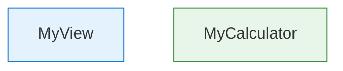

# Mermaid Diagram Conventions

Use Mermaid for all architecture and flow diagrams in design docs. Keep diagrams renderable, readable, and lightly color-coded for quick visual parsing.

## Syntax Rules

- Always use quoted node labels: `A["Label"]` not `A[Label]`
- Quoted labels prevent parsing failures from parentheses, slashes, ampersands, and other special characters
- Use `-- "label" -->` for labeled edges, not `-->|label|` (more resilient across renderers)

## Color Coding

Apply subtle `style` directives to distinguish architectural layers at a glance. Use the project's three-layer split:

| Layer | Fill | Stroke | Use For |
|-------|------|--------|---------|
| Pure Logic | `#e8f5e9` (light green) | `#388e3c` | Calculators, interpreters, generators |
| Effects | `#fff3e0` (light orange) | `#f57c00` | CameraManager, persistence, network |
| Glue / UI | `#e3f2fd` (light blue) | `#1976d2` | Views, view models, app entry |
| Platform | `#f3e5f5` (light purple) | `#7b1fa2` | AVFoundation, UIKit, system frameworks |

Apply styles after the graph definition:

## Sequence Diagrams

- No color styling needed — keep them clean
- Use `Note over` for contextual annotations
- Use `alt/else` blocks for branching flows

## Don'ts

- Don't use more than 4 colors — the palette above is the full set
- Don't color sequence diagrams
- Don't use ` ` in node labels — use short labels and let the design doc prose explain details
