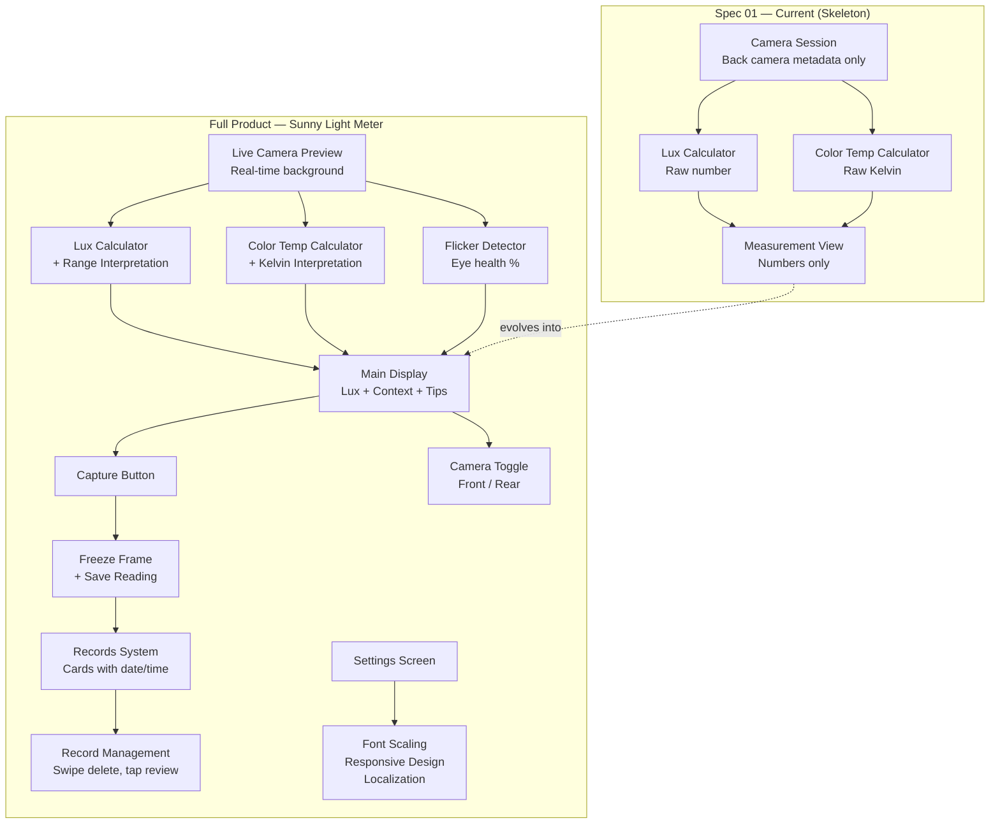
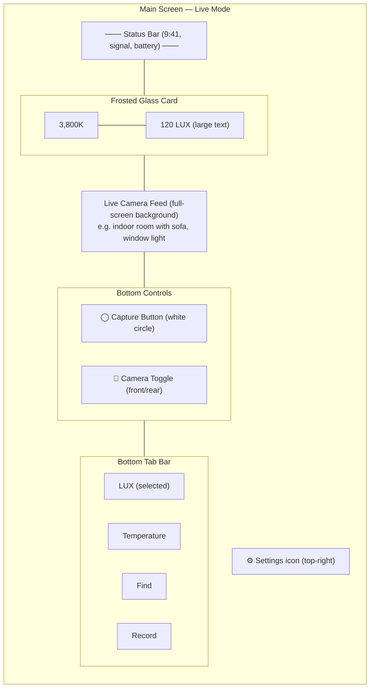
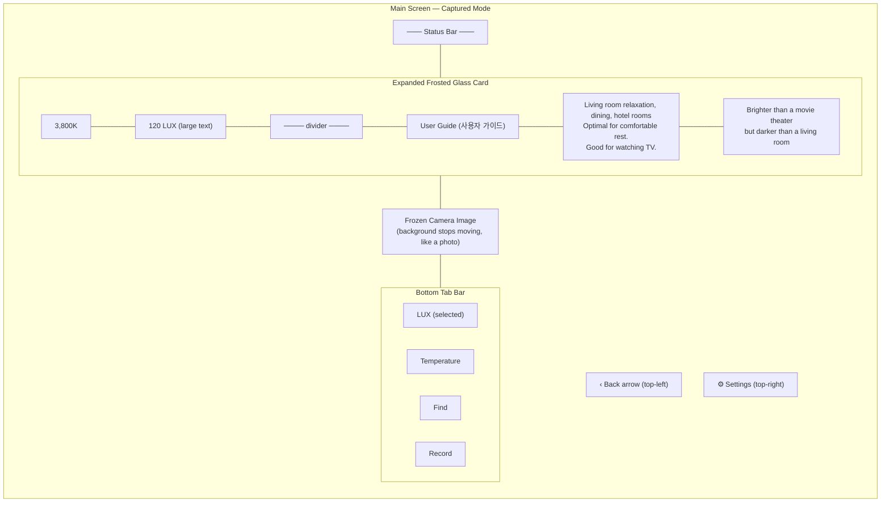
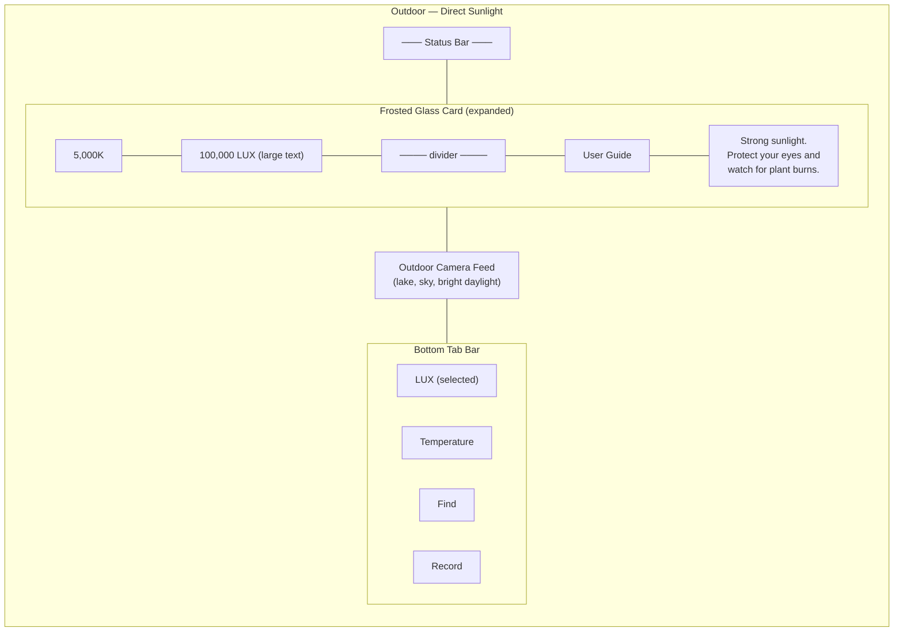
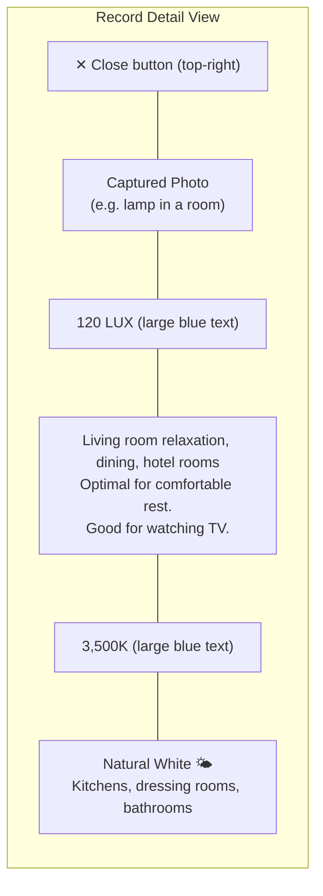
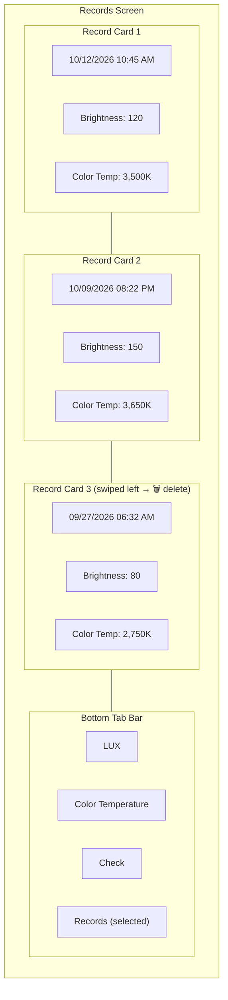
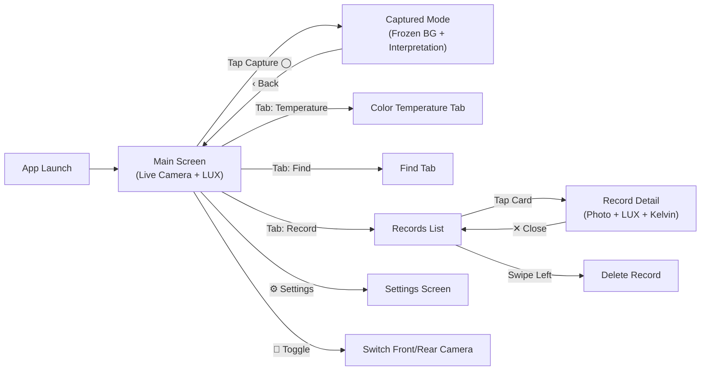

# Sunny Light Meter — Product Specification (Translated from Korean)

## Page 1: Title

Sunny Light Meter

## Page 2: Target Resolutions

Our baseline resolution: 1,179 x 2,556 pixels

Supported devices at this resolution:
- iPhone 14 Pro
- iPhone 15
- iPhone 15 Pro

The design must be responsive. The following resolution must also be supported:

1,170 x 2,532:
- iPhone 13
- iPhone 14

## Page 3: Font Scaling Rules

All text on the main screen must disable system font scaling so the smartphone's font size settings do not affect the app layout.

For React Native (reference from original doc):
```jsx
<Text {...props} allowFontScaling={false} />
```

Alternative approach — allow limited scaling with a cap:
```jsx
maxFontSizeMultiplier={1.2}
```

This lets the text grow slightly with system settings but caps the maximum size. Best of both worlds for accessibility and layout stability.

> Note: The original doc references React Native props. For our SwiftUI implementation, the equivalent approach is using fixed font sizes (`.font(.system(size: N))`) or capping Dynamic Type with `.dynamicTypeSize(...:.large)`.

## Page 4: (Blank page — likely a visual mockup placeholder)

## Page 5: Main Screen Behavior

When the app launches:
- The camera turns on and the live camera feed becomes the app's real-time background
- The lux value updates in real time on screen

Capture button (round button at the bottom):
- Tapping it captures the current moment
- Shows the captured lux value and an interpretation/description of that lux level

Camera toggle button (next to capture button):
- Switches between front and rear camera

After capture:
- The background freezes (like taking a photo — the background image stops moving)
- Displays lux reading + contextual interpretation (e.g., "Brighter than a movie theater but darker than a living room")

Reference: A similar app's demo video was linked in the original doc.

## Page 6: Lux Range Reference Table

| Lux Range | Environment / Use Case | User Guide Tip |
|-----------|----------------------|----------------|
| 0–10 | Very dark outdoors, full moon night | "Pre-sleep conditions. Be careful when moving around." |
| 20–100 | Hallways, bathrooms, storage rooms, movie theaters | "Suitable for passing through. Not appropriate for extended work." |
| 100–200 | Living room relaxation, dining, hotel rooms | "Optimal for comfortable rest. Good for watching TV." |
| 200–500 | General office work, kitchen cooking, light reading | "The most standard brightness for daily activities and office work." |
| 500–1,000 | Focused studying, precision handwork, store displays | "Recommended for study rooms or detailed tasks like sewing." |
| 1,000–2,000 | Bright window (indoors), broadcast studios, operating rooms | "Very bright. Suitable for video production or professional work." |
| 2,000–10,000 | Cloudy day outdoors, sunset outdoors | "Good for outdoor activities. Partial shade level for plants." |
| 10,000–100,000+ | Direct sunlight on a clear day, noon outdoors | "Strong sunlight. Protect your eyes and watch for plant burns." |

## Page 7: Color Temperature Reference Table

| Kelvin | Color Tone | Recommended Environment |
|--------|-----------|------------------------|
| Below 2,000K | Candlelight / Sunset 🔥 | Psychological calm, pre-sleep, atmospheric cafes |
| 2,700K–3,000K | Warm White 💡 | Bedrooms, living rooms, relaxation spaces |
| 3,500K–4,500K | Natural White 🌤 | Kitchens, dressing rooms, bathrooms |
| 5,000K–6,000K | Daylight 📖 | Study rooms, offices, precision work (improves focus) |
| 6,500K+ | Cool White ❄ | Hospitals, factories, warehouses |
| 10,000K+ | Blue Sky 🧊 | Clear day shade, specialized lab environments |

Contextual example: "The color temperature is higher than a bedroom but lower than a study room."

## Page 8: Flicker Percentage & Eye Health

| Flicker % | Safety Level | Description |
|-----------|-------------|-------------|
| 0%–3% | Very Safe | Minimal eye fatigue even with prolonged use |
| 3%–10% | Safe | Sensitive individuals may feel mild dryness or fatigue with long exposure |
| 10%–30% | Caution | Noticeable eye pain, blurred focus, and discomfort may occur |
| 30%–60% | Dangerous | Severe eye fatigue, migraines, dizziness. Focus drops sharply |
| 60%+ | Very Dangerous | Visible flickering. Risk of nausea, photosensitive seizures for sensitive individuals |

The page also shows a captured reading example:
- 120 LUX / 3,500 Kelvin / 5% Flicker
- With contextual tags: Reading & Study, Office & Focus, TV & Movies, Dining & Conversation, Sleep & Rest, Baby & Childcare, Kitchen/Dressing Room suitable, Date & Romantic, Coffee & Tea time

## Page 9: Records Screen

Each time the capture button is pressed, a record card is automatically saved with:
- Date
- Time
- Brightness (lux)
- Color Temperature (Kelvin)

Records screen behavior:
- Tapping "Record" shows cards in newest-first order (top to bottom)
- Swipe left on a card to reveal a Delete icon — tap to delete
- Tapping a card shows the captured photo with lux and color temperature info overlaid

Time format localization:
- English/French/Spanish: time suffix (e.g., 09:45 AM, 11:10 PM)
- Korean/Japanese/Chinese (Simplified & Traditional): time prefix (e.g., 오전 09:45, 午後 11:10)

## Page 10: Settings

References an external Google Slides document for the settings screen design.

---

## Analysis & Understanding

This PDF describes a full-featured light meter app called "Sunny Light Meter" that goes well beyond our current spec 01 skeleton. Here's what the full product vision includes:

1. Live camera background — the camera feed is the app background, not just metadata extraction
2. Capture functionality — a shutter button that freezes the frame and records the reading
3. Lux interpretation — contextual descriptions based on lux ranges (not just raw numbers)
4. Color temperature interpretation — contextual descriptions based on Kelvin ranges
5. Flicker detection — measuring light flicker percentage for eye health assessment
6. Front/rear camera toggle — switching between cameras
7. Records system — persistent storage of captured readings as cards with date/time
8. Record management — swipe-to-delete, tap-to-review with photo overlay
9. Localized time formatting — different time display formats per language
10. Responsive design — supporting multiple iPhone resolutions
11. Font scaling control — preventing system font size from breaking the layout
12. Settings screen — referenced externally, details not in this PDF

Our current spec 01 covers items 1 (partially — metadata only, no live preview), the raw lux calculation, and the raw color temperature calculation. The full product is significantly larger.



The gap between spec 01 and the full product includes: live camera preview rendering, capture/freeze functionality, lux/kelvin interpretation tables, flicker detection, records persistence, camera switching, localization, and settings. These would each be their own spec.

## UI Screen Reference (from product mockups)

The following diagrams represent the key screens and flows observed in the product design mockups.

### Main Screen — Live Measurement (LUX Tab)

The primary screen shows the live camera feed as a full-screen background with a frosted-glass measurement card overlaid near the top. A bottom tab bar provides navigation.



### Main Screen — After Capture (Frozen + Interpretation)

Tapping the capture button freezes the camera background and expands the card to show the user guide interpretation text.



### Outdoor High-Lux Example

When pointing at bright outdoor scenes, the readings and interpretation update accordingly.



### Record Detail — Tapped Card

Tapping a record card opens a full-screen view with the captured photo as background and lux + Kelvin interpretation overlaid.



### Records Screen — Card List

The Records tab shows saved measurement cards in reverse chronological order. Swipe left reveals a delete button.



### Screen Flow Overview


