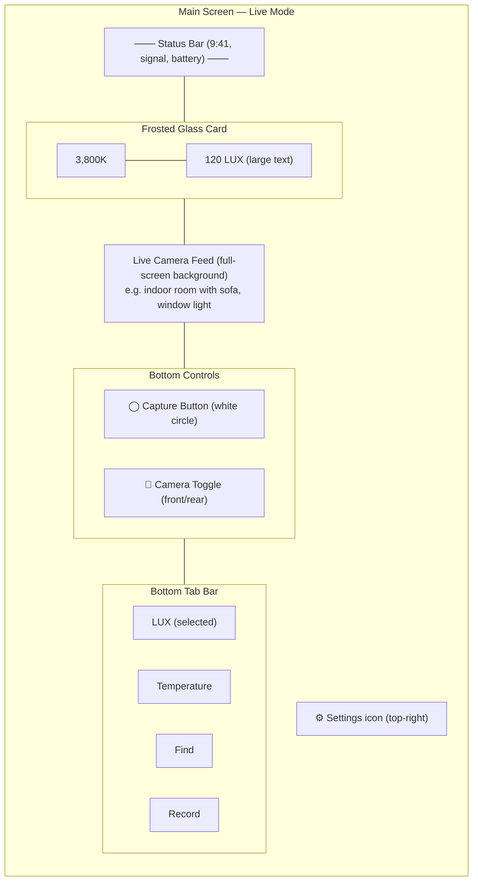
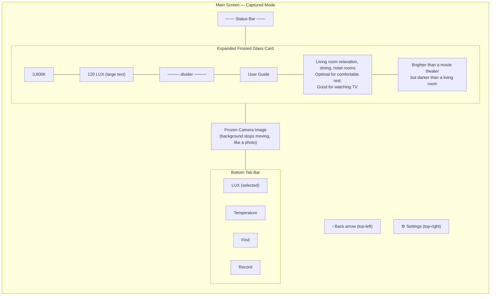
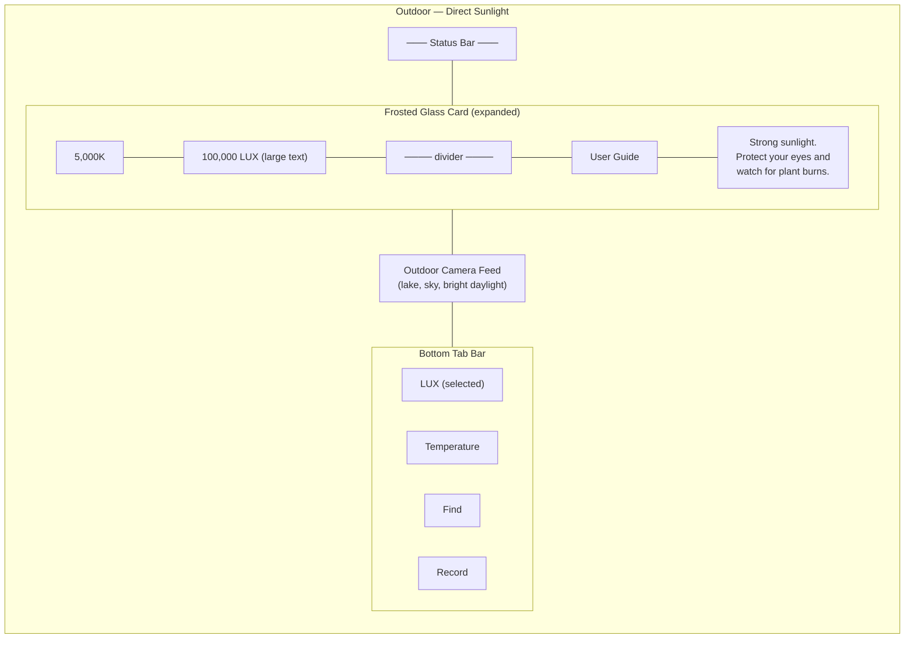
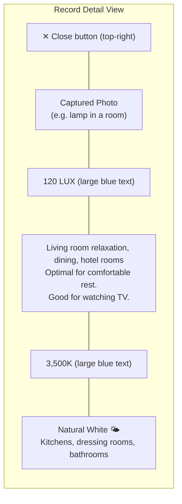
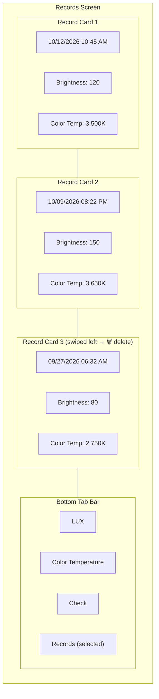
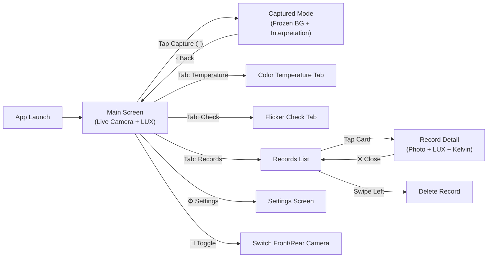
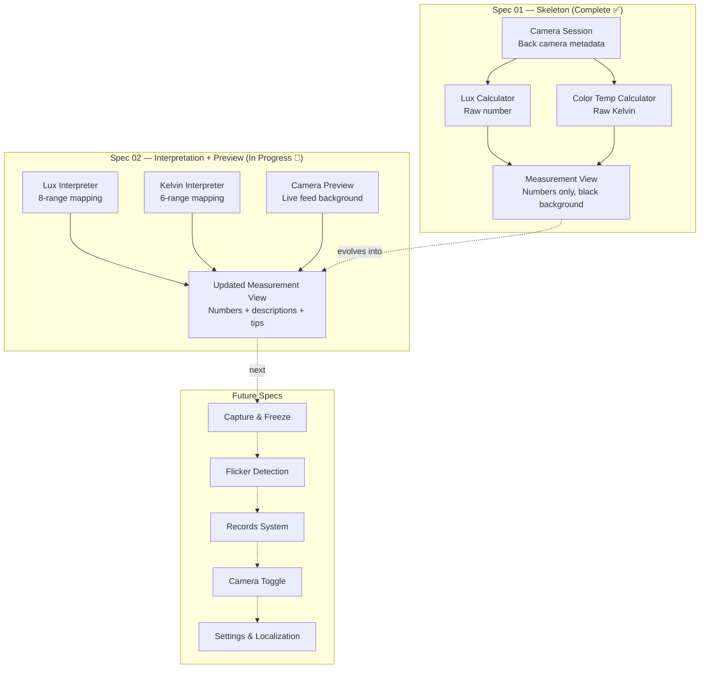

# Sunny Light Meter — Product Specification

## What Is It?

Sunny Light Meter is an iOS app that turns your iPhone camera into a real-time light measurement tool. Point your phone at any environment and instantly see the brightness (lux) and color temperature (Kelvin) of the light around you — along with plain-language interpretations of what those numbers mean.

The app is designed for anyone curious about their lighting environment: photographers checking exposure, parents evaluating nursery lighting, office workers wondering if their desk lamp is bright enough, or plant owners checking if their succulents are getting enough sun.

## How It Works

When you open the app, the camera activates and the live feed becomes the full-screen background. Overlaid on top is a frosted-glass card showing real-time readings:

- The current brightness in lux
- The current color temperature in Kelvin
- Both values update continuously as you move the phone

Tap the capture button to freeze the moment. The background stops moving (like taking a photo), and the card expands to show an interpretation: what kind of environment matches that brightness level, a practical tip, and a contextual comparison (e.g., "Brighter than a movie theater but darker than a living room").

## Target Devices

Baseline resolution: 1,179 × 2,556 pixels (iPhone 14 Pro, iPhone 15, iPhone 15 Pro)

Also supported at 1,170 × 2,532: iPhone 13, iPhone 14

The layout must be responsive across these resolutions. All text on the main screen uses fixed font sizes — system Dynamic Type settings must not affect the app layout. For accessibility balance, a capped scaling approach (max 1.2×) is acceptable.

## Core Features

### 1. Live Light Measurement

The primary experience. The camera feed fills the screen, and a translucent measurement card floats near the top showing:

- Color temperature (e.g., `3,800K`)
- Brightness (e.g., `120 LUX`) in large, prominent text

Both values stream in real time from the back camera's exposure metadata.

### 2. Capture & Interpret

A round capture button sits at the bottom of the screen. Tapping it:

1. Freezes the camera background (the image stops moving)
2. Expands the measurement card to show:
   - The lux range interpretation (environment description + user guide tip)
   - A contextual comparison sentence
3. A back arrow appears to return to live mode

### 3. Camera Toggle

A toggle button next to the capture button switches between front and rear cameras.

### 4. Lux Interpretation

Raw lux numbers are mapped to human-readable descriptions:

| Lux Range | Environment | User Guide Tip |
|-----------|------------|----------------|
| 0–10 | Very dark outdoors, full moon night | Pre-sleep conditions. Be careful when moving around. |
| 11–100 | Hallways, bathrooms, storage rooms, movie theaters | Suitable for passing through. Not appropriate for extended work. |
| 101–200 | Living room relaxation, dining, hotel rooms | Optimal for comfortable rest. Good for watching TV. |
| 201–500 | General office work, kitchen cooking, light reading | The most standard brightness for daily activities and office work. |
| 501–1,000 | Focused studying, precision handwork, store displays | Recommended for study rooms or detailed tasks like sewing. |
| 1,001–2,000 | Bright window (indoors), broadcast studios, operating rooms | Very bright. Suitable for video production or professional work. |
| 2,001–10,000 | Cloudy day outdoors, sunset outdoors | Good for outdoor activities. Partial shade level for plants. |
| 10,001+ | Direct sunlight on a clear day, noon outdoors | Strong sunlight. Protect your eyes and watch for plant burns. |

### 5. Color Temperature Interpretation

Raw Kelvin values are mapped to color tone labels and recommended environments:

| Kelvin | Color Tone | Recommended Environment |
|--------|-----------|------------------------|
| Below 2,000K | Candlelight / Sunset 🔥 | Psychological calm, pre-sleep, atmospheric cafes |
| 2,000K–3,499K | Warm White 💡 | Bedrooms, living rooms, relaxation spaces |
| 3,500K–4,999K | Natural White 🌤 | Kitchens, dressing rooms, bathrooms |
| 5,000K–6,499K | Daylight 📖 | Study rooms, offices, precision work (improves focus) |
| 6,500K–9,999K | Cool White ❄ | Hospitals, factories, warehouses |
| 10,000K+ | Blue Sky 🧊 | Clear day shade, specialized lab environments |

### 6. Flicker Detection & Eye Health

The app measures light flicker percentage to assess eye safety:

| Flicker % | Safety Level | Description |
|-----------|-------------|-------------|
| 0%–3% | Very Safe | Minimal eye fatigue even with prolonged use |
| 3%–10% | Safe | Sensitive individuals may feel mild dryness or fatigue with long exposure |
| 10%–30% | Caution | Noticeable eye pain, blurred focus, and discomfort may occur |
| 30%–60% | Dangerous | Severe eye fatigue, migraines, dizziness. Focus drops sharply |
| 60%+ | Very Dangerous | Visible flickering. Risk of nausea, photosensitive seizures for sensitive individuals |

A captured reading might show: `120 LUX / 3,500K / 5% Flicker` with contextual activity tags like "Reading & Study", "Office & Focus", "TV & Movies", "Sleep & Rest", "Baby & Childcare", etc.

### 7. Records

Every capture is automatically saved as a record card containing:

- Date and time
- Brightness (lux)
- Color temperature (Kelvin)

The Records tab displays cards in newest-first order. Swipe left on a card to reveal a delete button. Tapping a card opens a full-screen detail view showing the captured photo with lux and Kelvin interpretations overlaid.

Time format is localized:
- English/French/Spanish: suffix format (e.g., `09:45 AM`)
- Korean/Japanese/Chinese: prefix format (e.g., `오전 09:45`, `午後 11:10`)

### 8. Settings

A settings screen is accessible via the gear icon in the top-right corner. (Design details are maintained in a separate document.)

## App Navigation

The app uses a bottom tab bar with four tabs:

| Tab | Purpose |
|-----|---------|
| LUX | Main measurement screen with live camera background |
| Temperature | Color temperature focused view |
| Check | Light quality check (flicker analysis) |
| Records | Saved measurement history |

## UI Screen Reference

The following diagrams represent the key screens and user flows.

### Main Screen — Live Measurement (LUX Tab)

The live camera feed fills the screen. A frosted-glass card shows real-time lux and Kelvin. Capture and camera toggle buttons sit near the bottom.

### Main Screen — After Capture (Frozen + Interpretation)

Tapping capture freezes the background and expands the card with interpretation text.

### Outdoor High-Lux Example

Bright outdoor scenes produce high lux readings with corresponding interpretation.

### Record Detail — Tapped Card

Tapping a record opens a full-screen view with the captured photo and lux + Kelvin interpretations.

### Records Screen — Card List

Saved measurements displayed as cards. Swipe left to delete.

### Screen Flow Overview

## Implementation Progress

The app is being built incrementally through a series of specs:

