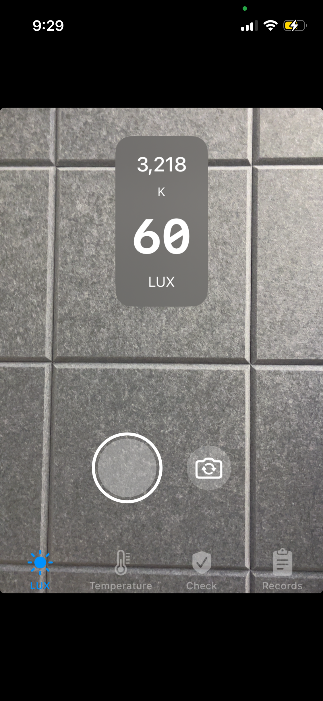
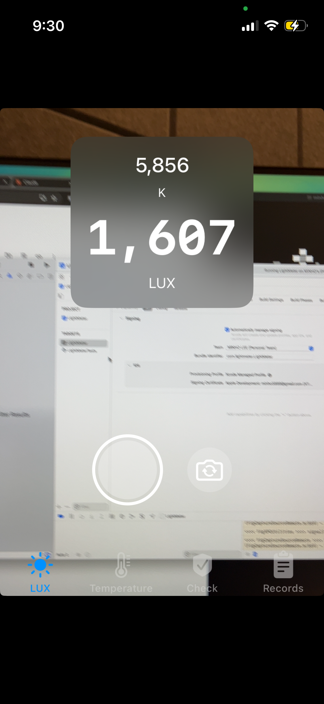
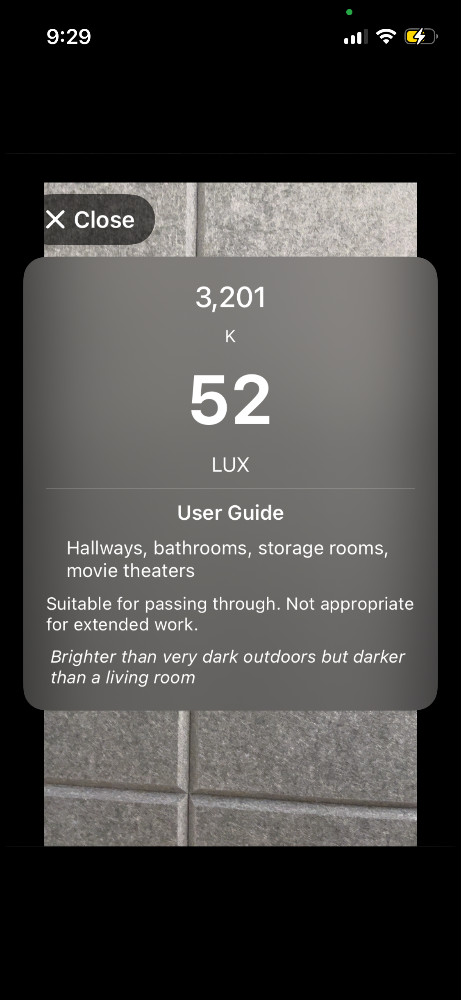
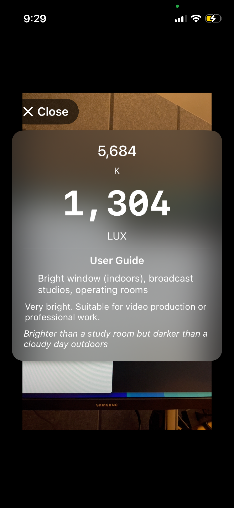

# Sunny Light Meter

[](https://swift.org)
[](https://developer.apple.com/ios/)
[](LICENSE)

An iOS app that turns your iPhone camera into a real-time light measurement tool. Point your phone at any environment and instantly see brightness (lux), color temperature (Kelvin), and plain-language interpretations of what those numbers mean.

Built for anyone curious about their lighting: photographers checking exposure, parents evaluating nursery lighting, office workers wondering if their desk lamp is bright enough, or plant owners checking sunlight levels.

<p align="center">
  
  &nbsp;&nbsp;
  
  &nbsp;&nbsp;
  
  &nbsp;&nbsp;
  
</p>

---

<a id="table-of-contents"></a>
## Table of Contents

1. [Project Status](#1-project-status)
2. [Getting Started](#2-getting-started)
3. [Project Structure](#3-project-structure)
4. [Architecture](#4-architecture)
5. [Documentation](#5-documentation)
6. [License](#6-license)

---

## [1. Project Status](#table-of-contents)

| Feature | Tab | Status | Description |
|---------|-----|--------|-------------|
| Live Lux + Kelvin | LUX | ✅ Built | Real-time brightness and color temperature with capture-to-interpret |
| Color Temperature | Temperature | ✅ Built | Live Kelvin reading with color tone label and environment tip |
| Flicker Detection | Check | ✅ Built | Light safety analysis using Accelerate vDSP FFT |
| Records | Records | ✅ Built | Persistent saved measurement history with index numbers, activity chips, timestamps, and swipe-to-delete |

---

## [2. Getting Started](#table-of-contents)

### Prerequisites

- macOS with Xcode installed
- [XcodeGen](https://github.com/yonaskolb/XcodeGen) (`brew install xcodegen`)
- An iPhone running iOS 17+ (camera features require a physical device)
- A free or paid [Apple Developer account](https://developer.apple.com)

### Setup

```bash
# Clone the repo
git clone https://github.com/minho5889/light-meter.git
cd light-meter

# Generate the Xcode project
xcodegen generate

# Run pure logic tests (no Xcode needed)
swift build
swift test
```

### Run on device

1. Open the project: `open LightMeter.xcodeproj`
2. In Xcode, select the LightMeter target → Signing & Capabilities
3. Set your Team to your Apple Developer account
4. Connect your iPhone via USB, select it as the run destination
5. Press Cmd+R to build and run

First time on the phone: go to Settings → General → VPN & Device Management → trust your developer certificate.

### Run tests in Xcode

```bash
# Regenerate project if you added/moved files
xcodegen generate

# Then in Xcode: Product → Test (Cmd+U)
# Or from terminal for pure logic only:
swift test
```

---

## [3. Project Structure](#table-of-contents)

```
LightMeter/
├── Logic/                  # 🟢 Pure logic — formulas, interpreters, generators
├── Camera/                 # 🟡 Effects — camera session, frame metadata
├── Features/               # 🔵 Glue — LUX and Temperature tab screens
├── SharedViews/            # 🔵 Glue — reusable view components
└── Design/                 # Font sizes, spacing, dimensions

LightMeterTests/
├── Logic/                  # 157 tests covering all pure logic
└── Formatting/
```

For the full file-by-file breakdown with module descriptions, see the [Developer Guide](docs/developer-guide.md).

---

## [4. Architecture](#table-of-contents)

The app follows a "functional core, imperative shell" pattern (called the "deterministic split" in the codebase). Pure logic is deterministic and portable — same inputs, same outputs, no hardware dependencies. Effects are thin camera wrappers. Glue wires them together in SwiftUI with no business logic.

The pure logic layer is 100% unit testable without mocks or devices, and it's what the React Native team ports to TypeScript. See the [Developer Guide](docs/developer-guide.md) for the full architecture breakdown and data flow diagram.

---

## [5. Documentation](#table-of-contents)

Three root-level docs cover everything you need. We strongly recommend reading all three before diving into the code.

### 1. [Light Science Primer](docs/light-science-primer.md)

Start here. Covers how a phone camera becomes a light meter — the three things we measure (lux, Kelvin, flicker), how each one comes from a camera frame, and the formulas behind them. Written for developers, not physicists. ~15 minutes.

### 2. [Developer Guide](docs/developer-guide.md)

The codebase map. What each module does, how data flows from camera hardware through three layers to the screen, and how the 157-test suite covers it. Read this before you start porting anything.

### 3. [React Native Handover](docs/react-native-handover.md)

The Android port plan. Team structure, what to build, suggested pace, and the key technical differences between iOS and Android camera APIs. Read this only if you're working on the React Native build.

### Optional: [Debugging](docs/debugging/)

The `docs/debugging/` folder contains reference material for when things go wrong or you want to understand the project's history:

- [Troubleshooting](docs/debugging/troubleshooting.md) — quick Q&A for build, device, and runtime issues
- [Swift 6 Crash Post-Mortem](docs/debugging/swift6-crash-post-mortem.md) — the launch crash caused by `@MainActor` closure isolation
- [Black Screen Post-Mortem](docs/debugging/black-screen-post-mortem.md) — the preview layer bug caused by multiple `AVCaptureVideoPreviewLayer` instances
- [Conventions and Workflow](docs/debugging/conventions-and-workflow.md) — commit message format, naming rules, and spec-driven development with Kiro

---

## [6. License](#table-of-contents)

This project is licensed under the MIT License — see the [LICENSE](LICENSE) file for details.
