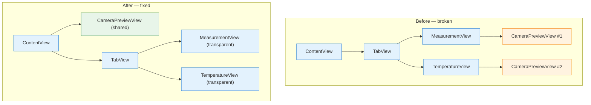

# Black Screen Bug — Post-Mortem

The camera preview was black from the very first frame, even though the `AVCaptureSession` was running and delivering frames. Lux and Kelvin values updated in real time — only the preview layer rendered nothing.

This turned out to be an architectural problem, not a session lifecycle problem. Two `AVCaptureVideoPreviewLayer` instances were connected to the same session, and AVFoundation only renders to the last one connected. The fix was to move to a single shared preview layer in `ContentView`.

---

<a id="table-of-contents"></a>
## Table of Contents

1. [Timeline](#1-timeline)
2. [Root Cause](#2-root-cause)
3. [Why Spec 08 Didn't Fix It](#3-why-spec-08-didnt-fix-it)
4. [The Fix — Spec 09](#4-the-fix--spec-09)
5. [Investigation Log](#5-investigation-log)
6. [Sources](#6-sources)

---

## [1. Timeline](#table-of-contents)

| When | What happened |
|------|---------------|
| Spec 08 | Fixed unnecessary session stop/start cycles on camera↔camera tab switches. Added `TabTransitionAction.resolve` and `isRunning` guard. Black screen persisted. |
| Post-spec 08 analysis | Identified the real root cause: multiple competing `AVCaptureVideoPreviewLayer` instances. Documented in troubleshooting as an open issue. |
| Spec 09 | Implemented the fix: single shared `CameraPreviewView` in `ContentView`, transparent tab overlays, `TransparentBackground` helper. |

### Symptoms on device (before fix)

- App launches, permission granted, session starts running
- Camera preview is black from the very first frame — not just on tab switches
- Lux and Kelvin values update in real time (proving frames reach `CameraFrameProvider`)
- No crash, no error, no console warning
- The session is running (`isRunning == true`)
- The problem was the preview layer, not the session

---

## [2. Root Cause](#table-of-contents)

### The one-layer constraint

`AVCaptureVideoPreviewLayer` has a documented constraint: only the most recently connected preview layer renders frames for a given session [[1]](#source-1). When you set `.session` on a second `AVCaptureVideoPreviewLayer` pointing to the same `AVCaptureSession`, the first layer goes permanently black [[2]](#source-2).

### How the codebase violated it

Both `MeasurementView` (tab 0) and `TemperatureView` (tab 1) each created their own `CameraPreviewView`:

```swift
// MeasurementView.swift — before the fix
CameraPreviewView(session: cameraViewModel.session)
    .ignoresSafeArea()

// TemperatureView.swift — before the fix
CameraPreviewView(session: cameraViewModel.session)
    .ignoresSafeArea()
```

Each `CameraPreviewView` is a `UIViewRepresentable` that creates a `VideoPreviewUIView` whose `layerClass` is `AVCaptureVideoPreviewLayer`. In `makeUIView`, the session is assigned — creating two independent preview layers pointing to the same session.

### How SwiftUI's TabView made it worse

SwiftUI's `TabView` eagerly creates all tab content views and keeps them alive in the view hierarchy. It does not lazily load or destroy tab bodies when switching. On app launch:

1. `ContentView` body is evaluated
2. `TabView` creates `MeasurementView` and `TemperatureView` simultaneously
3. Both views create their own `CameraPreviewView` → two `AVCaptureVideoPreviewLayer` instances
4. Both layers have `.session = cameraViewModel.session`
5. The second layer to connect "wins" — the first goes permanently black
6. Which layer "wins" depends on SwiftUI's internal view creation order (non-deterministic)

### Why frames still arrived

`AVCaptureVideoDataOutput` (used by `CameraFrameProvider`) is independent of the preview layer. It receives every frame regardless of how many preview layers exist. This is why lux/Kelvin values updated while the preview was black — the data pipeline was healthy, only the rendering was broken.

---

## [3. Why Spec 08 Didn't Fix It](#table-of-contents)

Spec 08 fixed the session lifecycle. It added `TabTransitionAction.resolve(from:to:)` so camera↔camera tab switches skip the stop/start cycle, and an `isRunning` guard on `startSession()` to prevent redundant calls. These were correct improvements.

But the black screen was never caused by the session stopping. It was caused by two preview layers competing for the same session's rendering pipeline. Even with the session running continuously, if two layers are connected, one will be black.

The spec 08 investigation focused on session lifecycle because the symptom (black preview) looked like a session problem. The actual problem was structural — too many preview layers — which is invisible unless you count how many `AVCaptureVideoPreviewLayer` instances exist at runtime.

---

## [4. The Fix — Spec 09](#table-of-contents)

### Architecture change

Moved from per-tab preview layers to a single shared preview layer in `ContentView`.



### What changed

| File | Change |
|------|--------|
| `ContentView.swift` | Added single `CameraPreviewView` in a `ZStack` behind the `TabView`. Gated on `permissionGranted` and `isCameraTab`. |
| `MeasurementView.swift` | Removed `CameraPreviewView`. Root background is now `Color.clear` with `TransparentBackground()` so the shared preview shows through. |
| `TemperatureView.swift` | Same — removed `CameraPreviewView`, transparent background. |
| `TransparentBackground.swift` | New `UIViewRepresentable` that walks the UIKit superview chain and clears background colors. Needed because SwiftUI's `TabView` wraps each tab in a `UIHostingController` with an opaque system background. |

### What didn't change

- `CameraPreviewView.swift` — the view itself was correct. The `layerClass` override pattern is Apple's recommended approach. The problem was creating multiple instances, not the implementation.
- `CameraSessionManager.swift` — session lifecycle was already correct after spec 08.
- `CameraFrameProvider.swift` — frame delivery was unaffected.
- `CameraViewModel.swift` — already exposed `session` and `permissionGranted`.
- `TabTransitionAction.swift` — tab transition logic from spec 08 was correct and unchanged.

### The key insight

The fix is structural, not behavioral. No logic changed. The same `CameraPreviewView` component is used — there's just one instance instead of two. The tab views went from "I own a preview layer" to "I'm a transparent overlay on top of a shared preview layer."

---

## [5. Investigation Log](#table-of-contents)

### What we tried in spec 08 (didn't fix the black screen)

1. `TabTransitionAction` pure function — correctly classifies tab transitions and skips stop/start for camera↔camera switches. Verified with property-based tests. Correct improvement, but the black screen was never caused by session lifecycle.

2. `isRunning` guard on `startSession()` — prevents redundant `startRunning()` dispatches. Defense-in-depth. Same — correct but unrelated to the root cause.

3. `previousTab` tracking in `ContentView` — enables the transition classification. Correct improvement.

### What we didn't try until spec 09

4. Counting how many `AVCaptureVideoPreviewLayer` instances existed at runtime. This would have revealed the problem immediately. We never instrumented or logged layer creation.

5. Moving the preview to a single shared location. This was the architectural fix that resolved it.

### The diagnostic gap

The black screen looked like a session problem because "session not running" is the most common cause of a black `AVCaptureVideoPreviewLayer`. We verified the session was running (lux/Kelvin values updated), but instead of asking "what else could cause a black preview layer?", we kept looking for session-level issues.

The right question was: "How many preview layers are connected to this session?" The answer was two, and that's one too many.

---

## [6. Sources](#table-of-contents)

<a id="source-1"></a>
**[1]** [Multiple AVCaptureVideoPreviewLayers — stackoverflow.com](https://stackoverflow.com/questions/11513704/multiple-avcapturevideopreviewlayers)
<br>Confirms that connecting a second preview layer to the same session causes the first to stop rendering.

<a id="source-2"></a>
**[2]** [Why can't I duplicate AVCapture Sessions? — stackoverflow.com](https://stackoverflow.com/questions/11230432/why-cant-i-duplicate-avcapture-sessions)
<br>Documents the behavior where the second preview layer renders briefly then freezes, while the first goes black.

<a id="source-3"></a>
**[3]** [AVCam: Building a Camera App — Apple Developer](https://developer.apple.com/documentation/avfoundation/capture_setup/avcam_building_a_camera_app)
<br>Apple's reference camera app. Uses a single preview layer with `layerClass` override — the pattern this fix follows.
