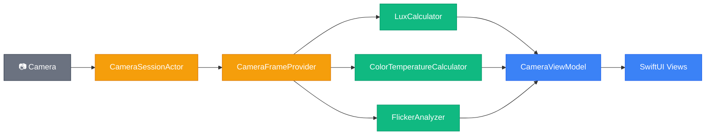

# How the LightMeter Codebase Works

This is your map to the iOS codebase. It covers what the app does, how the code is organized, where each module lives, and how the tests cover it. Read this before you start porting anything — it'll save you from guessing what a file does or why it's structured the way it is.

For the physics behind lux, Kelvin, and flicker, see the [Light Science Primer](docs/light-science-primer.md). For the React Native port plan, see the [Handover Guide](docs/react-native-handover.md).

---

## Table of Contents

1. [What the App Does](#what-the-app-does)
2. [How the Code Is Organized](#how-the-code-is-organized)
3. [How Data Flows](#how-data-flows)
4. [The Test Suite](#the-test-suite)
5. [Building and Running](#building-and-running)

---

## [What the App Does](#table-of-contents)

LightMeter turns an iPhone camera into a real-time light measurement tool. Open the app, point it at a scene, and a translucent card overlays two live readings: lux (brightness) and Kelvin (color temperature).

Four tabs:

- **LUX** — live lux + Kelvin measurement with a capture button and camera toggle button. Tap capture to freeze the frame and see a human-readable interpretation: what environment matches that brightness, a practical tip, a 2-column activity grid highlighting matching activities, and a comparison sentence. Close button returns to live mode. Tab bar hides during capture.
- **Temperature** — live Kelvin reading with color tone label and environment tip. No capture mode.
- **Check** — live light safety check using real-time Accelerate-based FFT flicker analysis.
- **Records** — fully functional saved measurement history screen with persistent storage, index numbers (`#3`, `#2`, `#1`), active activity chips, timestamps, and swipe-to-delete.
- **Multilingual Localization** — dynamic system-locale-based translation covering English, Korean, and French across all tabs, environment tips, descriptions, and activity chips.

### Lux ranges

The app uses 8 brightness ranges, each mapping to an environment description and a practical tip. The thresholds are defined in [`LuxRange.swift`](../LightMeter/Logic/LuxRange.swift) and the descriptions/tips live in [`LuxInterpreter.swift`](../LightMeter/Logic/LuxInterpreter.swift). See the [Light Science Primer](docs/light-science-primer.md) for the scale table and the science behind the spacing.

### Kelvin ranges

6 color temperature ranges, each with a color tone label and environment tip. The classification logic and exact strings are in [`KelvinInterpreter.swift`](../LightMeter/Logic/KelvinInterpreter.swift). See the [Light Science Primer](docs/light-science-primer.md) for the scale table and the physics behind warm vs. cool light.

---

## [How the Code Is Organized](#table-of-contents)

The codebase follows a "functional core, imperative shell" pattern (you'll see it called the "deterministic split" throughout the codebase). Every file belongs to one of three layers:

**Logic** — pure, deterministic, portable. These are the files you'll port to TypeScript.

| File | Role |
|------|------|
| [`LuxCalculator`](../LightMeter/Logic/LuxCalculator.swift) | `calculateLux(iso:exposureDurationInSeconds:)` → lux as Double. Returns 0.0 for invalid inputs (zero/negative). |
| [`LuxRange`](../LightMeter/Logic/LuxRange.swift) | `rangeIndex(for:)` → index 0–7. Shared by `LuxInterpreter` and `ComparisonGenerator` so thresholds aren't duplicated. |
| [`LuxInterpreter`](../LightMeter/Logic/LuxInterpreter.swift) | `interpret(lux:language:)` → `InterpretationResult` with environment description + tip, localized based on system locale. |
| [`KelvinInterpreter`](../LightMeter/Logic/KelvinInterpreter.swift) | `interpret(kelvin:language:)` → `InterpretationResult` with color tone + environment tip, localized. |
| [`ColorTemperatureCalculator`](../LightMeter/Logic/ColorTemperatureCalculator.swift) | `calculateColorTemperature(rawKelvin:)` → Kelvin clamped to [1 000, 15 000]. |
| [`ComparisonGenerator`](../LightMeter/Logic/ComparisonGenerator.swift) | `generate(lux:)` → "Brighter than X but darker than Y." Uses `LuxRange` internally. |
| [`InterpretationResult`](../LightMeter/Logic/InterpretationResult.swift) | `{ description, tip }` — conforms to `Equatable` and `Sendable`. |
| [`TabTransitionAction`](../LightMeter/Logic/TabTransitionAction.swift) | `resolve(from:to:)` → `.startSession`, `.stopSession`, or `.none`. Camera↔camera returns `.none`. |
| [`FlickerAnalyzer`](../LightMeter/Logic/FlickerAnalyzer.swift) | `analyze(samples:sampleRate:)` → `FlickerResult` representing the light safety calculations using Accelerate framework vDSP FFT. |
| [`AppLanguage`](../LightMeter/Logic/AppLanguage.swift) | Enum representing supported locales (`.english`, `.korean`, `.french`) and system locale detection. |
| [`LocalizedStrings`](../LightMeter/Logic/LocalizedStrings.swift) | Static translation lookup dictionary supplying all localized UI headers, tabs, and guide labels. |
| [`FlickerInterpreter`](../LightMeter/Logic/FlickerInterpreter.swift) | Static translator mapping raw safety level strings into localized descriptors. |
| [`ActivityChip`](../LightMeter/Logic/ActivityChip.swift) | Enum defining the 8 standard activities and mapping them to corresponding active Lux ranges. |
| [`CalibrationStore`](../LightMeter/Logic/CalibrationStore.swift) | Pure store managing the calibration multiplier: calculates ratio from targets, safety-clamps, and persists to standard `UserDefaults`. |

**Effects** — thin hardware wrappers. Rewrite these per platform; the logic layer stays the same.

| File | Role |
|------|------|
| [`CameraSessionActor`](../LightMeter/Camera/CameraSessionActor.swift) | Actor managing AVCaptureSession lifecycle: configuration, high-frame-rate formats (120/240 fps), locking exposure, toggling, and safe frame buffering. Exposes session non-isolatedly. |
| [`ImageProcessor`](../LightMeter/Camera/ImageProcessor.swift) | Thread-safe utility holding a single, persistent CIContext for high-performance pixel buffer conversion. |
| [`CameraFrameProvider`](../LightMeter/Camera/CameraFrameProvider.swift) | AVCaptureVideoDataOutputSampleBufferDelegate. Extracts standard frame metadata for Lux/Kelvin, Y-plane luminance for flicker checks, and transfers CVPixelBuffer safely to CameraSessionActor. |

**Glue** — views, view model, wiring. No business logic lives here.

| File | Role |
|------|------|
| [`CameraViewModel`](../LightMeter/Camera/CameraViewModel.swift) | Single source of truth: `@Published` lux, Kelvin, permission, error, camera position, session readiness, records persistent array (saves and loads to `UserDefaults` as JSON), and selected locale. |
| [`ContentView`](../LightMeter/ContentView.swift) | App container utilizing a custom floating capsule bottom tab bar overlay and shared single `CameraPreviewView` behind the views. Pause/resume camera session using `TabTransitionAction` logic. |
| [`Features/Measurement/`](../LightMeter/Features/Measurement/) | LUX tab — compact measurement card, dismissible reflected-light disclosure, calibration sheet overlay, and captured mode (expanded card, 8-activity grid overlay, and back chevron button). |
| [`Features/Temperature/`](../LightMeter/Features/Temperature/) | Temperature tab — live Kelvin reading with left-aligned color tone label. |
| [`Features/Check/`](../LightMeter/Features/Check/) | Check tab — live flicker check UI with safety gauge, real-time wave scope oscilloscope, and health report card. |
| [`Features/Records/`](../LightMeter/Features/Records/) | Records tab — list of persistent captured records chronologically ordered with swipe-to-delete gesture. |
| [`SharedViews/`](../LightMeter/SharedViews/) | `CameraPreviewView` (UIKit bridge), `CameraStateOverlay` (permission/error/preview), `PlaceholderView` (unused stub component). |
| [`DesignConstants`](../LightMeter/Design/DesignConstants.swift) | Centralized font sizes, spacing, dimensions. |
| [`Camera/LightRecord.swift`](../LightMeter/Camera/LightRecord.swift) | Codable model for saved records representing lux, Kelvin, timestamp, and active chips at time of capture. |

Tests live in `LightMeterTests/` — 157 tests covering the pure logic layer only. See [The Test Suite](#the-test-suite) for the breakdown.

---

## [How Data Flows](#table-of-contents)

Every frame follows the same path: hardware → effects → pure logic → glue → screen.

> 🟢 Pure logic &nbsp;&nbsp; 🟡 Effects &nbsp;&nbsp; 🔵 Glue &nbsp;&nbsp; ⚫ Hardware

`CameraFrameProvider` reads raw values from the device and passes them to `LuxCalculator` and `ColorTemperatureCalculator`. The pure logic never touches the camera. `CameraViewModel` publishes the results so SwiftUI views can observe them.

The interpreters (`LuxInterpreter`, `KelvinInterpreter`) and `ComparisonGenerator` are called at display time — they take the computed lux/Kelvin values and return human-readable strings.

---

## [The Test Suite](#table-of-contents)

All 157 tests target the pure logic layer. The effects and glue layers require real hardware and aren't unit tested — that's by design. The architecture pushes all testable logic into the pure layer so the untested surface is as thin as possible.

- **LuxCalculatorTests** (7) — formula correctness, edge cases (zero/negative ISO, zero exposure), large ISO, non-negativity invariant
- **LuxInterpreterTests** (28) — all 8 range mappings, boundary values at every threshold, negative value fallback, oracle equivalence, Korean and French translation assertions
- **LuxRangeTests** (17) — range index at every boundary, negative lux handling, equivalence with oracle
- **KelvinInterpreterTests** (24) — all 6 color tone ranges, boundary values, below-1000K fallback, determinism, Korean and French translation assertions
- **ColorTemperatureCalculatorTests** (10) — clamping at min/max, identity for in-range values, invariant across random inputs
- **CalibrationStoreTests** (4) — default identity multiplier, correct ratio calculation from reference targets, storage persistence round-trip, and safety clamping constraints
- **ComparisonGeneratorTests** (30) — sentence format for lowest/middle/highest ranges, boundary values, consistency with LuxInterpreter, completeness and correctness properties
- **TabTransitionActionTests** (8) — bug condition exploration (camera↔camera returns `.none`), preservation properties (camera→non-camera, non-camera→camera, non-camera→non-camera, same-tab), randomized verification
- **FlickerAnalyzerTests** (5) — mathematical accuracy against synthesized 50Hz, 100Hz, and 120Hz waves under different sampling rates, zero/low signal fallbacks, safety level classifications, verified with real-FFT unzipping algorithms.
- **FlickerInterpreterTests** (5) — translates raw safety levels into Korean, English, and French titles, formats dynamic Nyquist ceiling limits, and asserts safety descriptions contain no banned medical terms.
- **LocalizationTests** (5) — checks localization keys translate dynamically and maps activity chips accurately.
- **NumberFormattingTests** (1) — round-trip: format a number → parse it back → same value
- **SignalSmootherTests** (7) — convergence to constant input, bounded output within range, correct step-response direction, edge values for alpha (0 and 1), state reset, and significant figures rounding
- **TintInterpreterTests** (5) — green/neutral/magenta mappings, boundary thresholds, Korean/French/English translation assertions, consistency properties
- **CameraStateDecompositionTests** (6) — verifies isolated `MeasurementModel` calibration correctness, `RecordsStore` CRUD, legacy SwiftData migration, history capping constraints (100), scroll paging offsets, and CSV URL export generation

The suite uses two styles: unit tests (specific input → expected output) and property-based tests (random inputs → invariant rules like "lux is never negative"). Every module has both. When you port to TypeScript, replicate the boundary tests and representative value tests. For property-based tests, `fast-check` is a good equivalent.

Notable cross-module coverage: `ComparisonGeneratorTests` cross-checks against `LuxInterpreter` to verify both agree on range boundaries. Both `LuxInterpreterTests` and `ComparisonGeneratorTests` exercise `LuxRange` indirectly since they depend on it.

---

## [Building and Running](#table-of-contents)

Two build systems, different purposes:

- **Swift Package Manager** (`swift build` / `swift test`) — builds and tests the pure logic layer only. Fast, no Xcode needed. Good for iterating on logic and CI pipelines.
- **Xcode via XcodeGen** (`xcodegen generate` then Cmd+R) — builds the full app including camera, UI, and device deployment. Required for running on an iPhone.

`Package.swift` lists only the pure logic files and `DesignConstants.swift` — it excludes camera and UI code since those depend on iOS frameworks SPM can't build in isolation.

`project.yml` (XcodeGen config) sources directories recursively, so new files are picked up automatically after running `xcodegen generate`.
