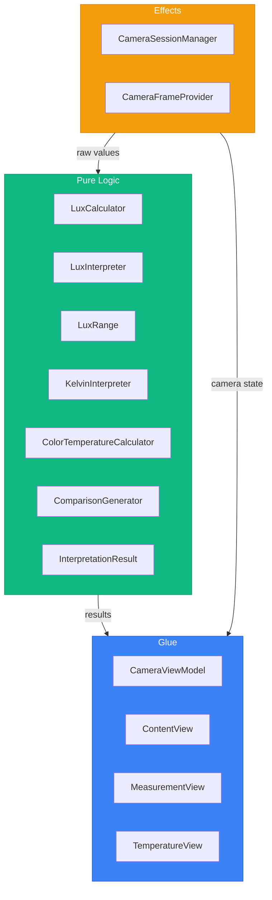
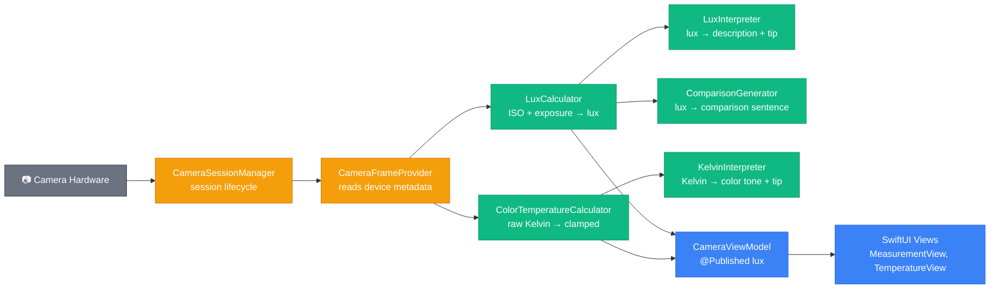

# Developer Guide — LightMeter iOS App

This document explains how the codebase is structured, what each module does, and how the test suite covers it. It is written for the PM and two developers working on this project.

---

<a id="table-of-contents"></a>
## Table of Contents

1. [How the App Works](#1-how-the-app-works)
2. [Architecture — The Three Layers](#2-architecture--the-three-layers)
3. [Project Structure](#3-project-structure)
4. [Module Reference](#4-module-reference)
5. [Data Flow](#5-data-flow)
6. [Test Suite](#6-test-suite)
7. [Unit Tests vs Property-Based Tests](#7-unit-tests-vs-property-based-tests)
8. [Test Coverage Map](#8-test-coverage-map)
9. [Build Systems](#9-build-systems)

---

## [1. How the App Works](#table-of-contents)

LightMeter turns an iPhone camera into a real-time light measurement tool. When you open the app, the camera feed fills the screen and a translucent card overlays two live readings:

- Lux (brightness) — how much light is hitting the camera
- Kelvin (color temperature) — what color the light is (warm orange vs cool blue)

The app has four tabs:

| Tab | What it does | Status |
|-----|-------------|--------|
| LUX | Live lux + Kelvin measurement, capture to freeze and interpret | Built |
| Temperature | Live Kelvin reading with color tone label | Built |
| Check | Flicker detection (light safety analysis) | Placeholder |
| Records | Saved measurement history | Placeholder |

When the user taps the capture button on the LUX tab, the camera frame freezes and the card expands to show a human-readable interpretation: what kind of environment matches that brightness, a practical tip, and a comparison sentence like "Brighter than a movie theater but darker than a living room."

---

## [2. Architecture — The Three Layers](#table-of-contents)

The codebase follows a strict separation called the "deterministic split." Every file belongs to exactly one of three layers:



> 🟢 Pure Logic &nbsp;&nbsp; 🟡 Effects &nbsp;&nbsp; 🔵 Glue

| Layer | Rule | What lives here |
|-------|------|----------------|
| Pure Logic | Same inputs always produce same outputs. No hardware, no frameworks, no side effects. | Calculators, interpreters, generators |
| Effects | Thin wrappers around hardware APIs. Minimal logic. | Camera session, frame buffer, device metadata |
| Glue | Wires pure logic to effects. No business logic allowed. | View models, SwiftUI views, navigation |

Why this matters: the pure logic layer is 100% unit testable without mocks, simulators, or devices. It is also portable — the same algorithms can be rewritten in any language for any platform.

---

## [3. Project Structure](#table-of-contents)

```
LightMeter/
├── LightMeterApp.swift              # App entry point
├── ContentView.swift                # Tab navigation, camera lifecycle
├── Logic/                           # 🟢 Pure Logic layer
│   ├── LuxCalculator.swift
│   ├── LuxInterpreter.swift
│   ├── LuxRange.swift
│   ├── KelvinInterpreter.swift
│   ├── ColorTemperatureCalculator.swift
│   ├── ComparisonGenerator.swift
│   └── InterpretationResult.swift
├── Camera/                          # 🟡 Effects layer
│   ├── CameraSessionManager.swift
│   ├── CameraFrameProvider.swift
│   └── CameraViewModel.swift        # 🔵 Glue (lives here because tightly coupled)
├── Features/                        # 🔵 Glue — feature screens
│   ├── Measurement/
│   │   ├── MeasurementView.swift
│   │   └── MeasurementCardView.swift
│   └── Temperature/
│       ├── TemperatureView.swift
│       └── TemperatureCardView.swift
├── SharedViews/                     # 🔵 Glue — reusable view components
│   ├── CameraPreviewView.swift
│   ├── CameraStateOverlay.swift
│   └── PlaceholderView.swift
└── Design/
    └── DesignConstants.swift         # Font sizes, spacing, dimensions

LightMeterTests/
├── Logic/                           # Tests for pure logic layer
│   ├── LuxCalculatorTests.swift
│   ├── LuxInterpreterTests.swift
│   ├── LuxRangeTests.swift
│   ├── KelvinInterpreterTests.swift
│   ├── ColorTemperatureCalculatorTests.swift
│   └── ComparisonGeneratorTests.swift
└── Formatting/
    └── NumberFormattingTests.swift   # Tests for locale-aware number display
```

---

## [4. Module Reference](#table-of-contents)

### Pure Logic (Logic/)

| Module | What it does | Key function | Input | Output |
|--------|-------------|-------------|-------|--------|
| `LuxCalculator` | Computes lux from camera exposure metadata | `calculateLux(iso:exposureDurationInSeconds:)` | ISO (Float), exposure (Double) | Lux (Double), 0.0 for invalid inputs |
| `LuxRange` | Maps a lux value to one of 8 range indices | `rangeIndex(for:)` | Lux (Double) | Index 0–7 (Int) |
| `LuxInterpreter` | Maps lux to a human-readable description and tip | `interpret(lux:)` | Lux (Double) | `InterpretationResult` |
| `KelvinInterpreter` | Maps Kelvin to a color tone label and tip | `interpret(kelvin:)` | Kelvin (Double) | `InterpretationResult` |
| `ColorTemperatureCalculator` | Clamps raw Kelvin to display range [1000, 15000] | `calculateColorTemperature(rawKelvin:)` | Raw Kelvin (Double) | Clamped Kelvin (Double) |
| `ComparisonGenerator` | Generates contextual comparison sentences | `generate(lux:)` | Lux (Double) | String like "Brighter than X but darker than Y" |
| `InterpretationResult` | Data type holding description + tip | — | — | `{ description: String, tip: String }` |

`LuxRange` is the shared dependency — both `LuxInterpreter` and `ComparisonGenerator` use `LuxRange.rangeIndex(for:)` to avoid duplicating threshold logic.

### Effects (Camera/)

| Module | What it does | Key responsibilities |
|--------|-------------|---------------------|
| `CameraSessionManager` | Manages AVCaptureSession lifecycle | Setup, start, stop, camera toggling, error reporting |
| `CameraFrameProvider` | Receives each camera frame and extracts metadata | Reads ISO, exposure duration, white balance gains from the device; calls pure logic calculators; stores latest frame for capture |

### Glue (Camera/, Features/, SharedViews/)

| Module | What it does | Key responsibilities |
|--------|-------------|---------------------|
| `CameraViewModel` | Single source of truth for all camera state | Holds `@Published` properties (lux, Kelvin, permission, error); wires SessionManager and FrameProvider together |
| `ContentView` | Tab navigation and camera lifecycle | 4-tab layout; starts/stops camera based on active tab and app foreground/background state |
| `MeasurementView` | LUX tab — live and captured modes | Live mode shows real-time card; capture freezes frame and expands card with interpretation |
| `MeasurementCardView` | Display component for lux + Kelvin readings | Pure display — receives pre-computed strings, no business logic |
| `TemperatureView` | Temperature tab — live mode only | Shows Kelvin reading with color tone label |
| `TemperatureCardView` | Display component for Kelvin reading | Pure display with interpretation text |
| `CameraStateOverlay` | Shared wrapper for camera-backed screens | Handles three states: permission denied, error, live preview |
| `CameraPreviewView` | UIKit bridge for camera preview | Wraps `AVCaptureVideoPreviewLayer` in a `UIViewRepresentable` |
| `PlaceholderView` | Stub for unbuilt tabs | Shows title + "Coming Soon" subtitle |

### Design

| Module | What it does |
|--------|-------------|
| `DesignConstants` | Centralized font sizes, spacing values, and component dimensions used across all views |

---

## [5. Data Flow](#table-of-contents)

This diagram shows how data moves from the camera hardware through all three layers to the screen on every frame:



> 🟢 Pure Logic &nbsp;&nbsp; 🟡 Effects &nbsp;&nbsp; 🔵 Glue &nbsp;&nbsp; ⚫ Hardware

The key insight: `CameraFrameProvider` (effects) reads raw values from the hardware and passes them to `LuxCalculator` and `ColorTemperatureCalculator` (pure logic). The pure logic never touches the camera. The `CameraViewModel` (glue) publishes the results so SwiftUI views can observe them.

---

## [6. Test Suite](#table-of-contents)

All tests target the pure logic layer. The effects and glue layers require a real device or simulator and are not unit tested.

| Test file | Tests for | Test count | What it validates |
|-----------|----------|------------|-------------------|
| `LuxCalculatorTests` | `LuxCalculator` | 6 | Formula correctness, edge cases (zero/negative ISO, zero exposure), non-negativity invariant |
| `LuxInterpreterTests` | `LuxInterpreter` | 22 | All 8 range mappings, boundary values at every threshold, negative value fallback |
| `LuxRangeTests` | `LuxRange` | 17 | Range index at every boundary, negative lux handling, equivalence with oracle |
| `KelvinInterpreterTests` | `KelvinInterpreter` | 20 | All 6 color tone ranges, boundary values, below-1000K fallback, determinism |
| `ColorTemperatureCalculatorTests` | `ColorTemperatureCalculator` | 9 | Clamping at min/max, identity for in-range values, invariant across random inputs |
| `ComparisonGeneratorTests` | `ComparisonGenerator` | 22 | Sentence format for lowest/middle/highest ranges, boundary values, consistency with LuxInterpreter |
| `NumberFormattingTests` | `NumberFormatter` | 1 | Round-trip: format a number → parse it back → same value |
| | | **Total: 97 unit + 16 property = 113** | |

---

## [7. Unit Tests vs Property-Based Tests](#table-of-contents)

The test suite uses two complementary testing approaches. Understanding the difference helps when reading or modifying tests.

### Unit tests — specific inputs, specific outputs

A unit test picks one concrete input and checks that the output matches an expected value. It is precise and easy to read.

```swift
// "If lux is 350, the description should be about office work"
@Test func range_office() {
    let r = LuxInterpreter.interpret(lux: 350)
    #expect(r.description == "General office work, kitchen cooking, light reading")
}
```

Strengths: easy to understand, pinpoints exact failures, documents expected behavior.
Weakness: only tests the specific values the developer thought of.

### Property-based tests — random inputs, invariant rules

A property-based test generates many random inputs and checks that a general rule (a "property") always holds. It does not check specific outputs — it checks structural invariants.

```swift
// "For ANY random lux value, the result should never be negative"
@Test func property_luxNonNegativity() {
    for _ in 0..<100 {
        let iso = Float.random(in: -1000...10000)
        let exposure = Double.random(in: -10.0...30.0)
        let result = LuxCalculator.calculateLux(iso: iso, exposureDurationInSeconds: exposure)
        #expect(result >= 0.0)
    }
}
```

Strengths: finds edge cases the developer did not think of, tests hundreds of inputs in one test.
Weakness: harder to debug when they fail (which random input caused it?), invariants must be carefully chosen.

### How they work together

| Aspect | Unit tests | Property-based tests |
|--------|-----------|---------------------|
| Input | Hand-picked specific values | Randomly generated |
| Assertion | Exact expected output | General rule that must always hold |
| Quantity | One input per test | 100–200 inputs per test |
| Reads like | "This input produces this output" | "For all inputs, this rule is true" |
| Best for | Boundary values, regression cases | Invariants, formula correctness, edge case discovery |

In this codebase, every module has both: unit tests for specific boundary values and representative values, plus property-based tests for invariants like "lux is never negative" and "clamped Kelvin is always in [1000, 15000]."

---

## [8. Test Coverage Map](#table-of-contents)

This diagram shows which test files cover which source modules:

```mermaid
graph LR
    subgraph SOURCE["Source Modules"]
        direction TB
        LC["LuxCalculator"]
        LR_["LuxRange"]
        LI["LuxInterpreter"]
        KI["KelvinInterpreter"]
        CTC["ColorTemperatureCalculator"]
        CG["ComparisonGenerator"]
        FMT["NumberFormatter<br/>(in card views)"]
    end

    subgraph TESTS["Test Files"]
        direction TB
        LCT["LuxCalculatorTests<br/>6 tests"]
        LRT["LuxRangeTests<br/>17 tests"]
        LIT["LuxInterpreterTests<br/>22 tests"]
        KIT["KelvinInterpreterTests<br/>20 tests"]
        CTCT["ColorTemperatureCalculatorTests<br/>9 tests"]
        CGT["ComparisonGeneratorTests<br/>22 tests"]
        NFT["NumberFormattingTests<br/>1 test"]
    end

    LCT --> LC
    LRT --> LR_
    LIT --> LI
    LIT -.->|"also exercises"| LR_
    KIT --> KI
    CTCT --> CTC
    CGT --> CG
    CGT -.->|"also exercises"| LR_
    CGT -.->|"cross-checks"| LI
    NFT --> FMT

    style SOURCE fill:#10b981,stroke:#059669,color:#fff
    style TESTS fill:#8b5cf6,stroke:#7c3aed,color:#fff
```



> 🟢 Source modules &nbsp;&nbsp; 🟣 Test files &nbsp;&nbsp; Solid arrows — direct coverage &nbsp;&nbsp; Dashed arrows — indirect coverage

Notable cross-module coverage:
- `ComparisonGeneratorTests` cross-checks its output against `LuxInterpreter` to verify both modules agree on range boundaries
- Both `LuxInterpreterTests` and `ComparisonGeneratorTests` exercise `LuxRange` indirectly since both modules depend on it

### What is not tested

| Module | Why |
|--------|-----|
| `CameraSessionManager` | Requires real camera hardware (effects layer) |
| `CameraFrameProvider` | Requires real camera hardware (effects layer) |
| `CameraViewModel` | Glue layer, depends on effects |
| All SwiftUI views | UI layer, would require UI tests or snapshot tests |

This is by design. The architecture pushes all testable logic into the pure layer, keeping the untested surface area as thin as possible.

---

## [9. Build Systems](#table-of-contents)

The project uses two build systems for different purposes:

| Build system | Command | What it builds | When to use |
|-------------|---------|---------------|-------------|
| Swift Package Manager | `swift build` / `swift test` | Pure logic layer + tests only | Fast iteration on logic, CI pipelines |
| Xcode (via XcodeGen) | `xcodegen generate` then Cmd+R | Full app including camera, UI, device deployment | Running on iPhone, testing camera features |

`Package.swift` explicitly lists only the pure logic files — it excludes all camera and UI code since those depend on iOS frameworks that SPM cannot build in isolation.

`project.yml` (XcodeGen config) sources entire directories recursively, so adding new files to any folder is automatically picked up after running `xcodegen generate`.
