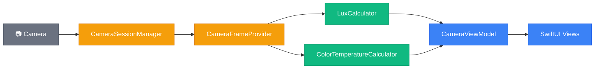

# How the LightMeter Codebase Works

This is your map to the iOS codebase. It covers what the app does, how the code is organized, where each module lives, and how the tests cover it. Read this before you start porting anything — it'll save you from guessing what a file does or why it's structured the way it is.

For the physics behind lux, Kelvin, and flicker, see the [Light Science Primer](docs/light-science-primer.md). For the React Native port plan, see the [Handover Guide](docs/react-native-handover.md).

---

<a id="table-of-contents"></a>
## Table of Contents

1. [What the App Does](#what-the-app-does)
2. [How the Code Is Organized](#how-the-code-is-organized)
3. [The Modules](#the-modules)
4. [How Data Flows](#how-data-flows)
5. [The Test Suite](#the-test-suite)
6. [Building and Running](#building-and-running)

---

## [What the App Does](#table-of-contents)

LightMeter turns an iPhone camera into a real-time light measurement tool. Open the app, point it at a scene, and a translucent card overlays two live readings: lux (brightness) and Kelvin (color temperature).

Four tabs:

- **LUX** — live lux + Kelvin measurement with a capture button. Tap capture to freeze the frame and see a human-readable interpretation: what environment matches that brightness, a practical tip, and a comparison sentence like "Brighter than a movie theater but darker than a living room." Close button returns to live mode. Tab bar hides during capture.
- **Temperature** — live Kelvin reading with color tone label and environment tip. No capture mode.
- **Check** — placeholder for flicker detection (the React Native team builds this).
- **Records** — placeholder for saved measurement history.

### Lux ranges

These are the 8 ranges the app uses to interpret brightness. Each maps to an environment description and a tip — see the `LuxInterpreter` module for the exact strings.

| Lux | Environment |
|-----|------------|
| 0–10 | Very dark outdoors, full moon night |
| 11–100 | Hallways, bathrooms, movie theaters |
| 101–200 | Living room relaxation, dining, hotel rooms |
| 201–500 | General office work, kitchen cooking |
| 501–1,000 | Focused studying, precision handwork |
| 1,001–2,000 | Bright window indoors, broadcast studios |
| 2,001–10,000 | Cloudy day outdoors, sunset outdoors |
| 10,001+ | Direct sunlight, noon on a clear day |

### Kelvin ranges

6 ranges for color temperature classification. See `KelvinInterpreter` for the exact strings.

| Kelvin | Color tone |
|--------|-----------|
| Below 2,000K | Candlelight / Sunset 🔥 |
| 2,000–3,499K | Warm White 💡 |
| 3,500–4,999K | Natural White 🌤 |
| 5,000–6,499K | Daylight 📖 |
| 6,500–9,999K | Cool White ❄ |
| 10,000K+ | Blue Sky 🧊 |

For the science behind these ranges — why they're spaced the way they are and what the numbers mean physically — see the [Light Science Primer](docs/light-science-primer.md).

---

## [How the Code Is Organized](#table-of-contents)

The codebase follows a "functional core, imperative shell" pattern (you'll see it called the "deterministic split" in the steering docs and spec files). Every file belongs to one of three layers:

- 🟢 **Pure logic** — deterministic functions. Same inputs, same outputs. No hardware, no frameworks, no side effects. This is where all the formulas and interpretation logic live. 100% unit testable without mocks or devices. Portable to any platform.
- 🟡 **Effects** — thin wrappers around camera hardware. Reads metadata, manages the capture session. No business logic.
- 🔵 **Glue** — wires the other two together. SwiftUI views, the view model, tab navigation. No business logic, no direct hardware calls.

```
LightMeter/
├── LightMeterApp.swift              # App entry point
├── ContentView.swift                # 🔵 Tab navigation, camera lifecycle
├── Logic/                           # 🟢 Pure logic
│   ├── LuxCalculator.swift
│   ├── LuxInterpreter.swift
│   ├── LuxRange.swift
│   ├── KelvinInterpreter.swift
│   ├── ColorTemperatureCalculator.swift
│   ├── ComparisonGenerator.swift
│   └── InterpretationResult.swift
├── Camera/                          # 🟡 Effects + 🔵 Glue
│   ├── CameraSessionManager.swift   # 🟡 AVCaptureSession lifecycle
│   ├── CameraFrameProvider.swift    # 🟡 Frame metadata extraction
│   └── CameraViewModel.swift        # 🔵 Wires camera → logic → UI state
├── Features/                        # 🔵 Feature screens
│   ├── Measurement/
│   │   ├── MeasurementView.swift
│   │   └── MeasurementCardView.swift
│   └── Temperature/
│       ├── TemperatureView.swift
│       └── TemperatureCardView.swift
├── SharedViews/                     # 🔵 Reusable view components
│   ├── CameraPreviewView.swift
│   ├── CameraStateOverlay.swift
│   └── PlaceholderView.swift
└── Design/
    └── DesignConstants.swift

LightMeterTests/
├── Logic/                           # Tests for pure logic only
│   ├── LuxCalculatorTests.swift
│   ├── LuxInterpreterTests.swift
│   ├── LuxRangeTests.swift
│   ├── KelvinInterpreterTests.swift
│   ├── ColorTemperatureCalculatorTests.swift
│   └── ComparisonGeneratorTests.swift
└── Formatting/
    └── NumberFormattingTests.swift
```

---

## [The Modules](#table-of-contents)

### Pure logic (Logic/)

These are the files you'll port to TypeScript. No platform imports, no side effects — just input → output.

- **LuxCalculator** — `calculateLux(iso:exposureDurationInSeconds:)` → lux as a Double. Returns 0.0 for invalid inputs (zero or negative ISO/exposure).
- **LuxRange** — `rangeIndex(for:)` → index 0–7. Shared by both `LuxInterpreter` and `ComparisonGenerator` so threshold logic isn't duplicated.
- **LuxInterpreter** — `interpret(lux:)` → `InterpretationResult` with description and tip. Uses `LuxRange` internally.
- **KelvinInterpreter** — `interpret(kelvin:)` → `InterpretationResult` with color tone and environment tip.
- **ColorTemperatureCalculator** — `calculateColorTemperature(rawKelvin:)` and `clamp(_:)` → Kelvin clamped to [1000, 15000].
- **ComparisonGenerator** — `generate(lux:)` → a sentence like "Brighter than a movie theater but darker than a living room." Uses `LuxRange` internally.
- **InterpretationResult** — `{ description: String, tip: String }`. Conforms to `Equatable` and `Sendable`.

### Effects (Camera/)

These talk to the hardware. You'll rewrite these for Android — the logic layer stays the same.

- **CameraSessionManager** — manages the AVCaptureSession lifecycle: setup, start, stop, camera toggling, error reporting. Exposes the `device` for metadata access.
- **CameraFrameProvider** — receives each camera frame and reads ISO, exposure duration, and white balance gains from the device. Calls the pure logic calculators. Stores the latest sample buffer and provides `captureFrame()` to convert it to a UIImage.

### Glue (Camera/, Features/, SharedViews/)

These wire everything together. No business logic lives here.

- **CameraViewModel** — the single source of truth for camera state. Holds `@Published` properties (lux, Kelvin, permission, error, camera position, sessionReady). Wires SessionManager and FrameProvider together. Provides `captureFrameAsync()` and `toggleCamera()`.
- **ContentView** — four-tab layout. Starts/stops camera based on active tab and foreground/background state.
- **MeasurementView** — LUX tab with live and captured modes. Live mode shows a compact card with capture and camera toggle buttons. Captured mode freezes the frame, expands the card, hides the tab bar.
- **MeasurementCardView** — pure display component. Receives pre-computed strings, no logic. Includes `formatValue()` for locale-aware number formatting.
- **TemperatureView / TemperatureCardView** — same pattern as the LUX tab but simpler. Live mode only, no capture.
- **CameraStateOverlay** — shared wrapper handling three states: permission denied, error, live preview.
- **CameraPreviewView** — UIKit bridge wrapping `AVCaptureVideoPreviewLayer` in a `UIViewRepresentable`.
- **PlaceholderView** — stub for unbuilt tabs. Title + "Coming Soon."
- **DesignConstants** — centralized font sizes, spacing, and dimensions.

---

## [How Data Flows](#table-of-contents)

Every frame follows the same path: hardware → effects → pure logic → glue → screen.



> 🟢 Pure logic &nbsp;&nbsp; 🟡 Effects &nbsp;&nbsp; 🔵 Glue &nbsp;&nbsp; ⚫ Hardware

`CameraFrameProvider` reads raw values from the device and passes them to `LuxCalculator` and `ColorTemperatureCalculator`. The pure logic never touches the camera. `CameraViewModel` publishes the results so SwiftUI views can observe them.

The interpreters (`LuxInterpreter`, `KelvinInterpreter`) and `ComparisonGenerator` are called at display time — they take the computed lux/Kelvin values and return human-readable strings.

---

## [The Test Suite](#table-of-contents)

All 108 tests target the pure logic layer. The effects and glue layers require real hardware and aren't unit tested — that's by design. The architecture pushes all testable logic into the pure layer so the untested surface is as thin as possible.

- **LuxCalculatorTests** (7) — formula correctness, edge cases (zero/negative ISO, zero exposure), large ISO, non-negativity invariant
- **LuxInterpreterTests** (26) — all 8 range mappings, boundary values at every threshold, negative value fallback, oracle equivalence
- **LuxRangeTests** (17) — range index at every boundary, negative lux handling, equivalence with oracle
- **KelvinInterpreterTests** (20) — all 6 color tone ranges, boundary values, below-1000K fallback, determinism
- **ColorTemperatureCalculatorTests** (10) — clamping at min/max, identity for in-range values, invariant across random inputs
- **ComparisonGeneratorTests** (27) — sentence format for lowest/middle/highest ranges, boundary values, consistency with LuxInterpreter, completeness and correctness properties
- **NumberFormattingTests** (1) — round-trip: format a number → parse it back → same value

The suite uses two styles: unit tests (specific input → expected output) and property-based tests (random inputs → invariant rules like "lux is never negative"). Every module has both. When you port to TypeScript, replicate the boundary tests and representative value tests. For property-based tests, `fast-check` is a good equivalent.

Notable cross-module coverage: `ComparisonGeneratorTests` cross-checks against `LuxInterpreter` to verify both agree on range boundaries. Both `LuxInterpreterTests` and `ComparisonGeneratorTests` exercise `LuxRange` indirectly since they depend on it.

---

## [Building and Running](#table-of-contents)

Two build systems, different purposes:

- **Swift Package Manager** (`swift build` / `swift test`) — builds and tests the pure logic layer only. Fast, no Xcode needed. Good for iterating on logic and CI pipelines.
- **Xcode via XcodeGen** (`xcodegen generate` then Cmd+R) — builds the full app including camera, UI, and device deployment. Required for running on an iPhone.

`Package.swift` lists only the pure logic files and `DesignConstants.swift` — it excludes camera and UI code since those depend on iOS frameworks SPM can't build in isolation.

`project.yml` (XcodeGen config) sources directories recursively, so new files are picked up automatically after running `xcodegen generate`.
