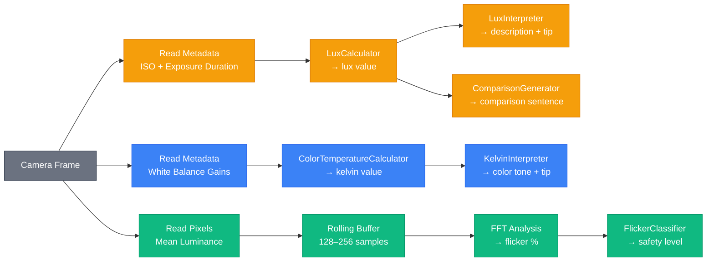

# Turning a Phone Camera Into a Light Meter

Your phone doesn't have a light sensor. Well, it does — the ambient light sensor that adjusts screen brightness — but that's a single crude number you can't access from app code. What your phone *does* have is a camera. And a camera, it turns out, is a surprisingly good light meter if you know how to read its metadata.

This guide covers the three things we measure — brightness, color, and flicker — and exactly how to pull each one from a camera frame. It's written for developers building the app, not for anyone studying optics. You need just enough physics to understand why the code works.

---

<a id="table-of-contents"></a>
## Table of Contents

1. [One Frame, Three Numbers](#one-frame-three-numbers)
2. [Brightness (Lux): Reading the Camera's Homework](#brightness-lux-reading-the-cameras-homework)
3. [Color Temperature (Kelvin): What White Looks Like](#color-temperature-kelvin-what-white-looks-like)
4. [Flicker: The Hard One](#flicker-the-hard-one)
5. [Where to Go From Here](#where-to-go-from-here)
6. [Appendix: Pipeline & Reference](#appendix-pipeline--reference)
7. [Sources](#sources)

---

## [One Frame, Three Numbers](#table-of-contents)

Every time the camera captures a frame, it hands you two things: metadata and pixels.

The metadata is the interesting part. Before the camera even saves an image, its auto-exposure system has already solved a physics problem: "How bright is this scene, and what color is the light?" It records the answer as ISO, exposure duration, and white balance gains. We just read those values and run them through simple formulas.

| What we get | Where it lives | What we compute |
|-------------|---------------|-----------------|
| ISO + exposure duration | Auto-exposure metadata | Brightness (lux) |
| White balance gains | Auto white balance metadata | Color temperature (Kelvin) |
| Raw pixel data | The actual image | Flicker percentage |

Lux and Kelvin come entirely from metadata — zero pixel processing, zero performance cost. Flicker is the exception. It needs actual pixel data across multiple frames. More on that later.

The three measurements are independent. A light can be bright and warm and flickering. Or dim and cool and perfectly steady. Each number tells you something different, and together they give a complete picture of any lighting environment.

---

## [Brightness (Lux): Reading the Camera's Homework](#table-of-contents)

### The idea

Lux is the SI unit for illuminance — how much light is hitting a surface [[1]](#source-1). One lux is one lumen per square meter. It measures light *arriving*, not light *leaving*. A lamp produces the same lumens whether you're next to it or across the room, but the lux you experience drops with distance.

Here's why a light meter matters: humans are terrible at judging brightness. Your living room at 150 lux feels "well lit," but it's 600x dimmer than a cloudy day outdoors (~10,000 lux) and 700x dimmer than direct sunlight (~100,000 lux). Your eyes adapt so smoothly you never notice.

### The scale

| Lux | What it looks like |
|-----|-------------------|
| 0–10 | Full moon night, very dark outdoors |
| 11–100 | Hallway, movie theater, dim bathroom |
| 101–200 | Living room with lamps on, hotel room |
| 201–500 | Office, kitchen, casual reading |
| 501–1,000 | Study desk, detailed handwork, retail store |
| 1,001–2,000 | Bright window indoors, TV studio |
| 2,001–10,000 | Cloudy day outdoors, open shade |
| 10,001+ | Direct sunlight, noon on a clear day |

These ranges aren't evenly spaced — they're roughly logarithmic, because that's how human brightness perception works. Doubling the lux doesn't feel twice as bright.

### How we get it from the camera

The camera doesn't have a lux sensor. But its auto-exposure algorithm has already figured out how bright the scene is — it had to, in order to choose the right ISO and shutter speed. We just reverse-engineer its decision [[6]](#source-6).

```
lux = (C × A²) / (ISO × T)
```

- `C` = 250 — incident-light calibration constant from the ISO 2720 standard (flat receptor) [[5]](#source-5)
- `A` = lens aperture f-number (f/1.6 on iPhone 13 mini, f/1.7 on Galaxy S24)
- `ISO` = sensor sensitivity
- `T` = exposure duration in seconds

The intuition is straightforward: if the camera cranks up ISO and uses a long exposure, the scene is dark. If it uses low ISO and a fast shutter, the scene is bright. The formula makes that relationship precise.

Note: ISO 2720 defines two calibration constants. K (10.6–13.4, typically 12.5) is for reflected-light meters and computes luminance in cd/m². C (240–400, typically 250 for a flat receptor) is for incident-light meters and computes illuminance in lux. Since we want lux, we use C=250.

### Implementation notes

- You compute lux from metadata, not pixels. Never look at pixel brightness for this — it's been mangled by white balance, tone mapping, and HDR processing.
- The camera must be in auto-exposure mode. Locked exposure gives you the brightness the camera is *calibrated for*, not the actual scene brightness.
- Aperture is a physical constant of the lens hardware. It doesn't change. You hardcode it per device or make it configurable.
- The 250 calibration constant is the ISO 2720 incident-light value for a flat receptor. It gives illuminance in lux directly. The older value of 12.5 is the reflected-light constant (K), which computes luminance in cd/m² — a different physical quantity. Using K=12.5 in a lux meter produces readings roughly 20x too low [[5]](#source-5).

---

## [Color Temperature (Kelvin): What White Looks Like](#table-of-contents)

### The idea

Color temperature tells you whether light looks warm (orange) or cool (blue), measured in Kelvin [[2]](#source-2).

The naming is counterintuitive: higher Kelvin means *cooler-looking* (bluer) light, even though the physical temperature is higher. A candle flame is ~1,800K (warm orange). Noon sunlight is ~5,500K (neutral white). A clear blue sky in shade is 10,000K+ (blue-white). We say "warm" and "cool" based on how colors feel psychologically, not their actual temperature.

Why it matters: color temperature affects mood, focus, and even sleep. Warm light (2,000–3,000K) promotes relaxation — bedrooms and restaurants. Neutral light (3,500–5,000K) keeps you alert — kitchens and offices. Cool light (5,000K+) sharpens focus — study rooms and hospitals. A reading lamp at 2,700K is great for a bedroom but terrible for a study desk.

### The scale

| Kelvin | Color tone | Feels like |
|--------|-----------|------------|
| Below 2,000K | Candlelight / Sunset 🔥 | Warm orange glow |
| 2,000–3,499K | Warm White 💡 | Traditional incandescent bulb |
| 3,500–4,999K | Natural White 🌤 | Neutral, balanced |
| 5,000–6,499K | Daylight 📖 | Bright white, like noon sun |
| 6,500–9,999K | Cool White ❄ | Blue-white, clinical |
| 10,000K+ | Blue Sky 🧊 | Very blue, like open shade |

### How we get it from the camera

The camera's auto white balance is constantly solving: "What does white look like under this light?" It adjusts red, green, and blue channel gains until whites look neutral.

Those gain values *are* the measurement. If the camera boosts blue and reduces red to neutralize the scene, the light source is warm (low Kelvin). If it boosts red and reduces blue, the light is cool (high Kelvin).

- On iOS, there's a convenience method: `device.temperatureAndTintValues(for: gains).temperature` gives you Kelvin directly.
- On Android, you get `COLOR_CORRECTION_GAINS` (four floats: R, G_even, G_odd, B) from `CaptureResult`. You compute the red/blue gain ratio and map it to Kelvin — a lookup table or simplified McCamy's formula works fine.

The raw value is an approximation. Different cameras give slightly different readings for the same light. That's fine — we clamp to [1,000, 15,000] and classify into six broad ranges.

### How lux and Kelvin relate

They don't, really. Lux is quantity (how much light). Kelvin is quality (what color). A candle and a fluorescent tube can both produce 100 lux, but the candle is ~1,800K while the fluorescent is ~4,000K.

There's a loose correlation in natural light — sunrise is both dim and warm, noon is both bright and cool. But indoors with artificial lighting, the correlation breaks down completely. A bright warm-white LED can be 500 lux at 2,700K. A dim cool-white fluorescent can be 100 lux at 6,500K.

We show both values together because neither tells the full story alone.

---

## [Flicker: The Hard One](#table-of-contents)

### The idea

Most artificial lights flicker [[3]](#source-3). Not on-off-on-off — more like bright-dim-bright-dim, many times per second. AC power cycles at 50Hz (Europe, Asia) or 60Hz (North America), so lights oscillate at 100Hz or 120Hz (twice per cycle).

You can't see it consciously, but your visual system still responds. The effects are well-documented: headaches, eye strain, reduced concentration, nausea. Some people are far more sensitive than others — children, migraine sufferers, and people with autism spectrum conditions tend to be more affected [[3]](#source-3).

The severity depends entirely on the light source:

- Old incandescent bulbs: flicker at 100–120Hz, but less than 10% intensity variation. Generally fine.
- Cheap LED bulbs: flicker at 100–120Hz with 30–100% intensity variation. Problematic.
- Quality LED bulbs: good driver electronics reduce flicker to under 3%.
- Sunlight: zero flicker.

There's also a nasty real-world interaction with dimming. When LEDs are dimmed using PWM (pulse-width modulation), flicker percentage often spikes. A bulb at 5% flicker on full brightness might hit 40% flicker at half brightness. Your users will encounter this.

### How we measure it

Flicker percentage captures how much the intensity oscillates within each cycle:

```
flicker% = (Lmax - Lmin) / (Lmax + Lmin) × 100
```

A light oscillating between 90 and 110 brightness units: `(110 - 90) / (110 + 90) × 100 = 10%`. Between 10 and 100: `(100 - 10) / (100 + 10) × 100 = 82%`. The first is barely noticeable. The second is severe.

### The scale

| Flicker % | Safety level | What it means |
|-----------|-------------|---------------|
| 0–3% | Very Safe | Minimal eye fatigue even with prolonged use |
| 3–10% | Safe | Sensitive individuals may feel mild dryness or fatigue |
| 10–30% | Caution | Noticeable eye pain, blurred focus, discomfort |
| 30–60% | Dangerous | Severe eye fatigue, migraines, dizziness |
| 60%+ | Very Dangerous | Visible flickering, risk of seizures for sensitive individuals |

These thresholds are informed by IEEE 1789 recommended practices [[4]](#source-4), which suggest a limit of ~8–10% flicker at 100–120Hz for comfortable viewing.

### How we detect it from the camera

This is where it gets interesting. Unlike lux and Kelvin (metadata lookups), flicker requires analyzing actual pixel data across multiple frames.

The approach:

1. Capture frames at a consistent rate (30fps minimum, 60fps preferred)
2. For each frame, compute mean luminance — average brightness across all pixels (or a center-weighted region)
3. Store values in a rolling buffer (128–256 samples for good FFT resolution)
4. Run a Fast Fourier Transform to convert from time domain to frequency domain
5. Look for peaks at 100Hz and 120Hz — the signatures of AC-powered flicker
6. If a peak exists, compute flicker percentage from the oscillation amplitude

Conceptually:

```
Frame 1: avg brightness = 142
Frame 2: avg brightness = 138
Frame 3: avg brightness = 143
Frame 4: avg brightness = 137
Frame 5: avg brightness = 144
...
(pattern repeats at ~100Hz or ~120Hz)

FFT reveals: peak at 120Hz with amplitude X
→ flicker% = amplitude-based calculation
```

### Why this is tricky on a phone

Four things make phone-based flicker detection harder than it sounds:

1. **Frame rate vs flicker frequency.** Most cameras capture at 30 or 60fps. Nyquist theorem says you can only detect frequencies up to half your sample rate — 15Hz at 30fps, 30Hz at 60fps. Neither reaches 100/120Hz directly. The workaround: flicker at those frequencies creates aliased patterns at lower frequencies. A 120Hz flicker sampled at 60fps aliases to ~0Hz. A 100Hz flicker at 30fps aliases to 10Hz. You detect the aliases, not the original frequency. Some phones support 120/240fps, which resolves this directly.

2. **Auto-exposure interference.** The camera constantly adjusts ISO and exposure, changing brightness between frames for reasons unrelated to flicker. You need to lock exposure during measurement or compensate for the changes.

3. **Rolling shutter.** Phone cameras expose different pixel rows at slightly different times. This can actually *help* (it creates visible banding from flicker), but it complicates the luminance averaging approach.

4. **Processing budget.** Mean luminance + FFT on every frame needs to run in real time. This should live in a native module, not JavaScript.

---

## [Where to Go From Here](#table-of-contents)

That's the entire physics model behind the app — and honestly, it's not that much physics. The camera already did the hard work of metering the scene. We're just reading its answers and running them through a few formulas.

Here's what that means in practice: two of the three pipelines (lux and Kelvin) are pure metadata reads. No pixel processing, no buffers, no FFT. You can have a working brightness and color temperature meter in an afternoon. Flicker is the one that takes real engineering effort — the aliasing workarounds, the rolling buffer, the real-time FFT — but it's also the feature that makes this app genuinely useful rather than a novelty.

If you're picking up this codebase for the first time, start with the lux pipeline. It's the simplest end-to-end path: read two numbers from camera metadata, plug them into a formula, classify the result. Once that's working, Kelvin is almost the same pattern with a different data source. Flicker comes last — by then you'll already understand the camera frame lifecycle and the pure-logic-vs-effects split that the architecture is built around.

The pure logic layer ports across platforms without changes. The calculators, interpreters, and classifiers don't know or care whether they're running on iOS or Android. Only the thin effects layer — the part that actually talks to the camera — needs to be rewritten per platform. For how this maps to the actual codebase, see the [Developer Guide](docs/developer-guide.md).

Point your camera at a lamp and see what comes back. That's the best way to build intuition for what these numbers actually mean.

---

## [Appendix: Pipeline & Reference](#table-of-contents)

Everything above is the narrative. Everything below is the stuff you'll `Cmd+F` for later.

### The full pipeline

One camera frame feeds three independent pipelines:



> 🟡 Lux pipeline &nbsp;&nbsp; 🔵 Kelvin pipeline &nbsp;&nbsp; 🟢 Flicker pipeline &nbsp;&nbsp; ⚫ Shared origin

The lux and Kelvin pipelines are metadata-only — cheap and fast. The flicker pipeline touches pixels and needs a rolling buffer + FFT — heavier, but still real-time in a native module.

The lux and Kelvin branches are already implemented in the iOS app and port directly. Flicker is new work for the React Native team.

### Formulas

Lux:
```
lux = (250 × aperture²) / (ISO × exposureSeconds)
// Returns 0 if ISO ≤ 0 or exposureSeconds ≤ 0
```

Color temperature:
```
kelvin = clamp(rawKelvin, 1000, 15000)
```

Flicker:
```
flicker% = (Lmax - Lmin) / (Lmax + Lmin) × 100
// Lmax and Lmin from the dominant flicker cycle detected by FFT
```

### Constants

| Constant | Value | Source |
|----------|-------|--------|
| Calibration constant (C) | 250 | ISO 2720 standard, incident-light flat receptor [[5]](#source-5) |
| iPhone 13 mini aperture | f/1.6 | Apple hardware spec |
| Samsung Galaxy S24 aperture | f/1.7 | Samsung hardware spec |
| Samsung Galaxy S25 aperture | f/1.9 | Samsung hardware spec |
| Kelvin minimum | 1,000 | App design choice (below this is infrared) |
| Kelvin maximum | 15,000 | App design choice (above this is uncommon) |
| AC mains frequency (Americas) | 60Hz → 120Hz flicker | Electrical standard |
| AC mains frequency (Europe/Asia) | 50Hz → 100Hz flicker | Electrical standard |

### Things that trip people up

1. **"Lux comes from pixel brightness."** No. Lux comes from camera exposure metadata (ISO and shutter speed). Pixel brightness has been processed by white balance, tone mapping, and HDR — it's unreliable for absolute measurement.

2. **"Higher Kelvin = warmer light."** Opposite. Higher Kelvin = cooler (bluer) light. "Warm" and "cool" describe psychological perception, not physical temperature.

3. **"Flicker means the light turns on and off."** Not quite. Flicker is intensity *variation*. A light that never fully turns off can still have severe flicker if its brightness oscillates significantly.

4. **"All LEDs flicker."** Quality LEDs with good driver electronics can be under 1% flicker. The problem is cheap LEDs with poor drivers.

5. **"The camera measures flicker directly."** The camera captures at 30–60fps. Flicker at 100–120Hz is faster than the frame rate. We detect it through aliased patterns in frame-to-frame brightness, or by using higher frame rates where available.

---

## [Sources](#table-of-contents)

<a id="source-1"></a>
**[1]** [Lux — Wikipedia](https://en.wikipedia.org/wiki/Lux)
<br>SI unit definition for illuminance, with reference values for common environments.

<a id="source-2"></a>
**[2]** [Color Temperature — Wikipedia](https://en.wikipedia.org/wiki/Color_temperature)
<br>Comprehensive reference on the Kelvin scale, black body radiation origin, and warm/cool color perception.

<a id="source-3"></a>
**[3]** [Lighting Ergonomics: Flicker — CCOHS](https://www.ccohs.ca/oshanswers/ergonomics/lighting_flicker.html)
<br>Canadian government occupational health authority on flicker causes, health effects, and frequency thresholds.

<a id="source-4"></a>
**[4]** [IEEE 1789-2015](https://standards.ieee.org/standard/1789-2015.html)
<br>Recommended practices for modulating current in LED lighting to limit flicker risk.

<a id="source-5"></a>
**[5]** [ISO 2720:1974](https://www.iso.org/standard/7688.html)
<br>International standard for general-purpose photographic exposure meters, source of the 12.5 calibration constant.

<a id="source-6"></a>
**[6]** [Exposure (photography) — Wikipedia](https://en.wikipedia.org/wiki/Exposure_(photography))
<br>Covers the relationship between scene luminance, ISO, aperture, and exposure time with formal equations.

Content was rephrased for compliance with licensing restrictions.
