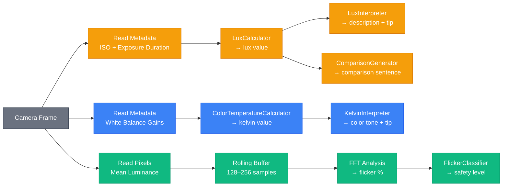

# Light Science Primer — What You Need to Know to Build This App

This document explains the three physical quantities the LightMeter app measures: lux (brightness), color temperature (Kelvin), and flicker. It is written for developers, not physicists. The goal is to give you enough understanding to know why the formulas work, what the numbers mean, and where the tricky parts are when implementing on a phone.

---

<a id="table-of-contents"></a>
## Table of Contents

1. [Lux — How Bright Is It?](#1-lux--how-bright-is-it)
2. [Color Temperature (Kelvin) — What Color Is the Light?](#2-color-temperature-kelvin--what-color-is-the-light)
3. [Flicker — Is the Light Steady?](#3-flicker--is-the-light-steady)
4. [How the Camera Gives Us These Numbers](#4-how-the-camera-gives-us-these-numbers)
5. [Quick Reference for Developers](#5-quick-reference-for-developers)
6. [Sources](#sources)

---

## [1. Lux — How Bright Is It?](#table-of-contents)

### What it is

Lux is the standard unit for measuring how much light hits a surface [[1]](#source-1). One lux equals one lumen per square meter. It is an SI unit, meaning it is internationally standardized and used everywhere from architecture to agriculture.

The key thing to understand: lux measures light arriving at a point, not light leaving a source. A 1000-lumen bulb produces the same lumens whether you are standing next to it or across the room, but the lux you experience drops dramatically with distance. Lux is what your eyes actually receive.

### Why it matters to people

Humans are surprisingly bad at judging brightness by feel. A living room at 150 lux feels "well lit" to most people, but it is actually 600x dimmer than a cloudy day outdoors (around 10,000 lux) and 700x dimmer than direct sunlight (around 100,000 lux). Our eyes adapt so seamlessly that we do not notice these enormous differences.

This is why a light meter is useful. It gives an objective number where human perception is unreliable. Parents checking nursery lighting, office workers evaluating desk lamps, plant owners checking sunlight levels — they all benefit from knowing the actual number.

### The scale in our app

| Lux | What it looks like |
|-----|-------------------|
| 0–10 | Full moon night, very dark outdoors |
| 11–100 | Hallway, movie theater, dim bathroom |
| 101–200 | Living room with lamps on, hotel room |
| 201–500 | Office, kitchen, casual reading |
| 501–1,000 | Study desk, detailed handwork, retail store |
| 1,001–2,000 | Bright window indoors, TV studio |
| 2,001–10,000 | Cloudy day outdoors, open shade |
| 10,001+ | Direct sunlight, noon on a clear day |

Notice the ranges are not evenly spaced. They roughly follow a logarithmic pattern because human perception of brightness is logarithmic — doubling the lux does not feel twice as bright.

### How a phone camera measures lux

A phone camera does not have a dedicated lux sensor. Instead, we reverse-engineer lux from the camera's auto-exposure settings [[6]](#source-6). Here is the chain:

1. The camera's auto-exposure algorithm looks at the scene and decides how to expose the image
2. It picks an ISO (sensor sensitivity) and an exposure duration (how long the sensor collects light)
3. These two values, combined with the lens aperture (a fixed physical property of the camera), tell us how bright the scene must be

The formula:

```
lux = (C × A²) / (ISO × T)
```

Where:
- `C` = calibration constant (12.5, from the ISO 2720 standard for reflected light metering [[5]](#source-5))
- `A` = lens aperture f-number (e.g., 1.6 for iPhone, 1.7 for Samsung Galaxy S24)
- `ISO` = sensor sensitivity (higher ISO = more sensitive = less light needed)
- `T` = exposure duration in seconds (longer exposure = more light collected)

The intuition: if the camera needs high ISO and long exposure, the scene is dark (low lux). If it uses low ISO and short exposure, the scene is bright (high lux). The formula just makes this relationship precise.

### What this means for implementation

- You do not compute lux from pixel values. You compute it from camera metadata (ISO and exposure duration).
- The camera must be in auto-exposure mode. If you lock exposure manually, the formula gives you the brightness the camera is calibrated for, not the actual scene brightness.
- The aperture is a physical constant of the lens. It does not change. iPhone 13 mini is f/1.6. Samsung Galaxy S24 main camera is f/1.7. Samsung Galaxy S25 main camera is f/1.9. You hardcode this per device (or make it configurable).
- The calibration constant (12.5) is an industry standard [[5]](#source-5). It comes from the assumption that the average scene reflects about 12.5% of incident light (the "middle gray" assumption in photography). It works well for general scenes. It is less accurate for very dark or very bright uniform surfaces, but for a consumer light meter it is more than adequate.

---

## [2. Color Temperature (Kelvin) — What Color Is the Light?](#table-of-contents)

### What it is

Color temperature describes the color appearance of light, measured in Kelvin (K) [[2]](#source-2). It tells you whether light looks warm (orange/yellow) or cool (blue/white).

The name comes from physics: if you heat a theoretical "black body" (a perfect absorber of light), it glows different colors at different temperatures. At around 1,800K it glows orange-red (like a candle flame). At 5,500K it glows white (like noon sunlight). At 10,000K+ it glows blue-white (like a clear blue sky in shade).

This is counterintuitive at first: higher Kelvin means cooler-looking (bluer) light, even though the physical temperature is higher. We call orange light "warm" and blue light "cool" because of how they feel psychologically, not because of their actual temperature.

### Why it matters to people

Color temperature affects mood, productivity, and health:

- Warm light (2,000–3,000K) promotes relaxation and sleep. Bedrooms and restaurants use it.
- Neutral light (3,500–5,000K) is balanced and alert. Kitchens and offices use it.
- Cool light (5,000–6,500K) promotes focus and alertness. Study rooms and hospitals use it.
- Very cool light (6,500K+) can feel harsh and clinical. Warehouses and factories use it.

People choosing light bulbs, setting up workspaces, or evaluating environments benefit from knowing the color temperature. A reading lamp at 2,700K is great for a bedroom but terrible for a study desk.

### The scale in our app

| Kelvin | Color tone | Feels like |
|--------|-----------|------------|
| Below 2,000K | Candlelight / Sunset 🔥 | Warm orange glow |
| 2,000–3,499K | Warm White 💡 | Traditional incandescent bulb |
| 3,500–4,999K | Natural White 🌤 | Neutral, balanced |
| 5,000–6,499K | Daylight 📖 | Bright white, like noon sun |
| 6,500–9,999K | Cool White ❄ | Blue-white, clinical |
| 10,000K+ | Blue Sky 🧊 | Very blue, like open shade |

### How a phone camera measures color temperature

The camera's auto white balance system is constantly analyzing the scene to figure out what "white" looks like under the current lighting. It does this by adjusting gain values for the red, green, and blue channels of the sensor.

On iOS, the system provides a convenient method that converts these gain values directly to a Kelvin number. On Android, you get the raw gain values and need to compute the Kelvin yourself.

The key insight: if the camera has to boost the blue channel and reduce the red channel to make whites look neutral, the light source must be warm (low Kelvin). If it boosts red and reduces blue, the light source must be cool (high Kelvin). The white balance gains are essentially the camera's measurement of the light's color.

### What this means for implementation

- On iOS: `device.temperatureAndTintValues(for: gains).temperature` gives you Kelvin directly. Easy.
- On Android: you get `COLOR_CORRECTION_GAINS` (red, green_even, green_odd, blue gain values) from `CaptureResult`. You need to convert these to an approximate Kelvin value.
- A practical approach for Android: compute the ratio of red gain to blue gain. A higher red/blue ratio means cooler light (camera is compensating by boosting red). Map this ratio to Kelvin using a lookup table or a simplified version of McCamy's formula. The mapping does not need to be precise — our app clamps to [1,000, 15,000] and classifies into just 6 broad ranges.
- The raw Kelvin value from the camera is an approximation, not a laboratory measurement. Different cameras will give slightly different readings for the same light source. This is fine for a consumer app.

### The relationship between lux and Kelvin

Lux and Kelvin measure completely different things. Lux measures how much light there is (quantity). Kelvin measures what color the light is (quality). A candle and a fluorescent tube can both produce 100 lux, but the candle is around 1,800K (warm orange) while the fluorescent is around 4,000K (neutral white).

In practice, there is a loose correlation in natural light: sunrise/sunset light is both dim and warm (low lux, low Kelvin), while noon sunlight is both bright and neutral-cool (high lux, higher Kelvin). But indoors, with artificial lighting, the correlation breaks down completely. A bright warm-white LED can be 500 lux at 2,700K, while a dim cool-white fluorescent can be 100 lux at 6,500K.

Our app displays both values simultaneously because together they give a complete picture of the lighting environment that neither value provides alone.

---

## [3. Flicker — Is the Light Steady?](#table-of-contents)

### What it is

Flicker is the rapid, repeated variation in the intensity of a light source over time [[3]](#source-3). Most artificial lights flicker because they are powered by alternating current (AC), which cycles on and off. In regions with 50Hz mains power (Europe, Asia, most of the world), lights flicker at 100Hz (twice per cycle). In regions with 60Hz mains (North America, parts of Asia), lights flicker at 120Hz.

"Flicker" does not mean the light turns completely off and on. It means the brightness oscillates — it gets slightly brighter and slightly dimmer many times per second. The amount of oscillation varies enormously between light sources.

### Why it matters to people

Even when flicker is too fast to consciously see, the human visual system still responds to it [[3]](#source-3). Documented effects include:

- Headaches and migraines
- Eye strain and fatigue
- Reduced concentration and reading performance
- Dizziness and nausea
- In extreme cases, seizures in photosensitive individuals

Some people are much more sensitive to flicker than others. Children, people with migraines, and people with autism spectrum conditions tend to be more affected.

The quality of the light source matters enormously:
- Old incandescent bulbs flicker at 100–120Hz but with less than 10% intensity variation — generally not problematic
- Cheap LED bulbs can flicker at 100–120Hz with 30–100% intensity variation — very problematic
- High-quality LED bulbs use better driver electronics to reduce flicker to under 3%
- Natural sunlight has zero flicker

### How we measure flicker

The standard metric is flicker percentage, which measures how much the light intensity varies within each cycle:

```
flicker% = (Lmax - Lmin) / (Lmax + Lmin) × 100
```

Where:
- `Lmax` = peak brightness within a flicker cycle
- `Lmin` = minimum brightness within a flicker cycle

If a light oscillates between 90 and 110 units of brightness: `(110 - 90) / (110 + 90) × 100 = 10%`. If it oscillates between 10 and 100: `(100 - 10) / (100 + 10) × 100 = 82%`. The first is barely noticeable; the second is severe.

### The scale in our app

| Flicker % | Safety level | What it means |
|-----------|-------------|---------------|
| 0–3% | Very Safe | Minimal eye fatigue even with prolonged use |
| 3–10% | Safe | Sensitive individuals may feel mild dryness or fatigue |
| 10–30% | Caution | Noticeable eye pain, blurred focus, discomfort |
| 30–60% | Dangerous | Severe eye fatigue, migraines, dizziness |
| 60%+ | Very Dangerous | Visible flickering, risk of seizures for sensitive individuals |

These thresholds are informed by IEEE 1789 recommended practices [[4]](#source-4) and general industry guidance. The IEEE suggests a limit of about 8–10% flicker at 100–120Hz for comfortable viewing.

### How a phone camera detects flicker

This is the most technically challenging measurement in the app. Unlike lux and Kelvin, which come from camera metadata, flicker requires analyzing the actual image data across multiple frames.

The approach:

1. Capture frames at a consistent rate (30fps minimum, 60fps preferred for better frequency resolution)
2. For each frame, compute the mean luminance — the average brightness across all pixels (or a center-weighted region)
3. Store these luminance values in a rolling buffer (128 or 256 samples gives good FFT resolution)
4. Apply a Fast Fourier Transform (FFT) to the buffer to convert from the time domain to the frequency domain
5. Look for peaks at 100Hz and 120Hz in the frequency spectrum — these are the telltale signatures of AC-powered light flicker
6. If a peak is found, compute the flicker percentage from the amplitude of the oscillation

Here is what that looks like conceptually:

```
Frame 1: avg brightness = 142
Frame 2: avg brightness = 138
Frame 3: avg brightness = 143
Frame 4: avg brightness = 137
Frame 5: avg brightness = 144
...
(pattern repeats at ~100Hz or ~120Hz)

FFT reveals: peak at 120Hz with amplitude X
→ flicker% = amplitude-based calculation
```

### Why this is hard on a phone

Several challenges make phone-based flicker detection tricky:

1. Frame rate limitation: most phone cameras capture at 30 or 60fps. By the Nyquist theorem, you can only detect frequencies up to half your sample rate. At 30fps, you can detect up to 15Hz — not enough for 100/120Hz flicker. At 60fps, you can detect up to 30Hz — still not enough.

   The workaround: flicker at 100/120Hz creates aliased patterns at lower frequencies when sampled at 30/60fps. A 120Hz flicker sampled at 60fps appears as a 0Hz (DC) or very low frequency beat pattern. A 100Hz flicker sampled at 30fps aliases to 10Hz. You can detect these aliased signatures, but it requires careful analysis.

   Alternatively, some phones support higher frame rates (120fps, 240fps) which can directly resolve 100/120Hz.

2. Auto-exposure interference: the camera's auto-exposure is constantly adjusting ISO and exposure duration, which changes the overall brightness between frames for reasons unrelated to flicker. You need to either lock exposure during measurement or compensate for auto-exposure changes.

3. Rolling shutter: most phone cameras use a rolling shutter, meaning different rows of pixels are exposed at slightly different times. This can actually help detect flicker (it creates visible banding patterns in the image), but it complicates the luminance averaging approach.

4. Processing speed: computing mean luminance and FFT on every frame needs to happen in real time. This is why the flicker detection should run in a native module (Java/Kotlin), not in JavaScript.

### The relationship between flicker and the other measurements

Flicker is independent of both lux and Kelvin. A light can be bright (high lux), warm (low Kelvin), and flickering badly (high flicker%). Or it can be dim, cool, and perfectly steady. The three measurements are orthogonal — they each tell you something different about the light.

However, there is one practical interaction: dimming. When LED lights are dimmed using PWM (pulse-width modulation), the flicker percentage often increases dramatically. A bulb that has 5% flicker at full brightness might have 40% flicker at 50% brightness. This is a real-world scenario your users will encounter.

Together, the three measurements give a complete picture:
- Lux tells you: "Is there enough light for what I am doing?"
- Kelvin tells you: "Is the light the right color for this activity?"
- Flicker tells you: "Is this light safe for my eyes over extended periods?"

---

## [4. How the Camera Gives Us These Numbers](#table-of-contents)

This section ties together how a single camera frame provides all three measurements. Understanding this data flow is essential for implementation.

### One frame, three measurements

When the camera captures a frame, the following data is available:

| Data point | Where it comes from | What we compute |
|-----------|-------------------|-----------------|
| ISO | Camera auto-exposure metadata | Used in lux formula |
| Exposure duration | Camera auto-exposure metadata | Used in lux formula |
| White balance gains | Camera auto white balance metadata | Converted to Kelvin |
| Pixel data | The actual image | Used for flicker detection (mean luminance) |

For lux and Kelvin, we only need metadata — we never look at the actual pixels. This is why those measurements are cheap and can run at full frame rate with no performance concern.

For flicker, we need the actual pixel data to compute mean luminance. This is more expensive but still feasible at 30–60fps in a native module.

### The data flow in the app



> 🟡 Lux pipeline &nbsp;&nbsp; 🔵 Kelvin pipeline &nbsp;&nbsp; 🟢 Flicker pipeline &nbsp;&nbsp; ⚫ Shared origin

The first two branches (lux and Kelvin) are implemented in the iOS app and should be ported directly. The third branch (flicker) is new work for the React Native team.

### iOS vs Android: where the data comes from

| Data point | iOS API | Android API |
|-----------|---------|-------------|
| ISO | `device.iso` (Float) | `CaptureResult.SENSOR_SENSITIVITY` (Integer) |
| Exposure duration | `device.exposureDuration` (CMTime) | `CaptureResult.SENSOR_EXPOSURE_TIME` (Long, nanoseconds) |
| White balance | `device.deviceWhiteBalanceGains` → `temperatureAndTintValues(for:)` | `CaptureResult.COLOR_CORRECTION_GAINS` (4 floats: R, G_even, G_odd, B) |
| Pixel data | `CMSampleBuffer` → `CVPixelBuffer` | `Image` from `ImageReader` or VisionCamera frame |

The pure logic layer (calculators, interpreters, generators) is identical on both platforms. Only the effects layer — how you read the data from the camera — changes.

---

## [5. Quick Reference for Developers](#table-of-contents)

### Formulas you will implement

Lux calculation:
```
lux = (12.5 × aperture²) / (ISO × exposureSeconds)
// Returns 0 if ISO ≤ 0 or exposureSeconds ≤ 0
```

Color temperature clamping:
```
kelvin = clamp(rawKelvin, 1000, 15000)
```

Flicker percentage:
```
flicker% = (Lmax - Lmin) / (Lmax + Lmin) × 100
// Where Lmax and Lmin are from the dominant flicker cycle detected by FFT
```

### Constants

| Constant | Value | Source |
|----------|-------|--------|
| Calibration constant (C) | 12.5 | ISO 2720 standard [[5]](#source-5) |
| iPhone 13 mini aperture | f/1.6 | Apple hardware spec |
| Samsung Galaxy S24 aperture | f/1.7 | Samsung hardware spec |
| Samsung Galaxy S25 aperture | f/1.9 | Samsung hardware spec |
| Kelvin minimum | 1,000 | App design choice (below this is infrared) |
| Kelvin maximum | 15,000 | App design choice (above this is uncommon) |
| AC mains frequency (Americas) | 60Hz → 120Hz flicker | Electrical standard |
| AC mains frequency (Europe/Asia) | 50Hz → 100Hz flicker | Electrical standard |

### Common misconceptions to avoid

1. "Lux comes from pixel brightness" — No. Lux comes from camera exposure metadata (ISO and shutter speed). Pixel brightness is affected by white balance, tone mapping, and other processing that makes it unreliable for absolute brightness measurement.

2. "Higher Kelvin means warmer light" — No. It is the opposite. Higher Kelvin means cooler (bluer) light. This is the most common confusion because "warm" and "cool" refer to psychological perception, not physical temperature.

3. "Flicker is just the light turning on and off" — Not exactly. Flicker is the variation in intensity. Even a light that never fully turns off can have severe flicker if its brightness oscillates significantly.

4. "All LED lights flicker" — Not true. High-quality LED lights with good driver electronics can have flicker below 1%. The problem is cheap LEDs with poor drivers.

5. "The camera measures flicker directly" — No. The camera captures frames at 30–60fps. Flicker at 100–120Hz is faster than the frame rate. We detect flicker through its aliased effects on frame-to-frame brightness variation, or by using higher frame rates where available.

---

## [Sources](#table-of-contents)

<a id="source-1"></a>
**[1]** [Lux — Wikipedia](https://en.wikipedia.org/wiki/Lux)
<br>SI unit definition for illuminance, with reference values for common environments.

<a id="source-2"></a>
**[2]** [Color Temperature — Wikipedia](https://en.wikipedia.org/wiki/Color_temperature)
<br>Comprehensive reference on the Kelvin scale, black body radiation origin, and warm/cool color perception.

<a id="source-3"></a>
**[3]** [Lighting Ergonomics: Flicker — CCOHS](https://www.ccohs.ca/oshanswers/ergonomics/lighting_flicker.html)
<br>Canadian government occupational health authority on flicker causes, health effects, and frequency thresholds.

<a id="source-4"></a>
**[4]** [IEEE 1789-2015](https://standards.ieee.org/standard/1789-2015.html)
<br>Recommended practices for modulating current in LED lighting to limit flicker risk.

<a id="source-5"></a>
**[5]** [ISO 2720:1974](https://www.iso.org/standard/7688.html)
<br>International standard for general-purpose photographic exposure meters, source of the 12.5 calibration constant.

<a id="source-6"></a>
**[6]** [Exposure (photography) — Wikipedia](https://en.wikipedia.org/wiki/Exposure_(photography))
<br>Covers the relationship between scene luminance, ISO, aperture, and exposure time with formal equations.

Content was rephrased for compliance with licensing restrictions.
